<!-- _class: title -->

# Tagging decays in flight inside the CVH fit

## A per-material-step score test for the muon-momentum-scale calibration
## Validation on Geant4 truth in the new B → J/ψ + X simulation

David Walter — 2026-08-08

---

# Why we need this

**B± → J/ψ(→μμ) K± is a key input to the magnetic-field calibration.**

- With the J/ψ four-momentum fixed by the two muons, the B mass constraint becomes an almost one-dimensional constraint on the **kaon curvature** $\kappa_K = 1/p_T$.
- Kaons and muons of the same $p_T$ lose energy differently, so combining the channels breaks the degeneracy between the field correction $A$ and the energy-loss correction $\varepsilon$.

**But kaons do not always survive the tracker.**

- $K^\pm \to \mu^\pm\nu$ has $c\tau = 3.7$ m; at 5 GeV a kaon travels $\gamma c\tau \approx 38$ m, so a few percent decay inside the tracking volume.
- The reconstructed track is then a **hybrid**: inner hits from the kaon, outer hits from the daughter muon. Its fitted curvature is not the kaon's.
- Hadrons also scatter inelastically off tracker material — same problem, different mechanism.

This is a systematic that does **not** shrink with more data. We need to know how large it is, and whether we can tag it.

---

# The signature we are looking for

A decay in flight produces, at one point along the track, **two correlated things at once**:

| | angular kink | momentum step |
|---|---|---|
| decay in flight | $\Delta\lambda,\ \Delta\phi \neq 0$ | daughter is softer: $\delta(q/p)\cdot q > 0$ |
| elastic scatter | $\Delta\lambda,\ \Delta\phi \neq 0$ | none |
| $\delta$-ray / energy-loss tail | negligible | momentum loss, no kink |

- $\lambda$ = dip angle, $\phi$ = azimuth, $q$ = charge, $p$ = momentum, so $q/p$ is the signed curvature parameter of the fit.
- **The two-body kinematics set the scale:** in the parent rest frame the daughter momentum is $p^{*} = (m_P^2 - m_\mu^2)/2m_P$ — **236 MeV** for $K\to\mu\nu$, only **30 MeV** for $\pi\to\mu\nu$.
- So a kaon decay is a *large-angle* kink that often breaks the track outright, while a pion decay is nearly collinear and shows up almost purely as a **momentum step**.

---

# The test: one extra hypothesis per material step

The converged CVH fit minimises

$$\chi^2 = \sum_{\rm hits} r^{\mathsf T} V^{-1} r \;+\; \sum_{\rm steps} \Delta x_{0,i}^{\mathsf T} Q_i^{-1} \Delta x_{0,i}$$

- $r$ = hit residuals, $V$ = hit covariance; $\Delta x_{0,i}$ = mismatch between the free track state at material step $i$ and the state propagated into it; $Q_i$ = the Geant4e multiple-scattering + energy-loss covariance of that step.
- The second sum is the **material model**: it already allows small random kinks, weighted by $Q_i$.

**Alternative hypothesis at step $i$:** add an *unconstrained* offset $\delta_i = (\Delta(q/p),\ \Delta\frac{dx}{dz},\ \Delta\frac{dy}{dz})$ — a kink with no $Q_i$ prior.

Since the fit has already converged, this is a **score (Rao) test** — no refit:

$$\Delta\chi^2_i = \tfrac{1}{2}\, g_i^{\mathsf T} H_i^{+} g_i \;\sim\; \chi^2(3), \qquad \hat{\delta}_i = -H_i^{+} g_i$$

with $g_i = -2\,[Rr]_i$ and $H_i = 2\,[R]_{ii}$, and $H^{+}$ the pseudo-inverse.

---

# Why it is free

$$R = V^{-1} - V^{-1}F\,C^{-1}F^{\mathsf T}V^{-1}$$

- $F$ = derivative of the residuals with respect to the track state, $C$ = the fit's state Hessian.
- **$R$ is already built** — it is exactly the matrix the fit forms to produce the alignment / field gradients and Hessian. The kink scan just reads its per-step diagonal $3\times3$ blocks.
- Cost: a handful of $3\times3$ eigen-decompositions per track. Negligible next to the fit itself.

**Three sub-tests are stored per step**, not just the combined one:

- $\Delta\chi^2$ (3 dof) — the full kink;
- $\Delta\chi^2$(angle) — the $(\Delta\lambda,\Delta\phi)$ block only;
- $\Delta\chi^2(q/p)$ — the momentum-step direction only;

plus the estimated kink $\hat{\delta}_i$ itself. **This decomposition turns out to matter.**

The three offsets per step are deliberately <em>not</em> registered as global fit parameters, so nothing leaks into the alignment/field outputs.

---

# Relation to the standard CMS kink finder

CMS already has `trkKink`, a muon-identification variable: it refits the tracker track and, at each layer, compares the forward- and backward-predicted Kalman states.

**It is not blind to momentum** — it uses the full local state $(q/p,\ dx/dz,\ dy/dz,\ x,\ y)$ with the complete covariance. *(An earlier version of this study claimed otherwise; that was wrong.)*

What is different here:

- **Available for hadrons.** `trkKink` is filled only for reconstructed muons; the kaon and pion tracks that carry this systematic never get it.
- **No second fit.** It is evaluated in situ from a matrix the CVH fit has already formed; `trkKink` requires its own dedicated Kalman refit.
- **Marginal, not one-sided.** The Hessian $H_i$ accounts for how the *rest* of the track absorbs a kink at step $i$, rather than comparing two independent one-sided predictions.
- **Decomposed.** `trkKink` returns a single 5-dof number mixing position, angle and momentum; here the momentum direction is separable — which is the whole result of this study.

A head-to-head benchmark against <code>trkKink</code> itself has not been run.

---

<!-- _class: section -->

# Validation on
# Geant4 truth

---

# The simulation that made this possible

Previous B → J/ψ + X samples kept no simulation truth, so we could only compare *rates* between species. The **new campaign keeps the Geant4 tracks and vertices**.

- 2016 post-VFP inclusive B → J/ψ + X, **4.19 M usable events**; every gen-matched track is linked to its Geant4 particle and to every vertex that particle produced, with the Geant4 process type.
- Truth classes, from the process type at that vertex:
  **decay in flight**, **nuclear interaction**, or nothing.
- A vertex only matters if it lies **between the first and last measurement**, so the label uses the path coordinate $s=\sqrt{R^2+Z^2}$: in-span if $s_{\rm first} < s_{\rm vtx} < s_{\rm last}$.

| species | tracks | decay | nuclear | clean |
|---|---:|---:|---:|---:|
| kaon | 74 581 | 1.05 % | 3.48 % | 95.5 % |
| pion | 203 721 | 0.64 % | 4.25 % | 95.1 % |
| **muon** | 1 083 059 | **0.00 %** | 0.005 % | 100 % |

Muons neither decay nor interact — **the null works**. The kaon decay daughters are 63.9 % muons, against the world-average branching fraction of 63.6 %.

---

<!-- _class: plots -->

## Null: the statistic behaves as advertised

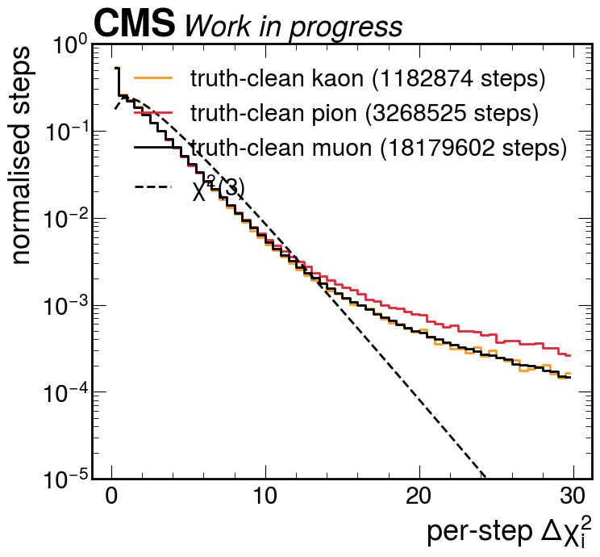
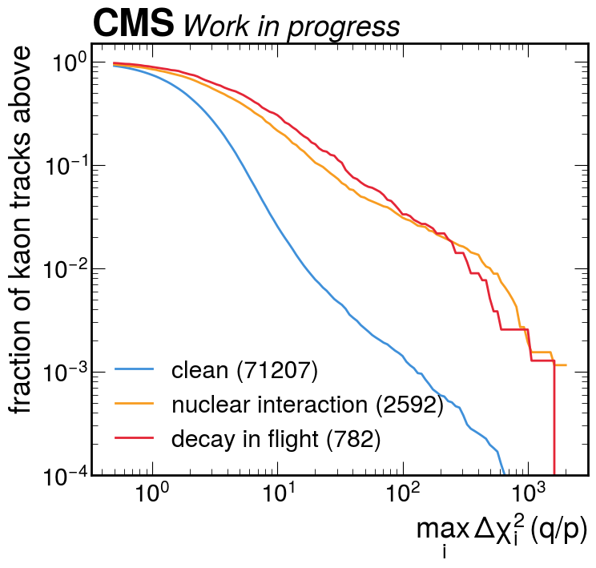

**Left:** per-step $\Delta\chi^2$ for tracks that Geant4 says nothing happened to. All three species lie on top of each other and follow $\chi^2(3)$ in the core, with a heavy tail above $\sim$13 from non-Gaussian multiple scattering. **Right:** the momentum-only sub-test on kaons, split by truth — decays and nuclear interactions separate from clean tracks.

---

# A trap that nearly invalidated the whole study

Matching a reconstructed track to its generated particle **cannot use a momentum window** here: the reconstructed $p_T$ of a decayed kaon follows the *daughter*, so any window throws away exactly the signal.

With the window open, a soft generated hadron can win the $\Delta R$ match to an **unrelated track** — usually a J/ψ muon, which are far more abundant.

- This bites hardest exactly where it hurts: a kaon that decayed is often **not reconstructed at all**, leaving its generated particle free to steal someone else's track.
- **22 %** of hadron matches were such steals — but **59 %** of the tracks labelled "decay".

**Fix:** let every stable charged species compete for the match and require the winner to be the species under study. No momentum cut, so no bias against hard decays.

Uncorrected, this alone drags the measured performance from AUC 0.72 down to **0.59**.

---

<!-- _class: plots -->

## The fix removes contamination, not signal

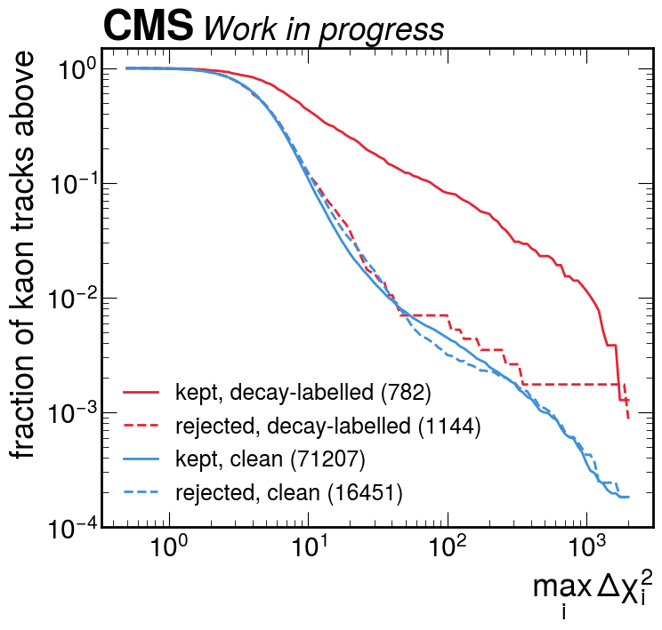
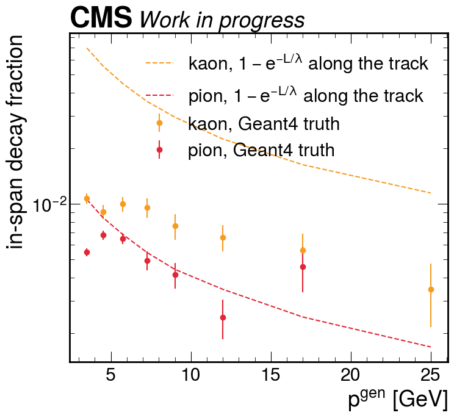

**Left:** rejected "decay" tracks (dashed red) have a score distribution lying exactly on top of clean tracks — no kink at all, and a reconstructed-to-generated $p_T$ ratio of 4.5. The kept ones (solid red) sit far above. **Right:** only **21 %** of in-tracker kaon decays survive into the track sample (pions **70 %**) — the large $K\to\mu\nu$ opening angle destroys the track before we ever see it.

---

<!-- _class: plots -->

## Tagging performance

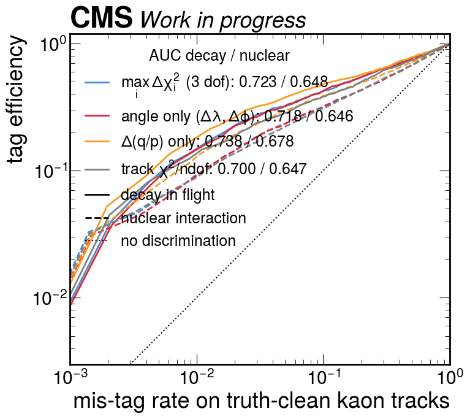
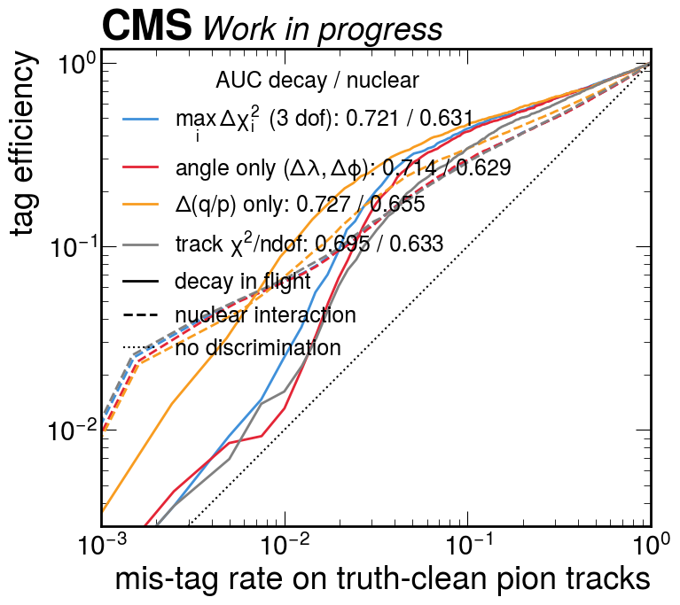

Solid = decays in flight, dashed = nuclear interactions, both against Geant4-clean tracks of the same species. Nuclear interactions are treated as signal too: they bias the curvature just as decays do, and a veto is entitled to remove them.

---

# What the momentum step buys

Efficiency at a **1 % mis-tag rate** on clean tracks — the regime a veto actually runs in:

| | $\Delta(q/p)$ only | 3 dof | angle only | $\chi^2/\mathrm{ndof}$ |
|---|---:|---:|---:|---:|
| kaon decays | **0.184** | 0.147 | 0.142 | 0.139 |
| **pion decays** | **0.092** | 0.025 | 0.013 | 0.016 |
| kaon nuclear | 0.126 | 0.093 | 0.092 | 0.089 |
| pion nuclear | 0.068 | 0.064 | 0.064 | 0.066 |

- **On pion decays the momentum-only test is 7× the angle-only one.** Exactly as the kinematics predict: $p^{*}=30$ MeV makes $\pi\to\mu\nu$ nearly collinear, so there is almost no angle to see and the momentum step is the entire signal.
- For **nuclear** interactions every variant performs alike — direction and momentum change together, so there is nothing specific to gain. The advantage is decay-specific.
- **Adding the two angular degrees of freedom actively dilutes** the decay signal (AUC 0.738 → 0.723 for kaons).
- The AUCs are all ~0.72 and hide this completely. **Quote working-point efficiency, not AUC.**

---

<!-- _class: plots -->

## The estimated momentum step closes against kinematics

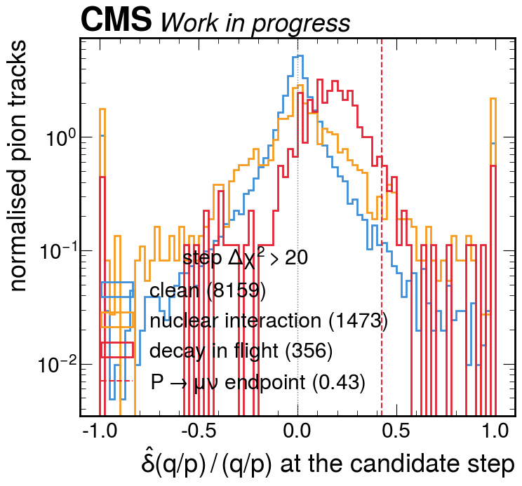
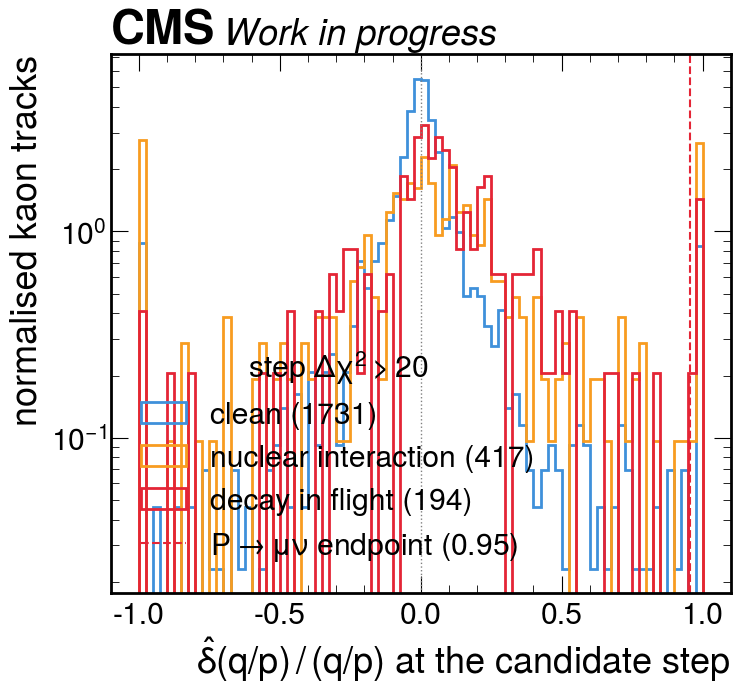

Fitted fractional momentum step $\hat{\delta}(q/p)/(q/p)$ at the candidate step; positive means the track loses momentum. **Left (pions):** the decay distribution peaks near $+0.2$ and terminates at the two-body endpoint $1-(m_\mu/m_\pi)^2 = 0.43$ — an absolute check of the estimator with **no free parameter**. 87 % of tagged pion decays lose momentum, against 50 % for clean tracks. **Right (kaons):** endpoint 0.95 is barely a constraint and $K\to\pi\pi^0$ dilutes the peak, so the distribution is much broader.

---

<!-- _class: plots -->

## Where the tagger works, and where it does not

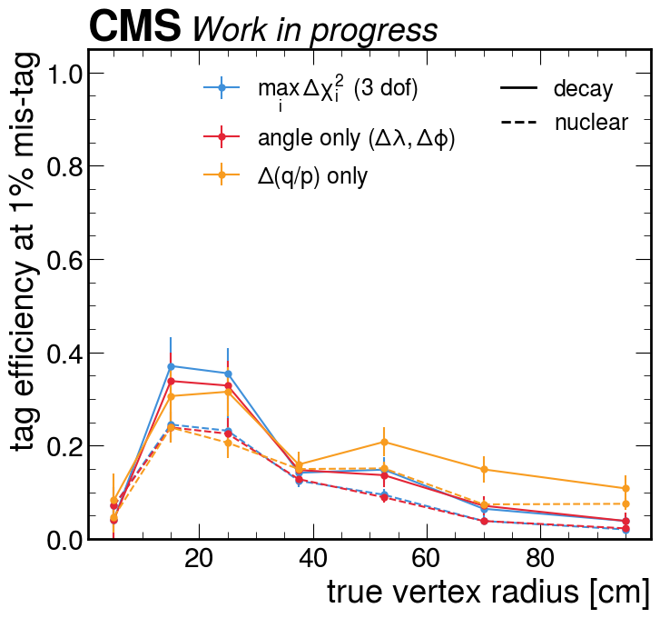
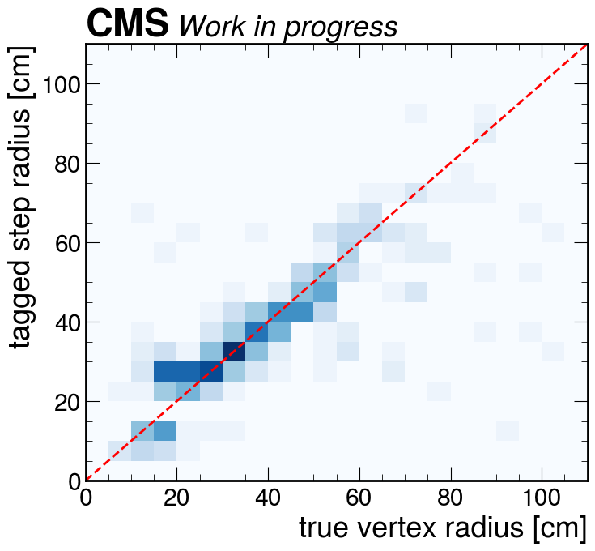

**Left:** efficiency peaks at $\sim$37 % for vertices at 10–30 cm and falls to a few percent beyond 80 cm — a kink near the end of the track has no downstream lever arm left to reveal it. **Right:** when a track *is* tagged, the flagged material step locates the true vertex to a median of **&minus;0.2 cm with an interquartile range of 7.8 cm**.

---

<!-- _class: plots -->

## The number that matters for the calibration

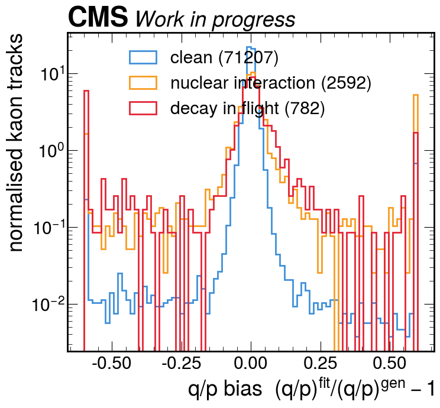

Curvature bias $(q/p)^{\rm fit}/(q/p)^{\rm gen}-1$ for kaons. Decays and nuclear interactions produce a **broad, nearly symmetric tail** — 66 % of decayed tracks fall outside $|{\rm bias}|<0.02$, against 23 % of clean ones — but they barely move the peak.

---

# Decay in flight is a lineshape effect, not a scale shift

| kaons | mean | median | core mean, $\lvert b \rvert < 0.02$ | outside core |
|---|---:|---:|---:|---:|
| clean | $-2.6\times10^{-3}$ | $-8.0\times10^{-4}$ | $-4.3\times10^{-4}$ | 0.23 |
| nuclear | $-5.2\times10^{-3}$ | $+4.7\times10^{-4}$ | $+2.3\times10^{-4}$ | 0.59 |
| decay | $-6.8\times10^{-2}$ | $-2.2\times10^{-4}$ | $+7.1\times10^{-4}$ | 0.66 |

- Contamination shifts the **mean** by $-7.7\times10^{-4}$, but the **core** by only $+1.7\times10^{-5}$.
- A kink veto at 1 % mis-tag changes the core mean by $-5\times10^{-6}$ — i.e. nothing.

**Consequence for the calibration:** the decay-in-flight systematic should be propagated through the **B mass lineshape**, not as a correction to the momentum scale. The veto is a tail-cleaning tool, and is worth having for that — but it is not the right instrument for a mean shift that is not there.

---

# Conclusions

- A decay-in-flight test now runs **inside** the CVH fit at every material step, at essentially no cost, and is available for the hadron tracks the B → J/ψ K calibration depends on.
- The new simulation with Geant4 truth turns this from a rate comparison into a **measured efficiency and purity**. The null is clean: zero decays in 1.08 M muon tracks.
- **The momentum-step direction is where the information is.** Separating it out gives 7× the efficiency of the angular test on pion decays at a 1 % mis-tag rate; combining the degrees of freedom dilutes it. The fitted step closes against two-body kinematics with no free parameter.
- Only **21 %** of in-tracker kaon decays reach the track sample at all — reconstruction removes the damaging ones before we see them.
- The surviving contamination is a **tail, not a bias**: it moves the curvature core by $2\times10^{-5}$.

### Next

- Build the species-arbitrated match into the producer (done offline so far) and re-run.
- Port the test to the two- and three-track fits so the kaon leg carries it under the B mass constraint.
- Feed the measured tail into the B → J/ψ K lineshape as the decay-in-flight systematic.

---

# Caveats

- **Elastic scattering is invisible in the truth.** Geant4 records a vertex only where it stored a secondary track: multiple scattering has *no* entries and hadron-elastic only 72 out of 92 000 vertices. Genuine elastic kinks therefore sit unlabelled in the "clean" background, so every efficiency and AUC quoted here is a **lower bound**.
- **The sample is what the B-candidate selection already accepted**, so it is depleted in violent decays. That is the right population for the systematic, but it is not the tagger's intrinsic power on an unbiased sample.
- The species-arbitrated match is currently applied **offline**; the producer-side version is written but not yet compiled.
- Kaon decay statistics are modest: 782 tagged-class tracks after all selections.
- No head-to-head comparison against the standard CMS `trkKink` has been run.
