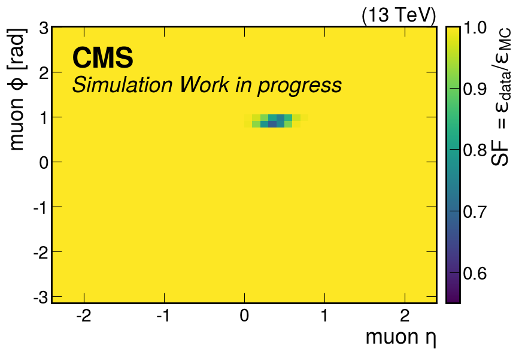
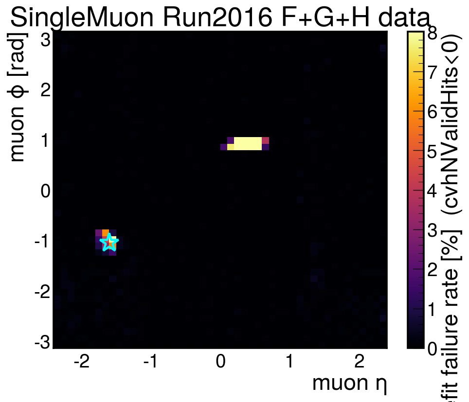
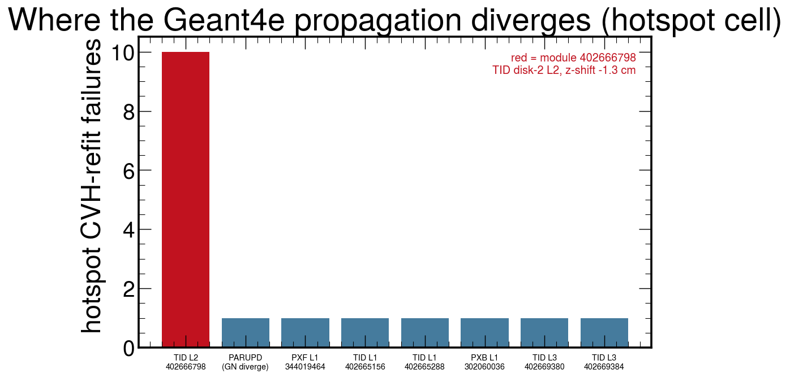
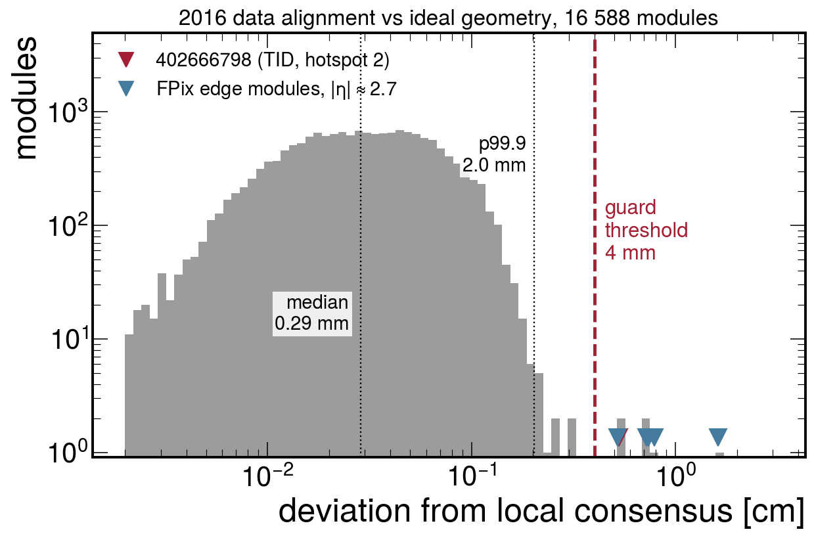
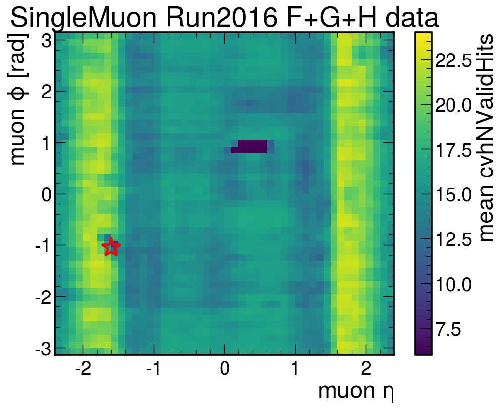
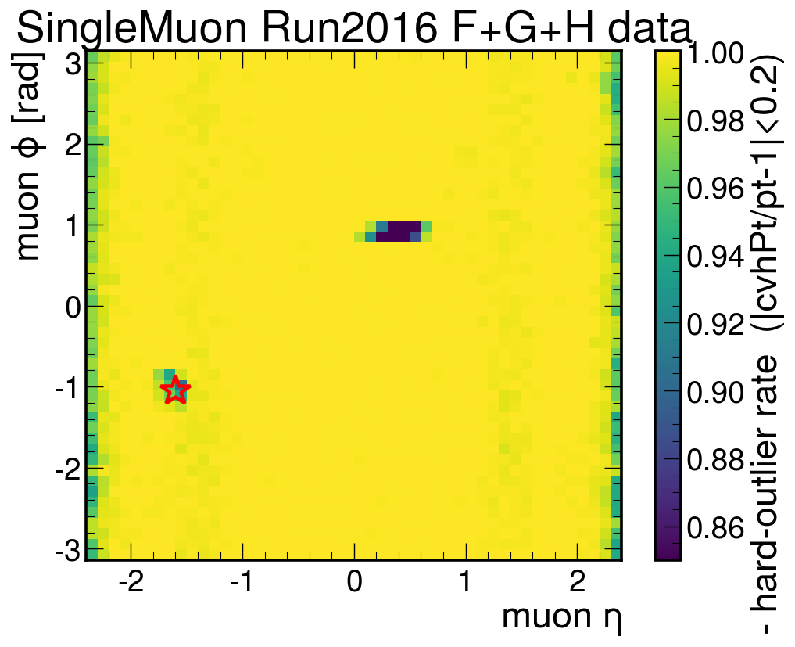

<!-- _class: title -->

# CVH refit inefficiency in 2016 data

## Root cause of the second efficiency hotspot
## and a generic guard against pathological alignment constants

David Walter — 2026-07-23

---

## Context: two data-only CVH efficiency hotspots

Data/MC comparison of the CVH refit efficiency (Z → μμ, p$_T$ 25–65 GeV) shows **two localized regions** where data is less efficient than MC — both absent in MC because MC uses the ideal detector geometry.

| | Hotspot 1 | Hotspot 2 |
|---|---|---|
| location | η ∈ [0.1, 0.65], φ ∈ [0.80, 1.00] | η ≈ −1.6, φ ≈ −1.05 |
| size of the effect | up to 41% loss (core SF 0.585) | ~13% loss |
| cause | glued TIB module **369141860** with garbage-**tilted** alignment (0.75 rad) | **unknown → this talk** |
| status | fixed in [WMass/cmssw PR 46](https://github.com/WMass/cmssw/pull/46); data→MC efficiency SF derived for the current dataset | SF applied as measured, uncorrected |

Both effects come from the **alignment constants in data**: modules that were off (or unusable) during data-taking have unconstrained degrees of freedom in the alignment fit, and the stored constants can be arbitrary.

---

<!-- _class: plots -->

## Measured data→MC efficiency correction (A/B refit study)

  

The efficiency SF as implemented in the analysis: the hotspot-1 correction (visible blob, core 0.585) is derived from refitting the same data events with and without the PR 46 fix (3.4M events per arm). Hotspot 2 is <b>not</b> corrected by that fix — the with/without comparison is identical there (SF = 1.000) — so it is carried as measured from data/MC (~13%, barely visible at this color scale) and its cause had to be something else.

---

<!-- _class: plots -->

## Hotspot 2 in the produced NanoAOD: the refit fails outright

  

SingleMuon 2016 F+G+H data, 5.0M muons. Fraction of selected muons (mediumId, global, p$_T$ 25–65) whose CVH refit <b>failed</b> (stored with sentinel values). Both hotspots appear — this production predates the PR 46 fix, so hotspot 1 (η 0.4, φ 0.9) also fails outright. The star marks hotspot 2: <b>3.2%</b> failure rate at (η −1.6, φ −1.05) vs <b>0.0%</b> at the mirror point (η +1.6) and 0.13% everywhere else. Muon <i>occupancy</i> is flat at both — these are not acceptance holes.

---

## The failing muons are perfectly reconstructed

Comparing muons with good vs failed CVH refit **in the same (η, φ) cell**:

| | good refit | failed refit |
|---|---:|---:|
| tracker layers with hits | 14.0 | 13.4 |
| valid tracker hits | 20.2 | 19.6 |
| valid pixel hits | 3.30 | 3.33 |
| high-purity track flag | 1.00 | 1.00 |
| standalone vs inner-track p$_T$ | agree | agree |
| **CVH refit** | converged | **failed** |

- Standard CMS tracking reconstructs these muons **flawlessly** — full hit complement, no quality difference
- Only the CVH refit (Geant4-based propagation, full material treatment) diverges
- ⇒ not a dead region, not missing hits — something breaks **inside the refit**, only with the **data alignment**

---

<!-- _class: plots -->

## Instrumenting the refit: the failure is one single surface

  

Each refit failure logged with the surface at which the track propagation aborts (6 data files, 40k events). In the hotspot cell: 16 of 17 failures are propagation aborts, and <b>10 of 16 abort on the same module: 402666798</b>, a TID disk −2 r-φ strip sensor at (η −1.68, φ −1.05). The abort happens mid-track (typically hit 6 of ~18) — the whole track is then lost.

---

## The culprit: one runaway alignment constant

Comparing the **aligned** position of every module with the **ideal** geometry:

- Module 402666798 sits **1.33 cm** from its ideal position — almost purely a **z-shift of −1.29 cm**
- Its neighbors (same TID ring, including its own glued partner) sit at 0.7–0.9 cm — the legitimate **coherent** movement of the large structure
- Deviation from the neighbors' consensus: **5.3 mm** — the module is out of plane w.r.t. its own disk
- Orientation is normal (tilt 0.45°) → it slips past the PR 46 guard, which triggers on **tilts** of glued composites (this is a **translation** on a single face)

**How large can a genuine misalignment be?** Over all 16 588 modules, the deviation from the local consensus is: median **0.29 mm**, 99% below **1.3 mm**, 99.9% below **2.0 mm**. Mechanically, modules are mounted and surveyed at the few-hundred-μm level — a single module 5 mm out of its disk plane is **not a physical position, it is a corrupted constant**.

---

<!-- _class: plots -->

## Module displacements: bulk vs pathological constants

  

Deviation of each module's aligned position from the local consensus of its layer neighbors. The bulk (genuine alignment) is sub-mm; a 4 mm threshold cleanly separates six pathological constants. The hotspot module (red) is the <b>only one inside the muon acceptance</b> — the other five are forward-pixel edge modules at |η| ≈ 2.7–2.8.

---

## Why the track dies — and why data only

- The r-φ face was **off during data-taking**: crossing tracks carry an "**inactive**"-type hit marker for the glued pair (conditions data), while neighbors and the z-mirror twin show only ordinary "missing" markers. Its stereo partner is alive with a normal hit rate
- An off module contributes **no hits to the alignment fit** → its position is unconstrained → the stored constant ran away (1.3 cm) — the **same origin as hotspot 1**, there as a rotation, here as a translation
- The dead face itself is harmless (1 of ~20 hits; normal inefficiency does the same elsewhere with zero effect)
- The damage comes from the **constant**: the refit splits the pair's inactive marker into per-face placeholders and must propagate to every recorded surface — the propagation to the **mis-placed plane** finds no valid intersection and **aborts the whole track**
- MC uses the ideal geometry → module at its nominal position → nothing fails
- ⇒ a **data-only** efficiency hole of exactly the observed size (~3% of muons in the cell cross the pair while it was off)

---

## Generic fix: a translation guard next to the PR 46 tilt guard

**Detection** (once per run, when the geometry is loaded):

- For every module: displacement of aligned vs ideal position
- Compare with the **local consensus** = median displacement of same-layer neighbors (|Δz| < 15 cm, |Δφ| < 0.6) — this subtracts the legitimate coherent structure movements
- Flag if the deviation exceeds **4 mm** (configurable; sits in the clean gap between 2.0 mm p99.9 and the 5–16 mm pathological cluster)

**Repair** for flagged modules:

- Surface rebuilt at **ideal position + consensus displacement** (glued composite as well — it is half-contaminated by a garbage face)
- Hits on flagged modules **re-inserted in the correct path order** (the stored order follows the garbage constants; the repaired surface can otherwise sit *behind* its neighbor → backward step → propagation abort). Alternative policy: drop the hit — both validated, see below
- On MC the guard is automatically inert (aligned = ideal → zero displacements)

---

## The six modules the guard repairs

| module | subdetector | η | φ | deviation [mm] | dominant |
|---|---|---:|---:|---:|---|
| 352453892 | FPix disk +2 | +2.70 | +0.06 | 16.1 | Δz |
| 352460036 | FPix disk +2 | +2.72 | +1.65 | 7.8 | Δz |
| 344066308 | FPix disk −2 | −2.75 | +0.32 | 7.4 | Δz |
| 344071428 | FPix disk −2 | −2.78 | +1.71 | 7.2 | Δz |
| **402666798** | **TID disk −2** | **−1.68** | **−1.05** | **5.3** | **Δz** |
| 344082692 | FPix disk −2 | −2.73 | −1.73 | 5.2 | Δz |

- **Only 402666798 is inside the muon acceptance** (|η| < 2.4) — it is the hotspot-2 module
- The five FPix modules are known dead edge modules (they also carry 14°–80° tilts); repairing them has no effect on W/Z muons
- All six deviations are dominated by an out-of-plane shift — exactly the degree of freedom that is unconstrained for a module without usable hits in the alignment fit

---

## Validation on data (same events, before vs after)

| check | result | impact |
|---|---|---|
| refit failures in the hotspot cell | **17 → 7** = level of the mirror control (4) | physics: recovers the lost muons |
| failures on module 402666798 | 10 → **0** | |
| recovered tracks | **+10** in the cell, healthy (16 valid hits, p$_T$ ≈ 42 GeV) | ~3% of data muons in the cell |
| all other tracks (50 812 matched) | **99.78% bit-identical** momentum; rest touch repaired modules, ${\Delta q/p \lesssim 10^{-5}}$ | surgical — no side effects |
| re-order vs drop policy | **identical** momenta (differences ≲ 0.004 σ) | equivalent here |

- The two hit policies agree because the re-included "hit" turns out to be the invalid placeholder — **there was never a real measurement to recover** on this module
- Re-ordering kept as default: a future pathological module that *does* have valid hits keeps its measurements

---

## Summary and next steps

- **Hotspot 2 is solved**: a single TID module (402666798) with a runaway alignment constant (5.3 mm out of its disk plane) makes the CVH propagation abort for every track that records it → 3.2% refit-failure hole at (η −1.6, φ −1.05), **data only**
- **Not** a dead module, not missing hits, not the PR 46 glued-tilt bug — a **translation** pathology on a non-glued face, invisible to the existing guard
- **Generic guard implemented** (tilt + translation now covered): local-consensus check at geometry load, surface repair + hit re-ordering; validated surgical on data, inert on MC
- With both guards, and no other module above 3.3 mm inside the acceptance, hotspots 1+2 are the **only** alignment-induced CVH efficiency holes in the 2016 data
- **Current dataset**: keep the measured data→MC efficiency SF (already in the analysis); the guard pays off at the next reprocessing
- **To do**: report the corrupted constant to tracker alignment; port the guard to the CMSSW 15 branch

---

<!-- _class: section -->

# Backup

---

<!-- _class: plots -->

## Backup: refit-quality maps in the data NanoAOD

  
  

Left: mean number of valid CVH hits — collapses to 7–12 (vs ~20) in the hotspot because failed refits are stored with sentinel values. Right: fraction of muons with |cvhPt/pt − 1| < 0.2. Both show the same single spot at (η −1.6, φ −1.05).

---

## Backup: the r-φ face was off — its stereo partner is alive

Fraction of well-fitted muons in the cell whose track uses each face of the glued pair (left), and a census of the raw hit records on muon tracks in 30k events (right):

| face | hotspot pair (−z) | mirror twin (+z) |
|---|---:|---:|
| glued composite | 0.298 | 0.342 |
| stereo face | 0.298 | 0.320 |
| **r-φ face** | **0.000** | 0.326 |

**Hit-type census (30k events):**
stereo 402666797: 86 valid
r-φ 402666798: none, ever
their composite: 6 **inactive** + 1 missing
mirror twin composite: 5 missing, 0 inactive
neighbor composite: 4 missing, 0 inactive

- "**Inactive**" markers = the conditions data recorded the module as **off** when crossed — unique to the culprit pair; neighbors and the mirror twin collect only ordinary "missing" markers
- ⇒ the r-φ sensor was dead in the readout during 2016; this is what left its alignment unconstrained
- The failing tracks carry only that marker's per-face **placeholder** — its mis-placed surface is what breaks the propagation
