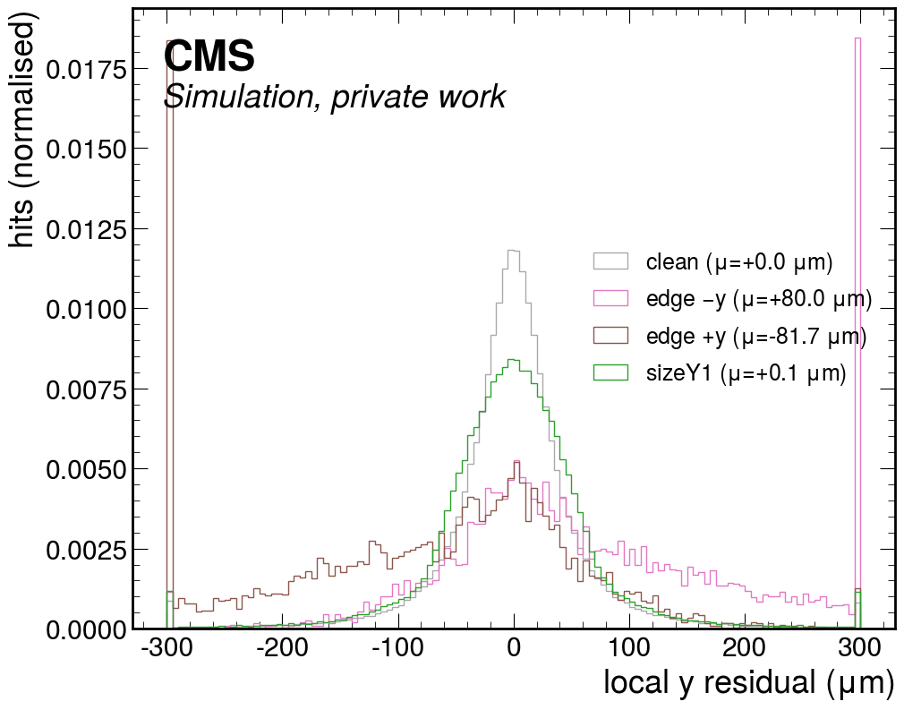
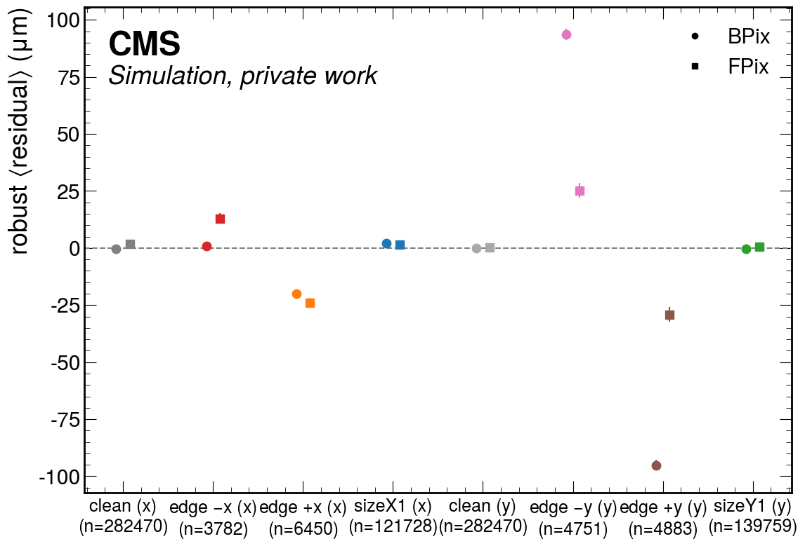
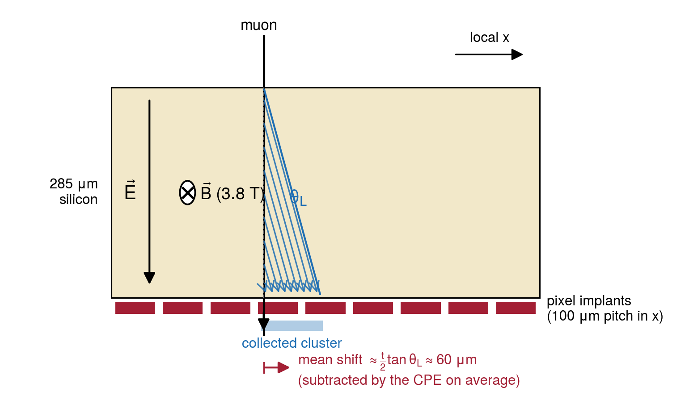
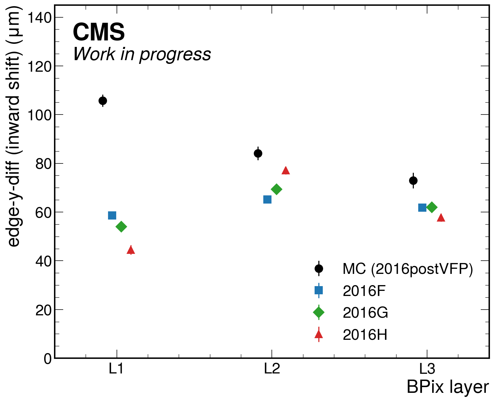
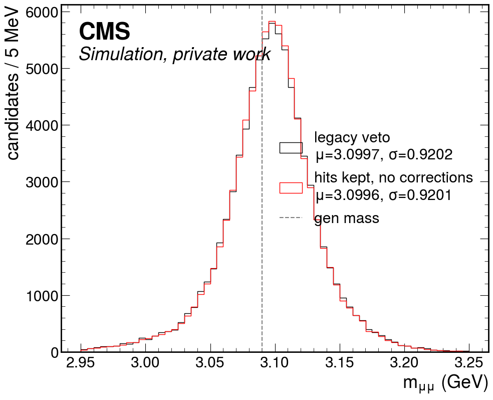
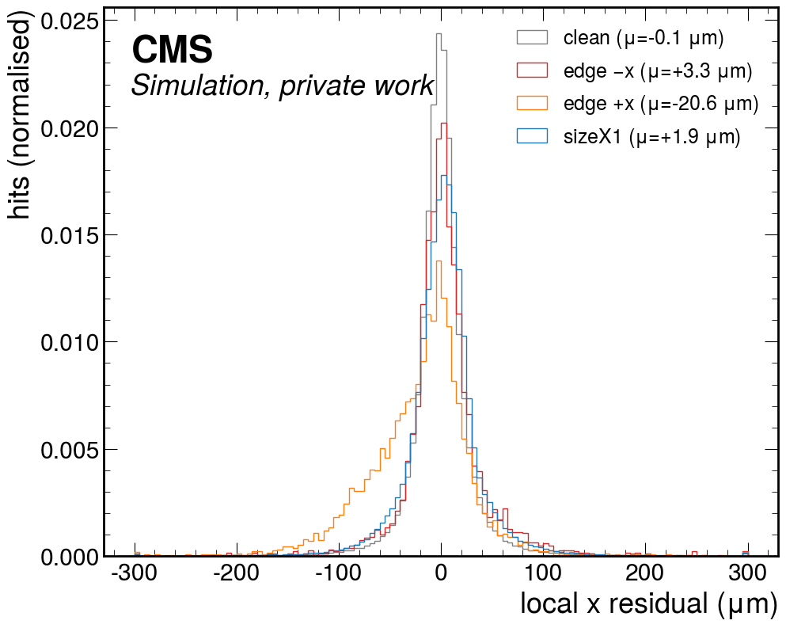

<!-- _class: title -->

# Recovering pixel edge and single-pixel-row/column hits in the CVH track fit

## MC gen-level validation, dedicated correction parameters,
## and first measurements in 2016 data

David Walter — 2026-07-24
W/Z mass — muon momentum calibration

---

## The problem: the CVH fit throws away 1/4 – 1/3 of pixel hits

The CVH refit demotes pixel hits with unreliable cluster positions (`applyHitQuality`):
clusters **touching the sensor edge** (truncated charge) and clusters with
**size 1 along local x** (no charge sharing → no interpolation).

- Their positions from the cluster-position estimate (CPE) are *biased*, and would pull
  the per-module local-x/y alignment parameters (→ Josh's original observation)
- Four pathology classes, any combination: **edge-x, edge-y, sizeX=1, sizeY=1**

Fraction of valid pixel hits on J/ψ→μμ tracks (this study):

| | edge (any) | sizeX=1 | vetoed total |
|---|---:|---:|---:|
| MC (B→J/ψ+X 2016postVFP) | 3–5% | 24–27% | **27–29%** |
| Data (2016G J/ψ) | 4.5% | 31–33% | **33–35%** |

**Data has systematically more pathological hits than MC** — exactly the population
where data/MC differences in the CPE live. Goal: recover these hits with dedicated
per-class correction parameters instead of vetoing them.

---

## Validation tool: gen-anchored refits of B→J/ψ+X MC

New inclusive B→J/ψ+X MC (2016postVFP, ALCARECO with gen particles kept):
**6112 files ≈ 82k J/ψ→μμ candidates** after gen matching (production ongoing).

Two fit modes of the two-track CVH refit (no mass constraint in either):

- **Gen-anchored** (`fitFromGenParms`): the 10 vertex/kinematic reference parameters
  are frozen to the generator values → no weak modes, hit biases measurable
  against an unbiased trajectory (validated unbiased in the past)
- **Free fit**: physics configuration; biases move into the fitted momentum

Baseline (veto on) vs. **hits re-included** (`keepPixelEdgeHits=True, pixelMinSizeX=1`),
same events:

| | χ²/ndof (gen-anchored) | χ²/ndof (free) |
|---|---:|---:|
| legacy veto | 8.5 | 1.059 |
| hits kept, no corrections | **331** | 1.093 |

Gen-anchored fit exposes the biased hits; **the free fit absorbs them silently**
into the track parameters — that is the danger for the momentum scale.

---

## Free-fit impact: large per-event, invisible on average (in MC)

82k matched candidates, identical events in both configurations:

| | mass bias vs. gen | resolution σ(m−m^gen) | χ²/ndof |
|---|---:|---:|---:|
| legacy veto | +2.626 ± 0.119 MeV | 34.14 MeV | 1.059 |
| hits kept, no corrections | +2.623 MeV | 33.27 MeV | 1.093 |

- 85% of candidates shift; per-candidate mass shift RMS ≈ 9 MeV;
  per-muon curvature changes 3–5×10⁻³ RMS
- **Mean scale unchanged at ≤ 5×10⁻⁵** and no η or charge structure at ~3×10⁻⁵
  precision — in MC the CPE biases average out (±x and ±y edges cancel)
- **Mass resolution improves by ~2.5%** — the extra ~0.8 pixel hits/track carry
  real information

The threat is *not* the global mean: it is **coherent per-module, per-edge-side pulls**
on alignment, and the **data/MC difference** in the biased population.

---

<!-- _class: section -->

# Where does the bias live?
# Per-hit attribution vs. gen truth

---

## Method: unbiased per-hit residuals from the gen-anchored fit

Measure each pathological hit against the fit **without letting it pull**:

- Pathological hits are **kept in the trajectory but de-weighted ×10⁻⁶** — they
  effectively do **not contribute to the fit** (equivalent to removing them)
- Why keep them at all? The trajectory then still has a **surface crossing and a
  predicted position** at each such hit, so the residual
  $\Delta = x^{hit} - x^{pred}$ is defined — the hit is *measured*, not *used*
- The prediction at that surface is driven by the neighbouring clean hits and the
  gen anchor → Δ is an unbiased measurement of the CPE bias of that hit
- Clean hits (fitted normally) serve as control; classification resolved
  **by sensor side**: −x/+x edge, −y/+y edge, sizeX=1, sizeY=1

Full MC statistics: **513k pixel hits, 45% carry at least one pathology flag**

Control quality: clean-hit mean residuals ≤ 0.4 μm in x and y

---

<!-- _class: plots -->

## Local-y residuals: edge hits are biased inward, sign flips with side

  

Local-y residual distributions (MC, gen-anchored fit). Clusters touching the −y sensor boundary
are reconstructed +94 μm too far inside the module; clusters at the +y boundary −95 μm —
the truncated charge pulls the cluster centroid towards the module centre on both sides.

---

<!-- _class: plots -->

## Mean residual per class and sensor side

  

Robust mean residuals per pathology class and side (MC). The y-edge bias is symmetric-inward;
in x only the +x edge is biased — the asymmetry introduced by the Lorentz drift (next slide).

---

<!-- _class: plots -->

## Interlude: what is the Lorentz drift?

  

Ionization charge drifts to the pixel implants along the sensor depth in the field
$\vec{E}$; inside the 3.8 T solenoid the drifting carriers feel $\vec{v}\times\vec{B}$ and travel at the
**Lorentz angle** θ_L (~23° in BPix) — the whole cluster is displaced along local x by
~t/2·tanθ_L ≈ 60 μm. The CPE subtracts this **average** shift. Consequences: a **size-1 cluster**
relies entirely on this correction (any mis-modelling → direct bias); an **edge cluster** loses
charge preferentially on one side of the drift direction → only the **+x edge** is biased.
θ_L depends on temperature, bias voltage, and irradiation → **evolves through the year, data ≠ MC**.

---

## Attribution summary (MC, robust means)

| class | BPix | FPix | interpretation |
|---|---|---|---|
| edge-y | ±(66–119) μm **inward**, L1→L3 decreasing | ±(25–29) μm inward | charge truncation |
| edge-x | **+x edge only: −20 μm** (all layers); −x edge ≈ 0 | −x +13 / +x −24 μm | truncation ⊕ Lorentz drift |
| sizeX=1 | +3.6 / +1.4 / +0.4 μm (L1/L2/L3) | small | Lorentz-shift correction |
| sizeY=1 | ≈ 0 (≤ 0.7 μm) | ≈ 0 | no drift along y |

- Magnitudes are **20–100× the alignment scale** → dedicated parameters are
  mandatory if these hits are re-admitted
- The one-sided edge-x pattern is the Lorentz-drift signature (charge drifts along +x)
- sizeX=1 is small but **uniform in sign** → survives averaging, directly scale-relevant

---

## Correction model: mean/diff basis, six parameters per pixel module

Per module and coordinate, an edge hit is corrected by $\;c = \text{mean} + s\cdot\text{diff}$,
with side sign $s=+1$ (hi edge), $-1$ (lo edge):

- **diff** = truncation / "breathing" mode — the dominant physics, ⊥ to translations
- **mean** = translation-like mode — isolates the component degenerate with the
  module's local-x/y *alignment*, so it can be monitored, priored, or dropped
- Lorentz asymmetry in x appears directly as mean ≈ diff ≠ 0

Six new global-correction parameter types on pixel modules (1440 modules × 6 = 8640):
**edge-x-mean/diff, edge-y-mean/diff (local x/y), sizeX1 (x), sizeY1 (y)**

### Implementation (technical)

- Registered alongside the alignment block; Jacobian columns = the local-x/y alignment
  derivative gated on hit class (×s for diff); flag `pixelHitClassCorrections`
- Corrections applied to the residuals in-fit via the standard `corFiles` mechanism
- Fit from stored per-candidate gradients + Hessians (grouped per layer or per module)

---

## MC closure: the machinery works end-to-end

Fit of the 6×(layer/disk) groups from 20k gen-anchored candidates
(all other parameters fixed at MC truth):

| parameter (BPix L1/L2/L3) | fitted (μm) | expected from attribution |
|---|---|---|
| edge-y-diff | +105.8 / +84.3 / +73.0 (± 2.5–3.2) | ✓ (−bias, by convention) |
| edge-y-mean | −0.8 ± 2.5 (L1) | ✓ ≈ 0 |
| edge-x-mean ≈ diff | +9…+11 | ✓ one-sided −20 μm picture |
| sizeX1 | −3.5 / −1.0 / −1.1 | ✓ |

- Applying the fitted corrections and refitting: **every group returns 0.00 μm**
  (exact closure — linear system with gen-anchored reference)
- Free fit with corrections applied: mass scale unchanged (+2.620 vs +2.626 MeV),
  **resolution gain retained** (33.26 vs 34.14 MeV), χ²/ndof 1.090

MC says: hits recovered, resolution improved, scale intact. Now: data.

---

<!-- _class: section -->

# First measurements
# in 2016 data

---

## Data fits: setup and quality handling

Source: split-1 repacked J/ψ ALCARECO on the group store,
`/ceph/.../group/cms/store/data/Run2016{F,G,H}/Charmonium/ALCARECO/TkAlJpsiMuMu-21Feb2020_UL2016-v1`
(F: 7 files, G: 121, H: 122 — full eras available). Free two-track CVH fit,
hits re-included + class-parameter gradients stored.

- First pass, capped at **150k events per era** → ~147k candidates each,
  read from the largest files of each era
- Run coverage caveat: the event cap is filled by the first 1–2 (multi-GB) files,
  each dominated by one long run — e.g. the **2016H sample covers 2 runs**
  (283453, 283478) although the full H directory spans **105 runs** (281613–284044).
  Nothing is missing from the dataset; full-era statistics = next iteration
- Class parameters solved per (type, subdetector, layer); other global
  parameters fixed at their calibrated/GT values (caveat on later slide)

Data-quality handling from the per-module version of the fit:

1. **A handful of modules (3–8 per era) fit at mm-level values** → blacklisted
   (<1% of modules; two are genuine detector findings, next slide)
2. **Per-candidate convergence gate** (edmvalref < 10⁻²): ~0.5% of free-fit
   candidates are non-converged, and a *single* diverged fit can dominate the
   unprotected gradient sum (next slide). Golden-JSON filtering: no effect

---

## A cautionary tale: apparent "detector defects" were fit artifacts

Two striking anomalies appeared in the first per-module / per-run fits:

- *BPix module 302123012 fitted at +22.7 mm (2016G only)* — looked like an
  IOV-specific alignment corruption
- *Run 283453, LS 451–514: sizeX1 shift up to +403 μm* — looked like an
  end-of-fill HV/timing scan inside the golden JSON

**Both were traced to single non-converged fits.** The 283453 case: ONE candidate
(LS 466, χ² = 7·10¹⁰, edm 10¹¹ × threshold, "J/ψ mass" 259 GeV, μ⁺ pT 10 TeV)
contributing a gradient 10⁵ × the median — the whole "anomaly" was its shadow.
The independent per-hit attribution (robust means) saw nothing; the discrepancy
between the two methods exposed the artifact.

- With a convergence gate (edmvalref < 10⁻², rejecting 0.4–0.5% of candidates)
  **both anomalies vanish and no module blacklist is needed** — the era table
  is unchanged
- Full certified-2016 scan (250 files, 160 runs, all F/G/H): **no condition
  pathologies found**; single mild flag (run 279681, sizeY1-y, +12 μm, weak-y channel)

**Production lesson: the calibration solve must gate on per-candidate convergence.**

---

## Cleaned era comparison (module blacklist applied), BPix, μm

| parameter | L | MC | 2016F | 2016G | 2016H (283478) |
|---|---|---:|---:|---:|---:|
| edge-y-diff | 1 | +105.8 | +58.6 | +54.0 | +44.5 |
| | 2 | +84.1 | +65.2 | +69.4 | +77.1 |
| | 3 | +73.0 | +61.8 | +61.9 | +57.8 |
| edge-y-mean | 1–3 | ≈ 0 | ≈ 0 | ≈ 0 | ≈ 0 |
| sizeX1 | 1–3 | −1…−3.5 | −1…−3 | −0.1…−2 | −0.2…−3.4 |
| sizeY1 | 1–3 | 0…+2ᵃ | ≤ ±2 | ≤ ±2 | ≤ ±2 |

ᵃ MC shows +10 μm at L3 for sizeY=1 — an error-weighting effect absent in data; under study.

- **Edge-y truncation bias confirmed in all eras at 45–77 μm — 15–45% below MC**
- Statistical precision 1–2 μm per era; eras mutually consistent except the
  L1 trend (next slide)

---

<!-- _class: plots -->

## The headline: edge-y inward bias, data vs. MC, era by era

  

Edge-y-diff (inward shift of y-edge clusters) per BPix layer. Data is 15–45% below the MC
expectation, and **L1 decreases monotonically F → G → H** — consistent with radiation-induced
evolution of charge collection that the MC conditions do not track.

---

## How robust are the data values? Simultaneous fit with alignment

Freed the per-module pixel alignment together with the class parameters
(Gaussian prior on alignment; the free fit has weak modes):

| | fixed | + local-x/y (2 μm prior) | + rotations (5·10⁻⁵ rad) | + rotations (2·10⁻⁴ rad) |
|---|---:|---:|---:|---:|
| edge-y-diff L1 (2016G) | +54.0 | +54.4 | +36.3 | +14.0 |
| edge-x-diff L1 (2016G) | −4.0 | −17.3 | −1.1 | −11.0 |

- **edge-y-diff at L2/L3, edge-y-mean, sizeX1, sizeY1: stable** under all variants
- **edge-x (both modes) and edge-y-diff at L1 are partially degenerate** with
  per-module alignment: translations for x (±x-edge populations are Lorentz-asymmetric
  ~1.8:1, breaking the mean/diff orthogonality), θₓ rotations for y at L1
  (a tilt shifts the two y-ends oppositely — same pattern as diff)
- MC closure (perfect alignment, bias still +106 μm) fixes the *physical* attribution;
  the production values must come from the **full generalized global-corrections fit**,
  where rotations are constrained independently (clean hits, cosmics, Z)

---

## Physics parameterization: one Lorentz-drift parameter for the x side

Instead of empirical x-corrections, fit the **underlying assumption**:
δtanθ_L per module/layer.

- Within the fit this is a *fixed linear combination of the class columns already
  stored*: response weights size-1 = 1 (δx = ½t·δtanθ_L), edge-x = κ ≈ −0.6,
  clean hits = 0 (differential to the trajectory)
- → implemented at the **solve level, no reprocessing** of any sample
- One number then describes the correlated sizeX1 / edge-x / condition-evolution
  pattern, instead of several empirical parameters that happen to move together
- Identifiability vs. alignment is *better* than for translations: a translation moves
  all clusters equally, δtanθ_L moves each cluster class differently
- Absolute normalization (size-1-equivalent μm → physical δtanθ_L) requires a
  digitizer-level study — quoted in size-1-equivalent μm for now

**Endgame parameter set: δtanθ_L (physics, x-drift) + edge-diff per coordinate
(truncation) + sizeY1 as null monitor** — smaller, physical, each with a
testable signature.

---

## δtanθ_L validation: internal consistency test, MC as control

**Run 283453 artifact as a stress test** (at the time believed to be a real
condition shift; later traced to one diverged fit — previous slide): one
parameter per layer absorbs the entire x-side pattern and *predicts* the
edge-x response — demonstrating the machinery's internal consistency on a
large coherent signal, whatever its origin:

| BPix | x-drift fit (size-1-eq.) | implied edge-x-mean (κ·LX) | measured edge-x-mean |
|---|---:|---:|---:|
| L1 | +33.8 ± 0.1 μm | −20.3 | −23.0 ± 0.4 |
| L3 | +101.4 ± 0.1 μm | −60.8 | −59.7 ± 0.4 |

- Agreement 2% (L3) – 12% (L1) with a single universal κ = −0.6; the residual layer
  dependence (κ_eff = −0.68 / −0.59) is the expected depletion/irradiation effect
- edge-x-diff is left undisturbed (its nominal truncation values) —
  the model does not leak into the asymmetry sector
- **MC negative control**: the model *refuses* to absorb the truncation bias
  (tension pushed into edge-x-diff, +10 → +12 μm) → **Lorentz drift vs. charge
  truncation are separable** through the size-1 lever arm
- On the cleaned nominal samples the parameter reproduces the previous sizeX1
  values (size-1 statistics dominate), all ≤ 3.5 μm

---

## Summary and next steps

**Established:**

- The vetoed 27–35% of pixel hits carry CPE biases of 20–100 μm, now measured
  per class, per side, per layer — in MC against gen truth and in 2016 data
- Six class-gated correction parameters (mean/diff basis) implemented in the CVH fit
  end-to-end: registration, Jacobians, application, exact MC closure
- Recovering the hits with corrections: **~2.5% better J/ψ mass resolution,
  momentum scale untouched (≤ 5×10⁻⁵)** in MC
- Data: edge-y bias **half of MC** and era-stable (45–77 μm); L1 shows a
  radiation-like era trend; two apparent detector defects traced to
  single non-converged fits → convergence gate now part of the solve

- **Physics parameterization implemented**: a single Lorentz-drift parameter
  (δtanθ_L) with digitizer-measured response weights, exact injected-signal
  closure, zero leakage into simultaneous alignment

**Next:**

- Fold the class columns into the full generalized global-corrections fit
  (resolves the edge-x / rotation degeneracies properly)
- Digitizer-level study to normalize the Lorentz parameter to physical δtanθ_L
  (and derive per-layer response weights); optional soft prior b(−x edge) = 0
- Extend to the remaining eras / full statistics; per-module granularity where populated
- Full-statistics eras + the simultaneous fit with the convergence-gated solve

---

<!-- _class: title -->

# Backup

---

<!-- _class: plots -->

## Backup: J/ψ mass spectra, veto vs. hits kept (MC free fit)

  

Vertex-fit dimuon mass, legacy veto (black) vs. hits re-included without corrections (red);
means and widths agree at the sub-MeV level while 85% of individual candidates migrate.

---

<!-- _class: plots -->

## Backup: local-x residuals by class and side (MC, gen-anchored)

  

Local-x residuals: the +x-edge population is shifted by −20 μm while the −x edge is unbiased —
the Lorentz-drift direction breaks the symmetry that holds in y.

---

## Backup: technical references

- Fit drivers: `Analysis/HitAnalyzer/test/runCvhJpsiGenMC.py` (MC, gen-anchored),
  `runCvhJpsi.py` (data) in `CMSSW_15_0_19_patch2_dev`
- New producer options: `keepPixelEdgeHits`, `pixelMinSizeX`, `fillHitDiagnostics`,
  `deweightPathoHits`, `pixelHitClassCorrections`, `corFile`
- Downstream fits: `calibration_studies/pixelhits/fit_classcorr.py`
  (`--per-module`, `--with-alignment [--align-6dof]`, `--run-min/max`,
  `--exclude-from-permodule`); era table: `compare_eras.py`
- MC: `/ceph/submit/data/group/cms/store/mc/inclusive_btojpsix_2016postvfp`
  (4 corrupt files excluded; PoolSource needs `noDuplicateCheck` — event numbers
  collide between production jobs)
- Data: split-1 repacked `/ceph/submit/data/group/cms/store/data/Run2016{F,G,H}/Charmonium/ALCARECO`
- Grads outputs: `/ceph/submit/data/user/d/david_w/ZMass/cvh/pixelhits_data_grads_*`
