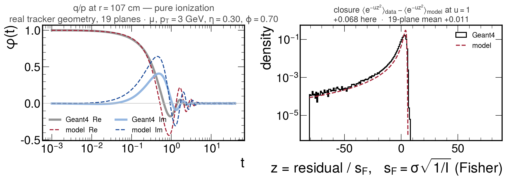
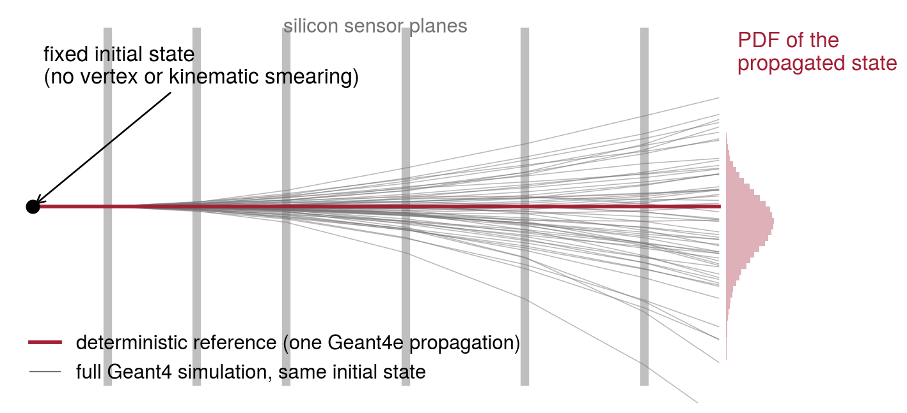
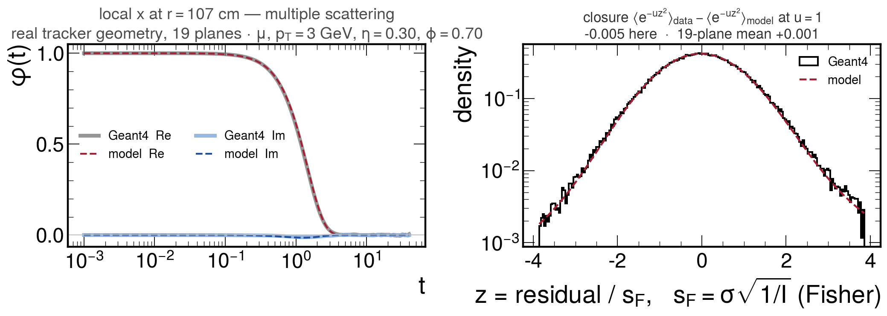
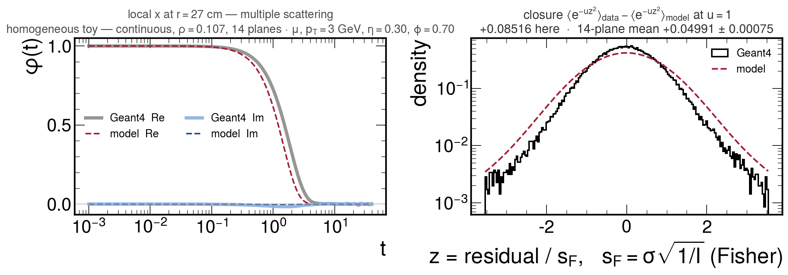

<!-- _class: title -->

# The process-noise model of the CVH track fit

## From a truncated variance to a cumulant generating function
## Status, mathematics, and what is not yet solved

David Walter — 2026-08-14
Muon momentum scale / CVH resolution


---

## Before anything else: the fit has not changed

**Nothing has yet deviated from CVH vanilla.** Every number in this deck is either a
property of the existing fit, or an offline measurement made against Geant4.

The CMSSW edits made so far, and how each was checked:

| edit | verification |
|---|---|
| `StepLengthLimit` exposed as a PSet parameter | default 10 mm reproduces the previously hard-coded value, so every existing config is bit-unchanged |
| one added export branch, `Mu*_dEref` | reproduces the existing production **bit-for-bit** (`Mu*_pt`, `Jpsi_mass` identical to the last bit); nothing reads it |
| two diagnostic probes, `CVH_MATGROUP_PROBE` and `CVH_ELOSS_CYL` | off by default; with the probe off, bit-identical to the pre-existing nominal on 14 982 matched candidates |

### Three states are kept distinct throughout, and labelled on every slide

**In CMSSW, behaviour-preserving** · **Offline prototype, measured** · <span class="planned">Planned / not done</span>

---

<!-- _class: section -->

# The problem

---

## What the fit assumes, and what the physics is

### Status: property of the existing fit

CVH models the material effects of each layer as a **Gaussian process-noise block $Q$**:
five track parameters per layer, with a covariance built from the Urban ionization model
and from Molière scattering.

Ionization is not Gaussian. It is a **compound Poisson process**: a few $10^4$ soft
excitations at fixed energies, plus delta-ray collisions drawn from a $1/E^2$
single-collision spectrum on $[e_0, t_{\max}]$.

- A $1/E^2$ spectrum has **no second moment** without a cut. The retained variance is
  linear in the cut energy — it is carried entirely by the top of the spectrum.
- So the fit truncates the spectrum at a fixed CDF quantile $\alpha = 0.999$
  (the PANDA prescription, report PV/01-07; PANDA itself uses 0.995–0.998).
- In units where the fit's own $\sigma$ is 1, the true block has $\kappa_2 = 366$–$869$.
  **The cut is not a detail of the model: it is doing the entire job.**

---

<!-- _class: plots -->

## One q/p block, as it actually is

<div class="figrow">
  
</div>

<div class="cap">

Real tracker geometry, 19 barrel modules, $r = 4.2 \to 106.8$ cm; $\mu^-$, $p_T = 3$ GeV; outermost plane.
Left: characteristic function, model against 200k full Geant4 rays. Right: the same thing as a density.
The reference subtracts the **mean** loss, so the **mode sits +4.90 away** in the fit's own $\sigma$; there is a
hard edge on the right (a block cannot gain energy) and a power-law tail running to $-80$.
A single symmetric Gaussian is being asked to represent this.

</div>

---

## The truncation is a step-length convention, not a physics choice

### Status: offline, measured

A fixed-**quantile** cut is equivalent to a fixed-**energy** cut, at an energy proportional
to the step's mean loss — hence to the step length. Measured in the homogeneous toy:

| propagator step limit | effective cut energy | ionization steps |
|---|---|---|
| 10 mm | 0.945 MeV | 122 |
| 1 mm | 0.1036 MeV | 1110 |

Ratio 9.1 — exactly the step-count ratio. **So the block variance is not additive under
step subdivision**: at 100-fold subdivision $\alpha = 0.999$ retains only 3.6 % of the
one-step variance, i.e. it loses 96 % of it.

Re-stepping the *same* trajectory with Geant4e, 10 mm $\to$ 1 mm: $\sigma_{q/p}$ moves by
**20 % (real geometry), 64 % (toy), up to a factor 2.8 on an individual plane**.

---

## Why nobody noticed

### Status: offline, measured

At **fixed** standardisation the model's predicted distribution is step-independent to
$< 1\,\%$, and every truncation convention gives *bit-identical* closure numbers.

- The step dependence lives entirely in the number the fit calls "the resolution":
  in the **weights**, in the **reported per-track covariance**, and in any calibration
  parameter extracted with those weights.
- A 20–64 % weight error is a real bias channel into the alignment, material and B-field
  parameters — and it is **invisible to a lineshape closure test**.

<div class="note">

**Cheap interim, if wanted:** a fixed energy cut $T_{\rm cut}$ makes cumulants 1–4 additive to double-precision rounding under 1000-fold subdivision, and removes the step dependence entirely. It fixes nothing else.

</div>

---

## Which channel is responsible? Measured, by switching channels off

### Status: offline, measured

| channel | share of the q/p block variance | shape |
|---|---|---|
| delta rays ($1/E^2$) | **99.6 %** | log-concave nowhere; carries the hard edge |
| excitations (fixed $e_1, e_2$) | **0.4 %** | near-Gaussian: 2 % in log within $\pm 1\sigma$ |

- The **mode displacement** (+4.90) and the **62 % log-concave mass fraction** are *both*
  properties of the delta-ray channel alone: kill the excitations and both survive intact.
- The 62 % is strikingly universal — **61–63 % over 33$\times$ in momentum and 30$\times$ in
  per-plane material**. It is the crossover between the Moyal-like core, which is
  log-concave everywhere, and the explicit $1/E^2$ channel, which is log-concave nowhere.
- The excitation core needs **no truncation at all**: its channels are Poisson at *fixed*
  energies. So $\alpha = 0.999$ exists for exactly one purpose — to tame the delta rays.

---

<!-- _class: section -->

# The mathematics

---

## The cumulant generating function

### Status: offline, implemented and validated

$$K(\theta) \;=\; \ln \varphi(-i\theta), \qquad
K(\theta) \;=\; \sum_{\rm channels} a\,\big(\mathbb{E}[e^{\theta J}] - 1\big)$$

for a compound Poisson with rate $a$ and jump $J$. For the $1/E^2$ channel on
$[e_0, t_{\max}]$ this is **closed form**, in exponential integrals.

**Cumulants add under convolution.** A representation carried by the CGF is therefore
**step-size independent by construction** — subdividing a step splits $a$ and changes
nothing. That is the core argument for the whole programme, and it is why no
fixed-quantile moment can ever be made additive.

The CGF is **entire**: every jump is bounded (delta rays kinematically by $t_{\max}$,
photons by $v \le 1$), so $\mathbb{E}[e^{\theta J}]$ is finite for *all* $\theta$.
An earlier "divergent half-line" was a **floating-point clip** ($e^{bw}$ overflow), not
mathematics. After a log-domain rewrite: **3.3$\times 10^{-14}$** against mpmath at 50
digits, where the old code was wrong by a factor ≈500 at $|\theta| \sim 0.01$–$0.1$ —
inside the working range.

---

## Three channels, one exponent

### Status: offline, implemented and validated

Ionization, multiple scattering and radiation are independent, so their **exponents add**
in $\ln\varphi$. Each is validated separately against mpmath (worst $7\times10^{-14}$ for
scattering, $6\times10^{-15}$ for radiation).

**One caveat, stated as mathematics rather than worked around.** The scattering spectrum
as modelled falls like $t^{-6}$ at large angle, so its moments diverge for $n \ge 5$ and
its CGF is $+\infty$ for every $\theta \ne 0$ **unless a maximum deflection is imposed**.
The cure is physical — a single Coulomb scatter cannot exceed $\pi$ — and it is not a free
parameter in disguise:

- the knob is emphatically live (it moves $K_{\rm ms}$ by 70 orders of magnitude), yet
- the block mode is stable to $10^{-5}$ over cut $= 1 \to 12$ rad, and the position
  information $1/I$ is flat to four decimals from $\pi$ down to **0.1 rad** — while the
  nuclear form factor terminates the spectrum at 0.08–0.17 rad anyway.

Scattering contributes **nothing** to the q/p mode ($3\times10^{-5}$ at the outermost
plane): the whole mode shift is radiative.

---

## The Fourier transform: where it is needed, and where it is not

### Status: offline, measured

The characteristic function $\varphi(t)$ is the natural object because the channel
exponents add. Two different needs, two different treatments:

- **The closure statistic $\langle e^{-uz^2}\rangle$ is obtained directly from $\varphi$**
  by a Gaussian-damped integral (a Weierstrass transform). **No inversion at all.**
- Where a density, or an expectation over one, is genuinely needed — the score, the
  information, the mode, the median — **exact FFT inversion** is used.

**The saddlepoint approximation is not usable here**, and this is a measured negative
result, not a preference:

- the saddlepoint density is a factor **2–8 low below the mode** and up to **140$\times$
  off in the deep tail**, at every momentum tested;
- arbitrated independently against the single-delta-ray asymptote $p(z) \propto 1/z^2$,
  which involves neither route: the FFT inversion converges onto it (0.91 $\to$ 0.996),
  the saddlepoint runs away from it;
- its Fisher information is 5–13 % off *unpredictably* — adding a channel carrying
  $5\times10^{-11}$ of the variance moved it by 33 %.

---

## Fisher information — the key idea

### Status: offline, measured

$$I \;=\; \mathbb{E}\big[\psi^2\big], \qquad \psi(r) = -\,\frac{d \ln p}{dr}
\qquad\Longrightarrow\qquad I > 0 \ \ \text{by construction}$$

$1/I$ is the Cramér–Rao bound: **the width the measurement can deliver, not the width of
the distribution.** For a Gaussian $I = 1/\sigma^2$ and everything reduces to ordinary
least squares. For a $1/E^2$ tail the two diverge violently:

| plane | $r$ [cm] | $\kappa_2$ (block variance) | $1/I$ | $\kappa_2 \cdot I$ |
|---|---|---|---|---|
| 0 | 4.2 | 888 | 0.0634 | $1.4\times10^{4}$ |
| 9 | 68 | 483 | 0.7356 | $6.6\times10^{2}$ |
| 18 | 107 | 448 | 1.6908 | $2.7\times10^{2}$ |

**The fit weights blocks by VARIANCE, which is why it needs a cut at all. The correct
weight is INFORMATION, which is finite and needs no cut.**

$1/I$ stable to four decimals over 8 decades of density floor, 40$\times$ in grid
resolution and the integration range; the pipeline is exact to $10^{-16}$ on a Gaussian.

---

## The Gaussian surrogate

### Status: offline prototype; <span class="planned">not in the fit</span>

Minimise $-\ln p$ by **iteratively re-weighted least squares**, so that the existing
sparse linear algebra is untouched — the block stays a Gaussian at every iteration:

$$\sigma^2_{\rm eff} \;=\; 1/I \quad \text{(constant per block, always positive)},
\qquad \mu_{\rm eff} \;=\; r - \psi(r)/I$$

All of the non-Gaussianity moves into the **re-centring**; the weight is a property of the
distribution, not of the realised residual. For a Gaussian this reduces *exactly* to
$(\mu, \sigma^2)$, i.e. to what the fit does today.

**Why the expected curvature and not the observed one.** The Newton curvature
$1/(d\psi/dr)$ goes **negative over 38–70 % of the probability mass** — the density is
simply not log-concave in the tail, so no positive-variance Gaussian surrogate exists
there at all. $I = \mathbb{E}[\psi^2]$ is an integral of a square and is positive
everywhere. The same argument makes the global-fit marginalisation survive (next section).

---

## Making the iteration converge

### Status: offline prototype, measured on real blocks

Convergence is not automatic and needs safeguarding — in order: fall back to the Fisher
curvature when the chosen one is not positive; cap $|{\rm step}|$ at $8/\sqrt{I}$;
backtrack until the objective strictly decreases; and **expand forward** while it keeps
decreasing.

- The **expansion is not optional**: $\psi \to 0$ like $1/|r|$ in the power-law tail, so a
  plain step from $r = -300$ is 0.006 and $\sim 5\times10^4$ iterations would be needed to
  walk back. With expansion, ≈25.
- Raw: **13/25** starts converge (one ran to 10 314 after 500 iterations).
  Safeguarded: **25/25**, 20–32 iterations, every one to the correct root.
- A hybrid — Newton where the summed curvature is positive, Fisher elsewhere — finds the
  same root and is **2–4$\times$ faster**.
- **Blocks must be pooled to $\ge 8$ Geant4 steps.** A one-step block is a near-delta whose
  hard edge sits 2400$\times$ inside its own $\sigma$; the joint minimum then lands on the
  support boundary and the answer is a constraint, not a fit. (The real fit pools anyway —
  its blocks are per module, never per Geant4 step.)

---

<!-- _class: section -->

# Does it close?

---

<!-- _class: plots -->

## How the test works — no hits, no fit, no selection

<div class="figrow">
  
</div>

<div class="cap">

One fixed initial state; one deterministic Geant4e reference propagation; $10^5$–$4\times10^5$
full Geant4 rays from the same state. At each plane the *predicted* PDF of the propagated state is compared with
the *sampled* one, through the bounded statistic $\langle e^{-uz^2}\rangle_{\rm data} - \langle e^{-uz^2}\rangle_{\rm model}$,
with $z$ the standardised residual. Nothing here depends on the track fit, on hit resolutions, or on any selection.

</div>

---

## The unit was the problem

### Status: offline, measured — this is the deliverable of the Fisher work

The statistic was quoted in a unit — the $\alpha$-truncated $\sigma$ — that is a
convention and moves with step size, while the model it tests is convention-free.
Replace it by $s_F = \sigma\sqrt{1/I}$, an absolute width.

Over a **100$\times$ change of the propagator step limit** (10 $\to$ 0.1 mm), q/p, mean over planes:

| normalisation | $u = 0.01$ | $u = 0.1$ | $u = 1$ |
|---|---|---|---|
| $\sigma$ (today) | non-monotonic | $\times 4.5$ | $\times 3.8$ |
| Fisher $s_F$ | 4 % (statistics-limited) | 0.8 % | **0.2 %** |

The scale itself: $\sigma$ falls by **7.1$\times$** in the median plane while $s_F$ moves by
**0.13 %**. And the change is exactly a relabelling — the identity
$\mathrm{closure}_F(u) \equiv \mathrm{closure}_\sigma(u\,I)$ is verified to $10^{-8}$, so it
cannot create or destroy a data–model difference.

---

<!-- _class: plots -->

## Multiple scattering: untuned, and closing to half a percent

<div class="figrow">
  
</div>

<div class="cap">

Same track and plane as before, position instead of curvature. No parameter of the Molière transform is fitted to
this or any simulation. The two curves sit on top of each other over 2.5 decades of density — and still differ by
$-0.005$ at this plane, $+0.0014$ averaged over the ladder. That is what the bounded statistic is for: "looks
identical" and "closes" are different statements.

</div>

---

<!-- _class: plots -->

## The same test in a toy of continuous material

<div class="figrow">
  
</div>

<div class="cap">

Homogeneous toy at $r = 27$ cm, where its residual peaks: the model is visibly wider than Geant4, the closure is
$+0.085$ at this plane and $+0.0499 \pm 0.0008$ over the ladder — 36–45$\times$ the real tracker.
**This is a toy artefact of continuous material, not a detector effect**: break the same material into thin layers
with empty gaps and it vanishes (next slide).

</div>

---

## Geometry, not the scattering model

### Status: offline, measured — position channel, $u = 1$, mean over planes

| geometry | position closure | note |
|---|---|---|
| homogeneous toy (continuous) | $+0.0499 \pm 0.0008$ | 67 $\sigma$ — and a **toy artefact** |
| layered toy, 1 model step per layer | $+0.0000 \pm 0.0008$ | thin layers, empty gaps |
| layered toy, 16 sub-steps per layer | $+0.0011 \pm 0.0008$ | 16$\times$ finer model steps: no change |
| **real tracker** | $+0.0014 \pm 0.0006$ | lands on the layered toy |

- Not a step-size effect in either direction: subdividing at fixed material moves nothing,
  and the layered toy takes steps **9$\times$ thicker** in $d/X_0$ than the homogeneous one
  and closes at zero.
- The one structural variable that orders the geometries the way the residual does is
  material **continuity at the scoring plane** (10.6 % / 0.08 % / 0.33 % of the scattering
  variance generated in material the ray has not yet left). **A measurement, not a
  demonstrated mechanism.**
- Consequence: on the real tracker **ionization is the large residual and scattering the
  small one** — the opposite of what the homogeneous toy suggested.

---

## Where the real tracker does not close

### Status: offline, measured

At $u = 1$, Fisher units, 19-plane mean: **q/p $+0.0115$** against **position $+0.0014$** —
ionization is the residual, by a factor 8.

The q/p residual **grows monotonically with radius**, $+0.0004$ at $r = 4$ cm to
$+0.0676$ at $r = 107$ cm, and that growth is **not a test artefact**:

- it survives per-plane acceptance ($\le 0.9\,\%$ of the effect, 0.3 % at the outermost plane);
- cutting to the most reference-like rays leaves at least a factor ≈90 of growth;
  material sampling is bounded at $\lesssim 40\,\%$ of the outermost value.

**The toys cannot be used to chase it.** The layered toy's own q/p profile is flat to
$\pm 0.003$ against the detector's $+0.068$, and it has 1.8 ionization steps per leg
against the real 17.3. This one wants the real geometry.

---

## $p_T = 40$: the curvature channel degrades, the position channel does not

### Status: offline, measured — layered toy, 400k events per configuration

| $u$ | q/p, $p_T = 3$ | q/p, $p_T = 40$ | position, $p_T=3 \to 40$ |
|---|---|---|---|
| 0.03 (peak) | $-0.0185$ | $\mathbf{-0.0925}$ | $+0.0008 \to +0.0006$ |
| 1 | $+0.0014$ | $-0.0045$ | $-0.0000 \to -0.0001$ |

**q/p moves by 26–231 $\sigma$ at every one of nine probes; position by at most 2.1 $\sigma$
at any of them.** The peak grows by a factor **5.0**, at 343 $\sigma$.

Over the same momentum step, the **radiative share of the q/p variance goes 2.5 % $\to$
18.6 %**, while the position channel stays 95–98 % multiple scattering.

<div class="note">

**That is a correlation between two measured quantities. The mechanism is NOT established** — ionization is still 81 % of the $p_T = 40$ variance, and no per-channel closure decomposition was run.

</div>

---

## A single probe hides most of it

### Status: offline, measured

The closure is a **curve**, not a number. Layered toy, q/p, $p_T = 3$, 400k events:

| $u$ | 0.01 | 0.03 | 0.1 | 1 |
|---|---|---|---|---|
| closure | $-0.0133$ ($-58\sigma$) | $-0.0185$ ($-71\sigma$) | $-0.0117$ ($-37\sigma$) | $+0.0014$ ($+8\sigma$) |

- At small $u$, $\langle e^{-uz^2}\rangle \simeq 1 - u\langle z^2\rangle$: a **negative**
  closure means the data are broader than the model. At large $u$ the weight collapses onto
  $z = 0$: a **positive** closure means the data are more peaked. Both are true here.
- **A sign change across $u$ cannot be a scale error.** If the data were the model rescaled
  by any width factor, the closure would have one sign at every $u$. It does not — so no
  choice of normalisation can remove it. It is a shape disagreement, which is exactly what a
  convention-free closure test is for.

---

<!-- _class: section -->

# What this means for the fit

---

## A gap found in the fit's own noise matrix

### Status: property of the existing fit

```cpp
errMSIout(0, 0) = ionifact * computeErrorIoni(...);   // Geant4ePropagator.cc
```

The q/p process noise carries the **ionization fluctuation only**.

- The reference dE/dx table is built with `ionOnly = false`, so the reference trajectory
  **does** subtract the radiative mean.
- The per-step radiative record is computed and exported — but, per its own code comment,
  "for the offline CF" — the characteristic-function study.
  **The radiative fluctuation is absent from $Q$ entirely.**
- There was a reason. For $d\sigma/d\nu \sim 1/\nu$ the mean converges but the second moment
  is dominated by $\nu \to 1$: a radiative *variance* describes the rare catastrophic
  radiator, not the 99.9 % that radiate nothing. The same pathology as ionization, in
  extremis — and the "truncation" applied was total removal. **Not an oversight.**
- A plausible contributor to the $p_T = 40$ degradation. **Not demonstrated to be the cause.**

The CGF has no such problem: the radiative channel is entire, and its exponent simply adds.

---

## Exports to the global fit: which parameters are safe

### Status: offline, derived and validated against finite differences

The surrogate reproduces the residual score exactly at convergence, but it drops the
**shape score** $\phi = -\,\partial \ln p/\partial a$ — the derivative through the *noise
distribution* rather than through the residual.

$\phi$ **vanishes exactly** for a parameter that does not reshape the noise:

| parameter | $\partial \eta_{\rm block}/\partial a$ | surrogate exports OK? |
|---|---|---|
| alignment | **0** — enters the hit rows only | yes (6 % per-track scatter, zero mean) |
| B-field, incl. the 50 scalar-potential modes | **0** — propagated-mean derivatives only | yes, same caveat |
| material / energy loss | $\ne 0$ | **no** |
| resolution parameters | identity | **no — this IS the signal** |

One convention is required for the top two rows to hold: the in-fit block CGF must be
expressed in **physical units**, with the transport weight living in the fit's Jacobians and
never inside the CGF. Free to fix now, expensive later.

---

## Exports: what dropping the shape score costs

### Status: offline, measured on a real 17-block track

| symptom | measured |
|---|---|
| per-block Jacobian bias | **+35 % to +53 %**, coherent on every block (1.7 % rms across blocks) |
| marginalised information in the material parameter | overstated by **1.88$\times$** |
| the surrogate's own uncertainty | under-reported by **1.51$\times$** |
| sandwich test: sensitivity vs score variance | **1778 vs 2704** — the true score passes to $<10\,\%$ |

It is a **bias, not a scatter**: it does not average away over tracks. By contrast the other
approximation — replacing the observed curvature by $I$ — is a 6 % per-track fluctuation
about 1, consistent with unbiased.

**Consequence: the cheap route is correct for the B-field programme** (the existing
50-mode production does not have to be redone) **and is not acceptable for material or
resolution.** No momentum closure test would reveal this.

The marginalisation itself survives either way: the expected Hessian is a sum of outer
products of scores, hence positive semi-definite for **any** density — the same trick already
used in the Gaussian case for the resolution parameters.

---

<!-- _class: section -->

# Plan, and what is not solved

---

## Planned

<span class="planned">None of the following is done.</span>

1. **Uncentred block CGF**, carrying the radiative *mean* as well as its shape. This
   requires the offline characteristic-function code's centred convention to change **in step** — otherwise the fit
   and the closure test silently diverge.
2. **Fisher weighting of the combined block** in the fit. *(In flight: an off-by-default
   environment switch in the propagator computes $1/I$ per q/p block, with a report-only
   mode that leaves the noise matrices untouched. Ionization channel, q/p component only;
   not yet written up.)*
3. **The 5×5 multivariate version.** Everything measured so far is the q/p
   projection — the dominant and the only strongly skewed one, but a projection.
4. **True-likelihood exports** for material and resolution. The specification exists: five
   FFT inversions per block, which is far too expensive as written. The route is to tabulate
   per block **class** rather than per block — the per-step parameters barely move along a
   track ($e_0$ is exactly 10.00 eV at every step, $t_{\max}$ spans 1.7 %). *A first pass
   gives ≈30 classes from 393 steps at 0.1 % binning, 2 at 1 %; not yet written up.*

**A sample re-production is required regardless**: the step logging is gated on `doRes_`,
so no existing production carries the records the CGF needs.

---

## Not solved (1/2)

### The profile-likelihood bias survives exactly correct exports

Profiling over the per-track nuisance parameters biases the global gradient — a
Neyman–Scott effect, driven by $\mathbb{E}[\psi^3] = +2.68$ where a Gaussian gives 0.

- Measured with **exactly correct exports**: the profiled gradient is **4.8 $\sigma$ from
  zero**, while the same gradient at the true track parameters is consistent with zero
  (the control that makes this interpretable).
- In parameter units, **0.054 $\sigma(A)$ per track — and it does not shrink with the
  number of tracks**, so against $N$ tracks it is $0.054\sqrt{N}\,\sigma$.
- The controlling ratio is $n_{\rm nuisance}/n_{\rm blocks}$: the toy has $1/17$, CVH has
  ≈100 against 20–40. **CVH is at the worse end, and the number is unmeasured there.**
- Needs a modified-profile (restricted-likelihood) term. It is not fixable by the exports, and it is
  the same size question for both export routes.

---

## Not solved (2/2)

### The $p_T = 40$ q/p non-closure
Factor 5 worse than at $p_T = 3$, mechanism unknown, and there is **no real-geometry
measurement at that momentum** — only the layered toy, a known-poor proxy for the
detector's ionization.

### The hit side is untouched
The plan treats hit blocks as Gaussian. Two independent indications that this is wrong: the
hit residuals are tail-dominated — the mean of $z^2$ (residual$^2$ over the model's own
predicted variance) is **147** for local $y$ and **8.7** for local $x$, where a correct model
gives 1 — and the fitted hit-$y$ variance scale runs $+0.04$ to $+0.40$ depending only on
where the $\chi^2$ cut is placed. The 2022 attempt was destroyed by exactly these tails.

### There is no error budget
Nothing translates a closure number at a given $u$ into a $\delta p/p$. Until that exists,
**"is this good enough for $\delta p/p \sim 10^{-5}$?" cannot be answered** — and it is the
only question that decides how much of this programme is needed.

---

## Summary

- The fit weights each material block by a **variance that does not exist** without a
  convention, and that convention is **a step-length setting in disguise** — 20–64 % in
  $\sigma$, up to 2.8$\times$ per plane, invisible to any lineshape test.
- The block is **99.6 % delta-ray**: one channel is responsible for the truncation, the
  skew, and the mode sitting +4.9 $\sigma$ from the reference.
- **Cumulants add; quantiles do not.** A CGF representation is step-size independent by
  construction. It is closed form, entire, and now validated to $3\times10^{-14}$.
- **Information, not variance, is the correct block weight** — finite, cut-free, and the
  Cramér–Rao bound. In the same units, $\kappa_2$ and $1/I$ differ by $10^2$–$10^4$.
- Under Fisher normalisation the closure test becomes **cut-independent to 0.2 %** across a
  100$\times$ step change, against factors of 2–4 today.
- On the real tracker **ionization is the residual** ($+0.0115$) and scattering is not
  ($+0.0014$); the position residual seen in a continuous-material toy is a toy artefact.
- For the global fit: the cheap route is **right for the B-field, wrong for material and
  resolution** — a coherent 35–53 % bias no momentum closure would show.
- **Nothing in the fit has changed yet.**

---

<!-- _class: title -->

# Backup

---

## Backup — where the numbers live

<div class="small">

| topic | note |
|---|---|
| CGF construction, entirety, log-domain rework, Fisher information, IRLS | `NOTES.md` sections XII–XXI |
| Fisher normalisation of the closure, step-limit scan, $\theta_{\rm cut}$ robustness | `NOTES_FISHERNORM.md` |
| Multiple-scattering and radiative channels, saddlepoint failures | `NOTES_XXII_msrad.md` |
| Fixed-energy truncation, additivity, the two motivations separated | `NOTES_TCUT.md` |
| Geometry dependence of the position closure | `NOTES_GEOMCLOSURE.md` |
| $p_T = 40$, NSUB scan, 400k statistics | `NOTES_TOY_PT40.md` |
| Global-fit exports, Bartlett identities, Neyman–Scott | `NOTES_EXPORTS.md` |
| Energy-loss reference: transmission, influence weights $w(r)$ | `NOTES_TRANSMISSION.md` |
| The figures in this deck | `NOTES_SLIDEFIGS.md` |
| External review; its open items are on the "not solved" slides | `CRITIQUE_260813.md` |

</div>

All of the above under `/work/submit/david_w/Documents/Resolution/`.
Code under `calibration_studies/resolution/` (`cgf_*.py`, `fisher_norm.py`,
`geom_closure.py`, `toy_pt_scan.py`, `exports_check.py`, `tcut_study.py`).

---

## Backup — the standing rules this study runs under

- **Verify the knob moves the output before interpreting a null.** Two "controls" in this
  study turned out to be inert. Every scan quoted here reports the size of the swing the
  knob produces before the answer is read off it.
- **Match the grid to the thing being scanned.** Four separate wrong answers in this thread
  came from an inversion grid, a density floor, or a parameter scan whose range was set for a
  different object than the one being measured.
- **Relative density floors, per-block matched grids, always.** An absolute floor on a grid
  380 sd wide once let tail garbage dominate an information integral by 57$\times$.
- **Tighten the Geant4 stepper in any simulation used for this.** The CMSSW defaults are
  100$\times$ loose and shift widths by 12 %; every simulation quoted here asserts the tight
  configuration from its own log.
- **Per-plane errors are correlated.** Every plane is evaluated on the same rays, so
  $\mathrm{err}/\sqrt{n_{\rm planes}}$ is wrong by up to 2.8$\times$; all errors quoted here
  are the per-event ones, validated against a bootstrap.
