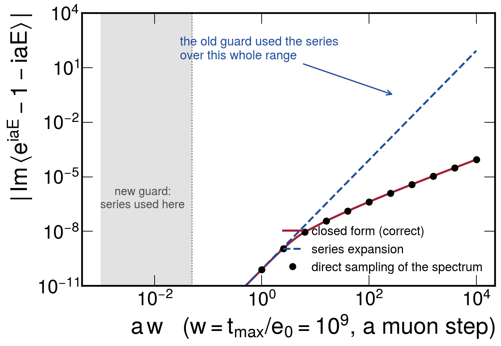
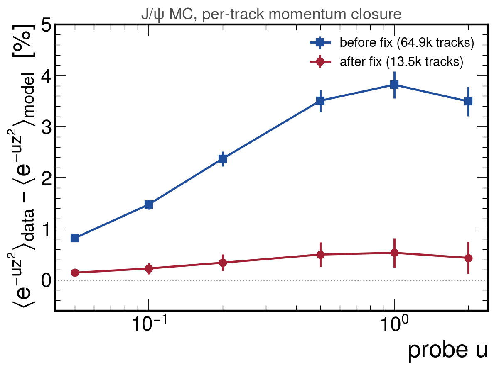
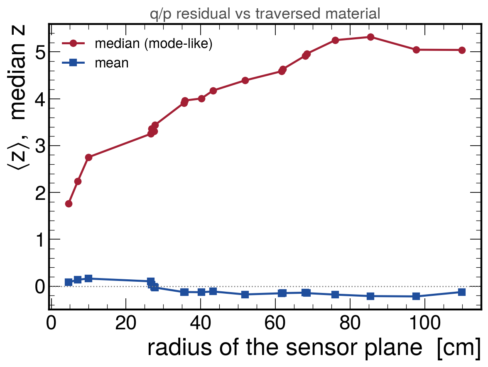
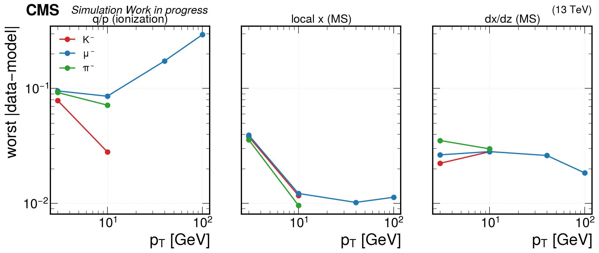
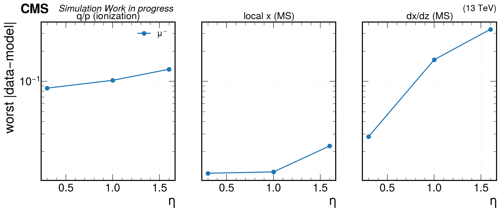
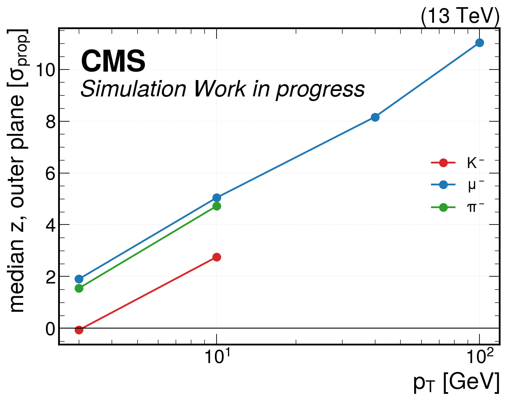

<!-- _class: title -->

# Predicting the PDF of the propagated track state

## A clean test of the resolution model against Geant4
## with no hits, no fit, no FSR and no selection

David Walter — 2026-08-04


---

## Why we needed a clean test

The resolution programme predicts the **full non-Gaussian distribution** of the track
state from first principles: ionization straggling (Urban compound-Poisson) and
multiple scattering (Molière), composed in transform space.

Every closure so far has been on a **compound object**:

| level | what is compared | what else is folded in |
|---|---|---|
| block | standardized block residual | fit weighting, estimation noise (dilution $\sim10^{-6}$ for muon ionization) |
| track | $q/p$ pull vs generated | hits, cluster-position biases, the fit itself |
| candidate | $J/\psi$ mass | + QED FSR, acceptance, mispairing, background |

A disagreement therefore has **many possible owners**, and the recurring
"model core is a few percent narrow" could never be pinned on the physics model.

---

## Josh's suggestion (2026-08-04)

> "Set up a clean propagation test. Propagate a single particle with fixed initial
> state, and also run the simulation many times for that one particle with the same
> initial state, and try to predict the pdf of the final 5d helix state on the sensor
> surface. Then you don't have fsr or any of the detector effects, selection etc.
> **A propagator that gives you the full pdf on the propagated state rather than just
> the covariance matrix.**"

Two things at once:

- a **unit test with ground truth** — Geant4 *is* the right answer by definition, so a
  disagreement is unambiguously the transport-fluctuation model;
- the **deliverable** itself — a propagator returning a PDF, which drops straight into
  the unbinned mass fit.

Built and run. This talk: the test, one bug it found, and what the model gets right.

---

<!-- _class: plots -->

## The test

<div class="figrow">
  
</div>

<div class="cap">

One muon, one **fixed** initial state (no vertex or kinematic smearing), simulated $10^6$ times —
the only thing that varies between events is the Geant4 random seed, so the spread **is** the
propagation kernel. Against it, **one** deterministic Geant4e propagation gives the reference state.

</div>

---

## What is compared, and where

For each crossed sensor plane $k$ and each linear functional $a$ of the local
5D state $x = (q/p,\ dx/dz,\ dy/dz,\ x,\ y)$:

$$ z \;=\; \frac{a\cdot\left(x^{\rm sim}_{k}-x^{\rm ref}_{k}\right)}{\sigma_k},
\qquad \sigma_k^2 = a^{T} C_k\, a $$

$x^{\rm sim}_k$ = true simulated state, $x^{\rm ref}_k$ = deterministic reference,
$C_k$ = the propagator's own noise covariance (the width a Gaussian track fit works with).

Compared through the **characteristic function** $\varphi(t) = \langle e^{itz}\rangle$:

- the simulated sample gives it for free — $\hat\varphi(t)=\frac1N\sum_j e^{itz_j}$, no binning, no fitting;
- the model *is* built in transform space, so no numerical inversion enters the test
  and cannot be blamed for a disagreement (inversion is used only to draw lineshapes);
- $\mathrm{Im}\,\varphi$ is the **skew** — the mean-vs-mode physics, tested directly.

Also quoted: the bounded average $\langle e^{-uz^2}\rangle$; small probe $u$ weights the
far tail, $u\sim1$ the core.

---

## The two sides

**Ground truth — no new simulation machinery needed.**
A simulated hit already stores exactly the local 5D parameterization at the sensor
entry face: entry point, $\theta,\phi$ at entry, and $|p|$. So the truth is read
straight out of the standard simulation output.

**Model — from the deterministic propagation.**
Per Geant4 step the propagator exports the physics that generates the noise:

- **ionization**: the Urban compound-Poisson parameters — two excitation channels
  (rate $a_{1,2}$ at energy $e_{1,2}$) and the $\delta$-ray channel (rate $a_3$,
  $1/E^2$ spectrum between $e_0$ and $t_{\rm max}$);
- **multiple scattering**: the raw material and kinematics ($Z_{\rm eff}$, $A_{\rm eff}$,
  $\rho d$, $p$, $\beta$, $d/X_0$), from which the screened-Rutherford
  (Molière) transform is built offline.

The model CF is then the product over all steps of the single-step transforms,
each evaluated at its own transported weight.

---

## Exact per-step weights <span class="footnote">(new; the fit cannot do this)</span>

The step loop transports the accumulated noise and *then* adds the step's own
contribution, so noise made at step $s$ is transported by steps $s+1\ldots N$ only.
Writing $J_s$ for the cumulative transport from the leg start through step $s$:

$$ A_{s\to k} \;=\; \Big(\textstyle\prod_{m=j}^{k} F_m\Big)\, J_s^{-1},
\qquad w_{s,k} \;=\; \big(A_{s\to k}^{T} a\big)_{\rm component} $$

$F_m$ = transport Jacobian of leg $m$ (sensor $m\!-\!1\to m$), $j$ = the leg containing step $s$.

- The propagator now optionally logs $J_s$ at **every** Geant4 step, so each step's
  noise reaches any surface **exactly**.
- The track fit instead has to pool steps into blocks and use one RMS-matched scalar
  weight per block — unavoidable there, but it would be a confound here, because
  the tails are the whole point.

**Closure check, run before believing any disagreement:** the per-step weights reproduce
the propagator's own transported ionization covariance at ratio **1.0000** at every layer.

<div class="footnote">Plumbing only — the log is opt-in, stored separately, and leaves the existing step records byte-identical.</div>

---

## Setup — a material ladder in one job

$\mu^-$, $p_T = 10$ GeV, $\eta = 0.30$, $\phi = 0.20$; ideal geometry and the same
field map on both sides. **1.024M** simulated events (~17 events/s/core, so $10^6$ is
~16 min on 64 cores). One deterministic propagation.

The muon crosses **20 sensors from $r = 4.6$ cm to $r = 110$ cm** — so a single job gives
the test at increasing traversed material, from "beam pipe + one pixel layer" to the
full tracker.

**99.63%** of events cross exactly the same modules through the same faces.

### Two geometry traps found on the way

- **$\eta = 0$ is unusable**: the pixel barrel ladders have a module boundary at $z=0$, so a
  track at exactly $\eta=0$ threads the gap in all three layers and produces **no pixel hits at all**.
- **The ray matters**: over an 18-point $(\eta,\phi)$ grid the fraction of events crossing every
  module cleanly ranged from **14.6% to 100%**. Edge-grazing rays force event dropping —
  exactly the selection effect the test exists to remove. The ray is chosen empirically.

---

<!-- _class: section -->

# Results

---

## What each residual isolates

Multiple scattering barely changes $|p|$ — in this sample it contributes $\sim10^{-7}$
of the $q/p$ variance. So the two functionals cleanly separate the two physics models:

| residual | dominated by | why it matters |
|---|---|---|
| $q/p$ | **ionization straggling only** | first real test of the muon Urban tail: at block level in the fit its leverage is $\sim10^{-6}$, so it was never measurable |
| local $x$, $dx/dz$ | **multiple scattering** | tests the first-principles Molière transform with no tuning |

Both are tested at every one of the 20 planes.

---

## A bug the test found immediately

The $\delta$-ray transform $\langle e^{iaE}-1-iaE\rangle$ was evaluated by series
expansion whenever $|a| < 10^{-6}$.

But the $1/E^2$ spectrum runs up to $E = w \equiv t_{\rm max}/e_0$, so the expansion
parameter is $a\,w$, **not** $a$ — and for muons $w \sim 10^{8}\!-\!10^{10}$
(a 10 eV $e_0$ against a multi-GeV kinematic $t_{\rm max}$).

- At $w=10^9,\ a=10^{-6}$ the series gives $\mathrm{Im} = -8.3\times10^{-2}$
  where the truth is $-6.5\times10^{-6}$ — **four orders of magnitude**, in the term that
  carries the skew.
- Stacked over ~350 steps this turned the model CF into a pure oscillation at small $t$.
- Same function as the 4 Aug skew fix: that fix correctly *added* the cubic imaginary
  term, but into a branch selected in the wrong regime — silently zero before, silently
  enormous after.

**Fix:** switch on $|a|\,w < 5\times10^{-2}$. Below that the closed form is
cancellation-limited and the series is the accurate branch; they agree to $3\times10^{-4}$ across the overlap.

---

<!-- _class: plots -->

## The bug, verified against direct sampling

<div class="figrow">
  
</div>

<div class="cap">

Importance-sampled evaluation of the $\delta$-ray transform (points) sits on the closed form (red)
over the whole range; the series (blue) departs as soon as $a\,w \gtrsim 1$. $a$ = conjugate variable
times the step's momentum-per-energy factor, $E$ = energy transfer in units of $e_0$.

</div>

---

<!-- _class: plots -->

## Impact: most of the "few-percent core" was this term

<div class="figrow">
  
</div>

<div class="cap">

Per-track momentum closure on $\text{B}\to J/\psi + X$ MC, **same production, same events**, model
recomputed. At $u=1$: $(+3.82\pm0.27)\%\ \to\ (+0.53\pm0.29)\%$ — now compatible with zero.
The recurring "model core is a few percent narrow", seen at track and candidate level and as the
mass likelihood's preference for a reduced resolution scale, was **dominated by this term**.

</div>

---

<!-- _class: plots -->

## Ionization: the model reproduces the Geant4 kernel

<div class="figrow">
  
</div>

<div class="cap">

Left: characteristic function, simulation vs model, real and imaginary parts — **the imaginary part
is the skew**, matched. Right: the lineshape over four decades of density, including the sharp Landau
peak and the long $\delta$-ray tail out to $z\sim-150$. $z$ = residual in units of the propagator's own width.

</div>

---

## Ionization — the numbers

| quantity | result |
|---|---|
| $\lvert\text{data}-\text{model}\rvert$ in $\langle e^{-uz^2}\rangle$ | $5\times10^{-4}$ in the far tail ($u=10^{-5}$), $0.012$ at $u=10^{-3}$, worst **$0.086$** at $u\sim0.1$ <span class="footnote">(corrected 6 Aug: the original run sampled 3 of the 20 layers and quoted $\le0.05$; over all 20 the worst is 0.086, at the thinnest layer)</span> |
| mean energy loss | $\lvert\langle z\rangle\rvert \le 0.22$ at every plane $\;\Rightarrow\;$ agrees with Geant4 to $(0.5\pm0.2)\%$ of the 30 MeV total |
| mean-vs-mode | median $z$ grows $+1.8 \to +5.0$ from the first to the last plane |

**The mean-vs-mode displacement measured directly.** The refit subtracts the *mean*
loss; the typical track loses less, so its momentum sits high. This is the same effect
identified on 4 Aug as the largest single term in the mass-scale closure budget —
here it is measured with nothing else in the way.

**Since this talk (5 Aug): the chain is now closed quantitatively.** Only a fraction of
a loss fluctuation survives into the fitted $q/p$ — each loss element only affects the
hits downstream of it. That fraction has been measured on sim-hit refits:
$T = +0.413 \pm 0.009$ (93k tracks; barrel 0.3–0.5, forward higher). Then
(mean $-$ mode) $\times\ T \approx 1.5$–2.5 MeV, which **is** the +0.2$\times10^{-3}$
peak displacement seen at candidate level. The effect measured here propagates to the
mass scale with the right size.

**One convention to be careful with:** the exported factor mapping a step's energy loss
to $d(q/p)$ is written for positive charge. The charge has to be reapplied by hand —
it flips the sign of the skew, so it is not cosmetic.

---

<!-- _class: plots -->

## Mean loss closes; the mode walks away from it

<div class="figrow">
  
</div>

<div class="cap">

$q/p$ residual against traversed material, in units of the propagator's own width. The **mean** stays flat and
near zero — the mean-loss model is right. The **median** grows steadily: the loss distribution is
one-sided, so the typical track keeps more momentum than the mean-corrected reference. A Gaussian
track fit sees only the first of these two curves.

</div>

---

<!-- _class: plots -->

## Multiple scattering: ~1% with no tuning

<div class="figrow">
  
</div>

<div class="cap">

Local $x$ at the outermost plane. The untuned first-principles Molière transform and the simulation
lie on top of each other: $\lvert\text{data}-\text{model}\rvert \le 0.012$ (and $\le 0.0015$ for
$u \le 0.01$) at every layer; $\le 0.028$ for the angle $dx/dz$.

</div>

---

## Multiple scattering — and a known effect, cleanly measured

Robust 68% half-width of the residual, in units of the propagator's own width:

| functional | half-width across the 20 planes |
|---|---|
| local $x$ | **0.84 – 0.92** |
| $dx/dz$ | 0.90 – 0.98 |

The simulated **core is 8–16% narrower** than the propagator's noise matrix — the known
core-vs-Rossi statement: the noise matrix carries the full Rossi variance while the core
of the distribution is Highland-like.

Previously this was only accessible through fits that had to trim tails, pool steps and
fight estimation noise, and the answer moved with the trimming convention. Here it is
measured **without pooling, without trimming and without dilution** — and the model
still matches, because the model contains the tail that makes the core narrow.

**Update (6 Aug): the block-level route now agrees.** Repeating the in-fit ECF scan with
the *exact* block eigenvalue spectra instead of one effective rank gives a core
3.9 / 5.5 / 7.0% narrower at $u$ = 0.5 / 1 / 2 — against 1.7–2.9% with the old
approximation, which was flatly inconsistent with the direct measurement above. Two
completely different methods, one through the fit and one with nothing in the way, now
give the same physics.

---

<!-- _class: section -->

# The scan:
# where the model stops working

---

## The campaign

The test is cheap enough to run as a **scan**, and a scan is what turns "the model
works" into "the model works *here*". Ten points, 200k events each (baseline 1.02M):

| axis | points | what it stresses |
|---|---|---|
| $p_T$ ($\mu^-$, $\eta=0.30$) | 3, 10, 40, 100 GeV | $\delta$-ray tail hardens; muon brems enters |
| $\eta$ ($\mu^-$, $p_T=10$) | 0.30, 1.00, 1.60 | material grows; incidence angle shallows |
| species ($\eta=0.30$) | $\mu^-,\pi^-,K^-$ at $p_T$ = 3, 10 | $T_{\max}$ collapses |

**The ray must be re-chosen at every point** — cleanliness depends on $p_T$ because the
trajectory bends. Over the scanned $(\eta,\phi)$ grids the clean fraction ranged from
**15% to 100%**; the chosen rays give 94–100% for muons.

<div class="footnote">Hadrons keep 79–87%: decay in flight plus nuclear interaction. Quoted, not corrected — the loss is on lifetime, uncorrelated with the transport fluctuations under test.</div>

---

<!-- _class: plots -->

## $p_T$: the model has an upper validity limit

<div class="figrow">
  
</div>

<div class="cap">

Worst $|$data $-$ model$|$ over all layers and probes. **Ionization degrades above 10 GeV
— 0.086 → 0.173 → 0.294 at 10 → 40 → 100 GeV — while both MS functionals stay flat.**
Ionization-only degradation is what a missing *radiative* process looks like: muon
bremsstrahlung and pair production are not in the model. Predicted in this talk's backup;
now measured. 40 GeV is the Z-muon scale, so this is not academic.

</div>

---

<!-- _class: plots -->

## $\eta$: the test breaks before the model does

<div class="figrow">
  
</div>

<div class="cap">

$q/p$ and local $x$ hold up. **The angle $dx/dz$ degrades by 12× — 0.028 → 0.164 → 0.329.**
The tail is still right ($\le 0.006$ for $u \le 10^{-3}$); only the **core width** moves.
That pattern — one component, core only, growing with $\eta$ — is the signature of a
missing **Jacobian**, not of missing physics. Next slide: it is exactly $\sec\theta_{\rm inc}$,
and it is a bug in *this comparison*, not in the fit.

</div>

---

## Diagnosed: a missing $\sec\theta_{\rm inc}$ in the comparison

Divide the measured width by $\sec\theta_{\rm inc}$, taken from the reference direction
($\cos\theta_{\rm inc} = 1/\sqrt{1+(dx/dz)^2+(dy/dz)^2}$), and it collapses:

| $\eta$ | $\sec\theta_{\rm inc}$ range | rob68 range | **rob68 $\times\cos\theta_{\rm inc}$** |
|---|---|---|---|
| 0.30 | 1.05 – 1.08 | 0.82 – 0.98 | **0.897 ± 0.040** |
| 1.00 | 1.31 – 1.56 | 1.25 – 1.47 | **0.912 ± 0.046** |
| 1.60 | 1.08 – 2.61 | 1.02 – 2.57 | **0.942 ± 0.038** |

At $\eta=1.60$ the factor spans 1.08 → 2.61 **inside one sample** (disks vs barrel) and the
width tracks it point for point. Corrected, it equals the local-$x$ column everywhere —
the same narrow core, no anomaly left.

**Where it comes from**: the exported $Q$ is **curvilinear**; the residual is a **local**
slope $dx/dz = u_x/u_z$. With $u_z = \cos\theta_{\rm inc}$, the slope carries a
$\sec\theta_{\rm inc}$ Jacobian the offline comparison never applied.

---

## Retraction — and why only one component moved

**An earlier version of the previous slide called this a defect in the fit's process noise.
It is not.** The CVH fit applies `curv2localJacobianAltelossD` at every measurement surface
(`…MakerG4e.cc:2027, 2104, 2165`). The bug is in `cf_propagation_test.py`, which applies
**local**-basis functionals to a **curvilinear** covariance (`load_model` reads $Q$, $F$
raw). The fit is fine — **this test was wrong**.

The component-by-component pattern is the confirmation:

| functional | affected? | why |
|---|---|---|
| $q/p$ | **no** | same variable in both frames — all ionization results stand |
| local $x$ | **no** here | shallow incidence lies in the local $y$–$z$ plane, so $x$ is untouched |
| $dx/dz$ | **yes**, $\times\sec\theta_{\rm inc}$ | $u_z = \cos\theta_{\rm inc}$ sits in the denominator |

- **What survives**: everything on the ionization slides, the brems limit, the species
  results, and MS at central $\eta$ (where $\sec\theta_{\rm inc} \le 1.08$).
- **What needs redoing**: MS at forward $\eta$, once $H$ is exported. Cheap.
- **The scan earned its keep anyway** — a bug that is a 5% effect at $\eta=0.30$ and a
  factor 2.6 at $\eta=1.60$ is invisible until you scan $\eta$.

---

<!-- _class: plots -->

## Species: the kaon lever, at propagation level

<div class="figrow">
  
</div>

<div class="cap">

Median $z$ at the outermost plane — the mean-vs-mode displacement the fit mistakes for a
momentum bias. It orders exactly as $T_{\max}$ does: at $p_T$ = 10, $\mu^-$ 5.04, $\pi^-$
4.72, $K^-$ **2.75**; at $p_T$ = 3, $\mu^-$ 1.90, $\pi^-$ 1.55, $K^-$ **$-0.07$** — the
kaon's mean-vs-mode gap essentially *vanishes* once $T_{\max}$ collapses to 37 MeV.

</div>

---

## Species — why this is the lever the calibration wants

$T_{\max} = 2m_ec^2\beta^2\gamma^2/(1+2\gamma m_e/M+(m_e/M)^2)$ falls steeply with mass:

| $p$ [GeV] | $\mu$ | $\pi$ | $K$ | $\mu/K$ |
|---|---|---|---|---|
| 3 | 646 MeV | 408 MeV | **37 MeV** | 17× |
| 10 | 4.78 GeV | 3.44 GeV | **402 MeV** | 12× |

- **The kaon is the lever; the pion is a control.** $\pi$ tracks $\mu$ to within 10% on
  every number here — its mass is too close. Only $K$ moves.
- **The ionization model is *better* for kaons**: worst $|$d$-$m$|$ = **0.028** at $p_T$=10
  against the muon's 0.086. With the $\delta$-ray tail kinematically capped, the compound
  Poisson is far better conditioned — the block-level claim that "the energy-loss width
  becomes genuinely fittable" for slow hadrons, now demonstrated with nothing in the way.
- So the multi-species programme is validated at the level where it can be trusted: the
  species dependence of the mean-vs-mode is *physics we can predict*, not a nuisance.

---

## Summary

- **Built the clean propagation test**: one fixed-state muon, $10^6$ Geant4 simulations,
  20 sensor planes from 4.6 to 110 cm, compared against one deterministic propagation
  entirely in transform space.
- **It found a real bug on first contact** — the $\delta$-ray series was being used far
  outside its validity, giving a term wrong by four orders of magnitude. Fixing it removes
  most of the "few-percent narrow core" that has followed this programme at every level:
  $(+3.8\to+0.5)\%$ on the per-track momentum closure.
- **Ionization**: model matches the Geant4 kernel to $5\times10^{-4}$ in the far tail,
  worst $0.086$ at $u\sim0.1$ and at the thinnest layers, with the skew right and the mean
  loss good to $(0.5\pm0.2)\%$.
- **Multiple scattering**: untuned Molière matches to $\le 0.012$ absolute; the 8–16% narrow
  core is reproduced rather than fitted.
- **The scan turned it into a validity map**: ionization holds to $p_T \lesssim 20$ GeV and
  breaks above (missing brems); MS holds everywhere tested. The apparent forward angular
  blow-up was **this test's own bug** — a missing $\sec\theta_{\rm inc}$ from comparing a
  local slope against a curvilinear covariance. Found *because* the scan was run.
- The per-step weights close against the propagator's own covariance at **1.0000** —
  the disagreements above are physics, not bookkeeping.
- **Confirmed since (5 Aug)**: re-running everything the bug touched now prefers an
  *unreduced* resolution scale on the B→J/ψ+X rungs ($r$ = 1.00, was ≤ 0.85) — this
  diagnosis, verified independently at candidate level. It fixed the core **width**, not
  the peak **offset**: all rungs still sit at +0.15–0.26$\times10^{-3}$, which the
  corrected (and correctly tiny) skew is not supposed to absorb.

---

## What's next

**Immediate — re-run what the bug touched.** Track-level and candidate-level closures at
full statistics, the mass-likelihood scale scan, and the parts of the MC closure ladder
that used the ionization skew.

**Extend the test.** ~~Scan $p_T$ and $\eta$; repeat for kaons and pions.~~ **Done — see
the scan section.** It found the model's upper $p_T$ limit (brems above ~10 GeV), a real
defect in the angular process noise at forward $\eta$, and confirmed the kaon lever.

What the scan opened instead:

- **Export the curv$\to$local Jacobian $H$ per leg** and use $H^T a$ in `model_variance`.
  One branch in `G4ePropagationExport.cc`, one line offline, models re-run in seconds.
  Until then, quote MS only at central $\eta$, where $\sec\theta_{\rm inc} \le 1.08$.
- **Add muon brems/pair production** to the model, or state $p_T \lesssim 20$ GeV as its
  validity range and treat higher momenta separately.
- Re-examine the MS core numbers with $H$ applied: at $\eta=0.30$ the correction is only
  5–8%, so "core 8–16% narrower" moves a little, not qualitatively.

**Then the deliverable Josh named:** the same machinery already produces a per-track
PDF rather than a covariance matrix. With it validated against Geant4, it can replace
the Gaussian mass constraint in the fit and the learned density in the unbinned mass fit.

---

<!-- _class: title -->

# Backup

---

## Backup — what is not covered yet

- **The ionization response used in the FIT is not the one measured here.** The
  linear-response CF weights each loss dof by its influence in $V$, which carries the
  $\alpha$-truncated variance and so transmits almost none of the skew. The real
  response is the hit-path lever arm, $T \approx 0.41$ (measured 5 Aug). Until the
  fluctuation term uses $T$, the model cannot absorb the peak offset — this test is
  clean, its consumer is not yet.
- **Scattering displacement within a step.** The angular kick times its lever arm is
  included; the direct positional smearing generated inside one step is not.
  Second order for thin steps, but not zero for thick ones.
- **Muon bremsstrahlung and pair production** are absent from the model. Negligible at
  10 GeV, not at 40 GeV — this is the first thing the $p_T$ scan will expose.
- **The standardizing width** is the propagator's truncated one by construction, so
  $z$ is not an $O(1)$ variable: the ionization residual has a core of order one under a
  tail reaching $|z|\sim10^3$. That is why the comparison is quoted in transform space.
- **The 0.37% of dropped events** are geometric (a large scatter near a module edge, or a
  decay in flight) and are quoted rather than corrected.

---

## Backup — how to reproduce

```
cleanprop/scan_ray.sh 500                     # pick a clean ray
cleanprop/run_cleanprop_sim.sh 128 8000 0.30 0.20 10   # ground truth
cf_propagation_test.py --targets  --sim <file> --out targets.txt
cmsRun runCleanPropModel.py pt=10 eta=0.30 phi=0.20 targets=targets.txt
cf_propagation_test.py --compare --sim '<dir>/*.root' --model model.root \
                       --functionals qop locx
```

Conditions are pinned to the CVH refit drivers on both sides
(2016 `Extended` geometry, design conditions, grid field). Note that the
`run2_design` + `Ideal` combination yields a geometry with **no pixel sensitive
volumes** in this release — hence the explicit pin.

Full write-up, including the per-layer tables and every caveat:
`Documents/Resolution/NOTES.md` (entry of 2026-08-04) and
`calibration_studies/resolution/cleanprop/README.md`.
