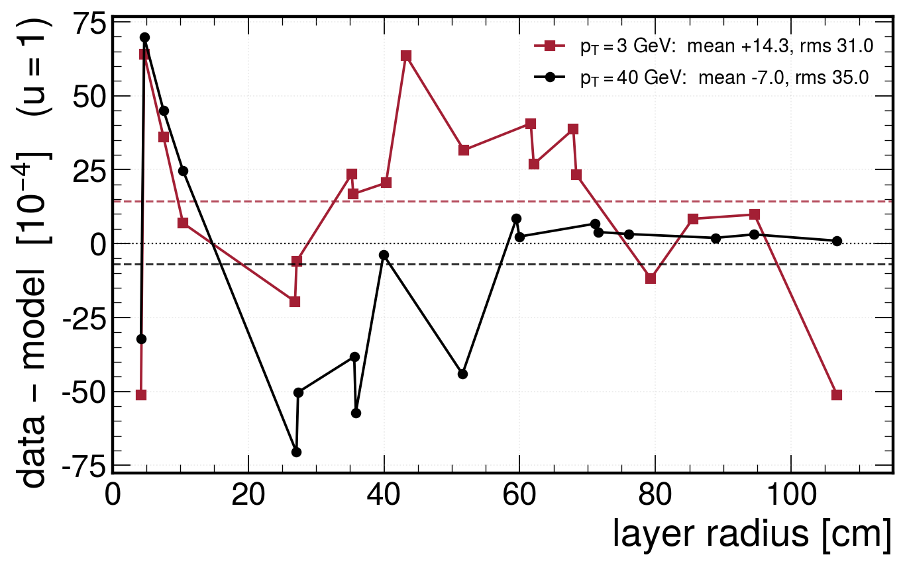
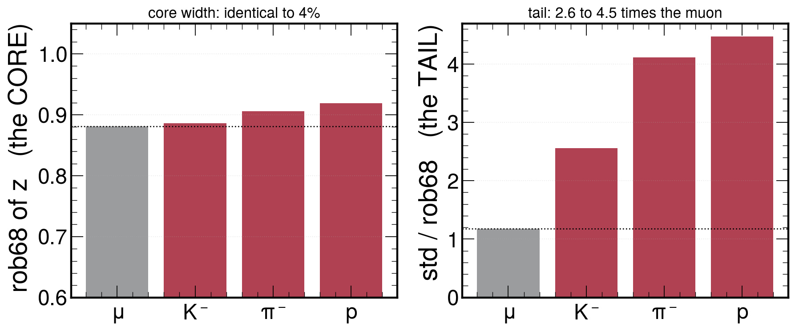
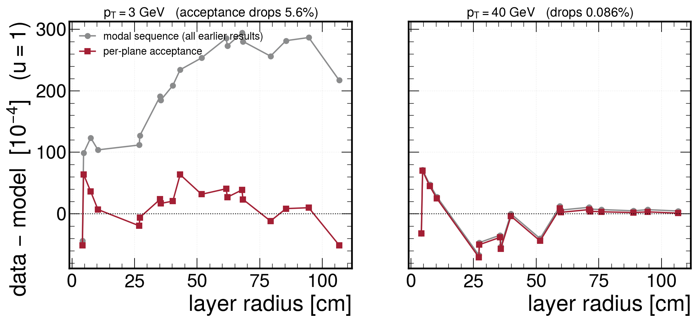

<!-- _class: title -->

# Predicting the PDF of the propagated track state

## A clean test of the resolution model against Geant4
## with no hits, no fit, no FSR and no selection

### 2 of 3 — the transport model alone

David Walter — 2026-08-12
Z mass working group


---

## Why we needed a clean test

The resolution programme predicts the **full non-Gaussian distribution** of the track
state from first principles: ionization straggling (Urban compound-Poisson) and
multiple scattering (Molière), composed in transform space.

Every closure so far has been on a **compound object**:

| level | what is compared | what else is folded in |
|---|---|---|
| block | standardized block residual | fit weighting, estimation noise (dilution $\sim10^{-6}$ for muon ionization) |
| track | $q/p$ pull vs generated | hits, cluster-position biases, the fit itself |
| candidate | $J/\psi$ mass | + QED FSR, acceptance, mispairing, background |

A disagreement therefore has **many possible owners**, and the recurring
"model core is a few percent narrow" could never be pinned on the physics model.

---

## The idea

> "Set up a clean propagation test. Propagate a single particle with fixed initial
> state, and also run the simulation many times for that one particle with the same
> initial state, and try to predict the pdf of the final 5d helix state on the sensor
> surface. Then you don't have fsr or any of the detector effects, selection etc.
> **A propagator that gives you the full pdf on the propagated state rather than just
> the covariance matrix.**"

Two things at once:

- a **unit test with ground truth** — Geant4 *is* the right answer by definition, so a
  disagreement is unambiguously the transport-fluctuation model;
- the **deliverable** itself — a propagator returning a PDF, which drops straight into
  the unbinned mass fit.

Built and run. This talk: what the test is, and what the model does and does not get right.

---

<!-- _class: plots -->

## The test

<div class="figrow">
  
</div>

<div class="cap">

One muon, one **fixed** initial state (no vertex or kinematic smearing), simulated $10^6$ times —
the only thing that varies between events is the Geant4 random seed, so the spread **is** the
propagation kernel. Against it, **one** deterministic Geant4e propagation gives the reference state.

</div>

---

## What is compared, and where

For each crossed sensor plane $k$ and each linear functional $a$ of the local
5D state $x = (q/p,\ dx/dz,\ dy/dz,\ x,\ y)$ — curvature, the two **direction slopes**, and
the two **positions** in the sensor's local frame:

$$ z \;=\; \frac{a\cdot\left(x^{\rm sim}_{k}-x^{\rm ref}_{k}\right)}{\sigma_k},
\qquad \sigma_k^2 = a^{T} C_k\, a $$

$x^{\rm sim}_k$ = true simulated state, $x^{\rm ref}_k$ = deterministic reference,
$C_k$ = the propagator's own noise covariance (the width a Gaussian track fit works with).
$dx/dz,\,dy/dz$ are **tangents**, not angles (equal in radians for small deflections).

Compared through the **characteristic function** $\varphi(t) = \langle e^{itz}\rangle$:

- the simulated sample gives it for free — $\hat\varphi(t)=\frac1N\sum_j e^{itz_j}$, no binning, no fitting;
- the model *is* built in transform space, so no numerical inversion enters the test
  and cannot be blamed for a disagreement (inversion is used only to draw lineshapes);
- $\mathrm{Im}\,\varphi$ is the **skew** — the mean-vs-mode physics, tested directly.

Also quoted: the bounded average $\langle e^{-uz^2}\rangle$; small probe $u$ weights the
far tail, $u\sim1$ the core.

---

## The two sides

**Ground truth — no new simulation machinery needed.**
A simulated hit already stores exactly the local 5D parameterization at the sensor
entry face: entry point, $\theta,\phi$ at entry, and $|p|$. So the truth is read
straight out of the standard simulation output.

**Model — from the deterministic propagation.**
Per Geant4 step the propagator exports the physics that generates the noise:

- **ionization**: the Urban compound-Poisson parameters — two excitation channels
  (rate $a_{1,2}$ at energy $e_{1,2}$) and the $\delta$-ray channel (rate $a_3$,
  $1/E^2$ spectrum between $e_0$ and $t_{\rm max}$);
- **multiple scattering**: the raw material and kinematics ($Z_{\rm eff}$, $A_{\rm eff}$,
  $\rho d$, $p$, $\beta$, $d/X_0$), from which the screened-Rutherford
  (Molière) transform is built offline.

The model CF is then the product over all steps of the single-step transforms,
each evaluated at its own transported weight.

---

## Exact per-step weights <span class="footnote">(new; the fit cannot do this)</span>

The step loop transports the accumulated noise and *then* adds the step's own
contribution, so noise made at step $s$ is transported by steps $s+1\ldots N$ only.
Writing $J_s$ for the cumulative transport from the leg start through step $s$:

$$ A_{s\to k} \;=\; \Big(\textstyle\prod_{m=j}^{k} F_m\Big)\, J_s^{-1},
\qquad w_{s,k} \;=\; \big(A_{s\to k}^{T} a\big)_{\rm component}\big/\sigma $$

$F_m$ = transport Jacobian of leg $m$, $j$ = the leg containing step $s$. The propagator now
optionally logs $J_s$ at **every** Geant4 step, so each step's noise reaches any surface **exactly**.

**Where the weight ends up:** it scales the *argument* of that step's exact log-CF, and the
exponents add — so the step's full Landau/Molière **shape** arrives at the surface, not just
its variance:

$$ \log\varphi_z(t) \;=\; \sum_{s} S_s\big(w_{s,k}\,t\big) $$

- The track fit instead pools steps into blocks with one RMS-matched scalar weight per
  block — unavoidable there, but a confound here, because the tails are the point.

**Closure check, run before believing any disagreement:** the per-step weights reproduce
the propagator's own transported ionization covariance at ratio **1.0000** at every layer.

<div class="footnote">Plumbing only — the log is opt-in, stored separately, and leaves the existing step records byte-identical.</div>

---

## Setup — a material ladder in one job

$\mu^-$ at $p_T = 3$ and $40$ GeV, $\eta = 0.30$, $\phi = 0.70$; ideal geometry and the same
field map on both sides. **200k** simulated events per momentum, one deterministic
propagation each (~17 events/s/core).

The muon crosses **19 sensor planes from $r = 4.2$ cm to $r = 107$ cm** — so a single job
gives the test at increasing traversed material, from "beam pipe + one pixel layer" to the
full tracker, at every plane along the way.

The same setup is run for $K^-$, $\pi^-$ and $p$ at $p_T=3$ to separate what is *transport*
from what is *species*.

**The ray is chosen, not arbitrary.** Which modules a straight-ish track clips is a strong
function of $(\eta,\phi)$, and edge-grazing rays force events to be dropped — the one
selection effect this test exists to avoid. Details in backup.

---

<!-- _class: section -->

# Results

---

## What each residual isolates

Multiple scattering barely changes $|p|$ — in this sample it contributes $\sim10^{-7}$
of the $q/p$ variance. So the two functionals cleanly separate the two physics models:

| residual | dominated by | why it matters |
|---|---|---|
| $q/p$ | **ionization straggling only** | first real test of the muon Urban tail: at block level in the fit its leverage is $\sim10^{-6}$, so it was never measurable |
| local $x$, $dx/dz$ | **multiple scattering** | tests the first-principles Molière transform with no tuning |

Both are tested at every one of the 20 planes.

---
<!-- _class: plots -->

## Ionization: the lineshape closes, the skew is over-stated

<div class="figrow">


</div>

<div class="cap">

$q/p$ at the outermost plane, $p_T$=3 — the **energy-loss** residual, a *different* functional
from the position residual quoted later. **Right:** the Landau peak and the $\delta$-ray tail
are both reproduced over four decades. **Left:** as a characteristic function — the two agree
through the core ($t\lesssim0.3$), then **both components oscillate with larger amplitude in
the model** ($\mathrm{Re}$ to $-0.45$ vs $-0.18$, $\mathrm{Im}$ to $0.67$ vs $0.42$), i.e. the
model's peak is too sharp. A **peak-shape** disagreement, not a width error.

</div>

---

<!-- _class: plots -->

## Multiple scattering: exact, with no tuning

<div class="figrow">


</div>

<div class="cap">

Local $x$ at the outermost plane, $p_T$=3. The untuned first-principles Molière transform and
the simulation lie **on top of each other** — characteristic function (real *and* imaginary)
and lineshape over 2.5 decades. **Nothing here is fitted.** This is the *shape* behind the
single closure numbers on the next slides, and it is the position residual those numbers use.

</div>

---

<!-- _class: plots -->

## The result: closes on average, scatters plane to plane

<div class="figrow">



</div>

<div class="cap">

Per-plane closure of the position residual at the core probe $u=1$, for a 3 GeV and a 40 GeV
muon. Dashed lines are the means. Nothing is fitted: the model is first-principles Molière
and Urban, evaluated with the propagator's own step records.

</div>

---

## Both momenta close — and what does not

| | $u=0.01$ | $u=0.1$ | $u=1$ | mean $\lvert z\rvert$ | std $z$ |
|---|---|---|---|---|---|
| $p_T$ = 3 GeV | +0.00016 | +0.00062 | **+0.00143** | 0.001 | 1.022 |
| $p_T$ = 40 GeV | −0.00012 | −0.00029 | **−0.00070** | 0.003 | 1.040 |

**Averaged over the planes the model closes at the $10^{-3}$ level** at both momenta — on a
distribution whose width was never fitted to it.

**Plane-to-plane the residual scatters by rms $\approx3\times10^{-3}$**, with excursions to
$7\times10^{-3}$: larger than the mean, and **the same size at 3 and at 40 GeV**.

That last point is the useful one. $\chi_c^2\propto1/(p\beta)^2$ and $\chi_a^2\propto1/p^2$, so
$\Omega=\chi_c^2/\chi_a^2$ is **momentum-independent** — a scattering-strength error gives the
*same fractional* effect at every momentum and would move both curves together. It does not.
The per-plane structure is **not yet explained**, and is the open item of this test.

---
<!-- _class: plots -->

## Hadrons: the core closes, the tail does not

<div class="figrow">



</div>

<div class="cap">

$p_T$ = 3 GeV, per-plane acceptance, with an inelastic veto applied (see next slide).
**rob68** $=\tfrac12(q_{84}-q_{16})$, the half-width of the central 68 % interval — it equals
$\sigma$ for a Gaussian but ignores the tails, so it measures the **core**. **std/rob68** is
then a pure tail index: it is $1$ for a Gaussian, $1.18$ for the muon here.

</div>

---
## Hadrons — what the two panels mean

**Left.** Core width identical for every species to within 4 % (muon 0.881 vs
0.886 / 0.906 / 0.919). **The model describes hadron multiple scattering as well as the muon's.**

**Right.** std/rob68 runs 2.6 – 4.5 against the muon's 1.18 — the entire excess is **tail**.
The probe dependence confirms it: deficits are largest at $u=0.01$ (tail-weighted), and
$K^-$ closes at $u=1$ as well as the muon. A mis-scaled width would do the opposite.

**Where it comes from.** The model's physics list has **ionization, bremsstrahlung and
transportation only — no hadronic processes**, so it cannot contain:

- **inelastic** — taggable. Hadrons lose ~95 % of $p_0$ in a discrete population where the
  muon's tail is smooth. A veto at 0.2 $p_0$ removes $\mu$ 0.003 %, $K$ 0.30 %,
  $\pi$ 1.4 %, $p$ 3.8 %.
- **nuclear elastic** — *not* taggable (it costs no momentum) and the dominant remainder.
  $\theta_N\approx18$ mrad vs Coulomb $\theta_0\approx0.2$ mrad, $\sim7\times10^{-4}$ per layer.

**A model gap with a known physical cause, not a calibration discrepancy.**

---
## Limitations of this test — read the numbers with these

**1. Acceptance is the delicate part.** A ray that scatters enough to miss or clip a plane
must be handled explicitly, and the obvious choice — requiring a common plane sequence — is
**tail-selective**, since a ray is dropped precisely when it scattered. Everything here
applies acceptance **per plane** instead; backup quantifies the difference.

**2. The reference is fixed; the ensemble is not.** The model propagates one
deterministic trajectory while the simulated rays spread to ~2 mm by the outer tracker.
Two consequences, both measured:
- **material sampling**, $\langle dE(\rm path)\rangle \neq dE(\langle \rm path\rangle)$ — the most-wandered
  quartile loses 1.6× more energy in the outer interval; 6 % of the total at $p_T$=3
- **state-dependent noise** — the per-step scattering PDF depends on how far the track
  has already deviated (variance ratio 0.990)

**3. Hadrons cannot be tested cleanly at all.** Any acceptance either truncates the
large-deflection tail or readmits nuclear interactions the model has no term for. The two
choices bracket the truth and neither *is* it.

**4. No hits, no fit, no FSR.** That is the point of the test — but it means nothing here
constrains hit reconstruction, the fit's weighting, or the mass lineshape. Deck 3.

---
## Summary

**The transport model reproduces Geant4 for muons at both momenta.** Averaged over planes
the position residual closes at the $10^{-3}$ level at 3 and at 40 GeV, with nothing fitted —
the model is first-principles Molière and Urban, evaluated on the propagator's own step
records. Four physics corrections were needed to get there (backup).

**Two things do not close, and both are identified.** The $q/p$ skew is over-stated —
a peak-vs-mean effect, not a width error. And plane-to-plane the residual scatters by
$\approx3\times10^{-3}$, equally at both momenta, so it is not a scattering-strength error;
that one is still open.

**Hadrons: core right, tail missing.** Quantified, with a known cause — the propagator's
physics list has no hadronic processes. Relevant to the $B\to J/\psi K$ channel, where the
kaon leg's resolution is right but its tail is $\sim2.5\times$ wider in second moment than a
Gaussian treatment assumes.

### Next
- nuclear elastic as a second component in the scattering prior (angle dof, not energy loss)
- the same test with sim-truth interaction tagging, so hadrons can be tested cleanly

---

<!-- _class: title -->

# Backup

---
<!-- _class: plots -->

## Backup — the acceptance choice, and why it is per-plane

<div class="figrow">



</div>

<div class="cap">

**Grey**: acceptance applied to the *whole track* — a ray counts only if its entire
(module, entry-face) sequence matches the modal one. **Red**: acceptance applied **per
plane**. Same events, same model, same code; only the selection rule differs.

</div>

---

## Backup — what the whole-track acceptance does

Requiring a common plane sequence discards a ray precisely when it **scattered enough to
miss or clip a module** — tail-selective by construction. It hands the comparison a
distribution with its tail cut off: narrower than the model, i.e. an apparent
"model over-predicts" that grows with radius.

It drops **0.086 %** of rays at $p_T$=40, **5.6 %** at $p_T$=3, and **21 - 26 %** for $p_T$=3
hadrons.

| | $u=0.01$ | $u=0.1$ | $u=1$ |
|---|---|---|---|
| $p_T$=3, whole-track | +0.00205 | +0.01072 | **+0.01982** |
| $p_T$=3, per-plane | +0.00016 | +0.00062 | **+0.00143** |
| $p_T$=40, whole-track | +0.00007 | +0.00009 | −0.00038 |
| $p_T$=40, per-plane | −0.00012 | −0.00029 | −0.00070 |

Per-plane is legitimate: the model's predicted variance at a plane is a property of the
**deterministic reference path**, not of the individual ray. It recovers **98.4 %** of the
dropped rays. Where the cut removes 0.086 % it changes nothing; where it removes 5.6 % it
was the entire discrepancy.

---

## Backup — two geometry traps

- **$\eta = 0$ is unusable**: the pixel barrel ladders have a module boundary at $z=0$, so a
  track at exactly $\eta=0$ threads the gap in all three layers and produces **no pixel hits
  at all**.
- **The ray matters**: over an 18-point $(\eta,\phi)$ grid the fraction of events crossing
  every module cleanly ranged from **14.6 % to 100 %**. Edge-grazing rays force event
  dropping — exactly the selection effect the test exists to remove. The ray is therefore
  chosen empirically, by scanning.

---

## Backup — bugs this test found, and what they cost

**1. Missing within-step lateral displacement.** The CF applied each step's angular kick
at a single point, so material traversed *inside* a step contributed no displacement —
the $DD\,(D\,L + L^2/3)$ next to the $DD\,D^2$ that was there. 8.8 % of the position
variance. Fixed by sub-step quadrature, converged at $N=2$.

**2. Moliere screening radius.** Missing Geant4's $(1+e^{-Z^2/1000})$ on $\chi_a^2$ —
~4.5 % of the MS exponent, and the dominant term of the four.

**3. Per-element $\chi_c^2/\chi_a^2$** (0.3 %) and **nuclear form factor $|F|\to|F|^2$**
(0.07 %). The latter was enabled because it is the correct equation, not because it
improved the closure — it does not, on its own.

**4. A retraction.** A residual mean growing with layer and flipping sign between the two
members of each stereo pair was read as a Geant4 field-integration chord error. It is the
acceptance cut: the reference does not cross a module at its centre, so the cut is
one-sided in local $x$ and a stereo pair projects it with opposite sign. Under per-plane
acceptance the same quantity is 0.001 $\sigma$ at every plane, on the same events.
A matched loose/tight stepper pair later bounded the real chord effect at $\lesssim10^{-4}$.

---

## Backup — how to reproduce

```
cleanprop/scan_ray.sh 500                     # pick a clean ray
cleanprop/run_cleanprop_sim.sh 128 8000 0.30 0.20 10   # ground truth
cf_propagation_test.py --targets  --sim <file> --out targets.txt
cmsRun runCleanPropModel.py pt=10 eta=0.30 phi=0.20 targets=targets.txt
cf_propagation_test.py --compare --sim '<dir>/*.root' --model model.root \
                       --functionals qop locx
```

Conditions are pinned to the CVH refit drivers on both sides
(2016 `Extended` geometry, design conditions, grid field). Note that the
`run2_design` + `Ideal` combination yields a geometry with **no pixel sensitive
volumes** in this release — hence the explicit pin.

Full write-up, including the per-layer tables and every caveat:
`Documents/Resolution/NOTES.md` (entry of 2026-08-04) and
`calibration_studies/resolution/cleanprop/README.md`.
