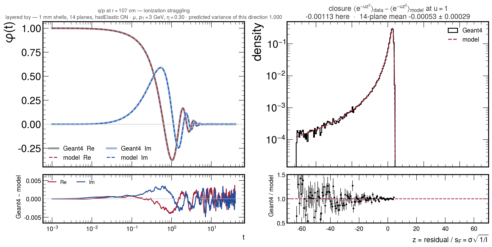
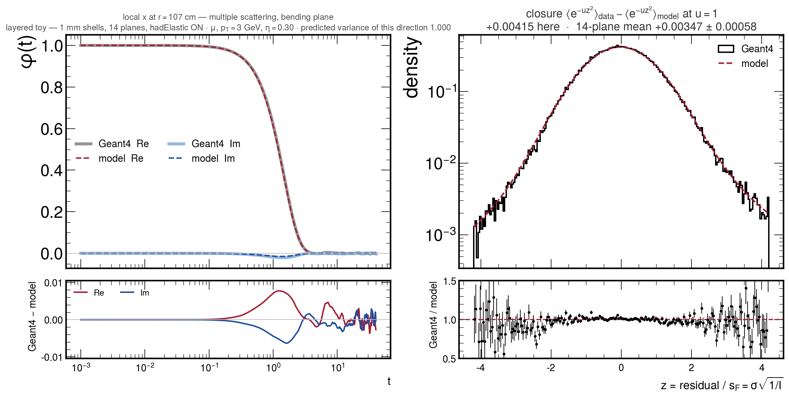
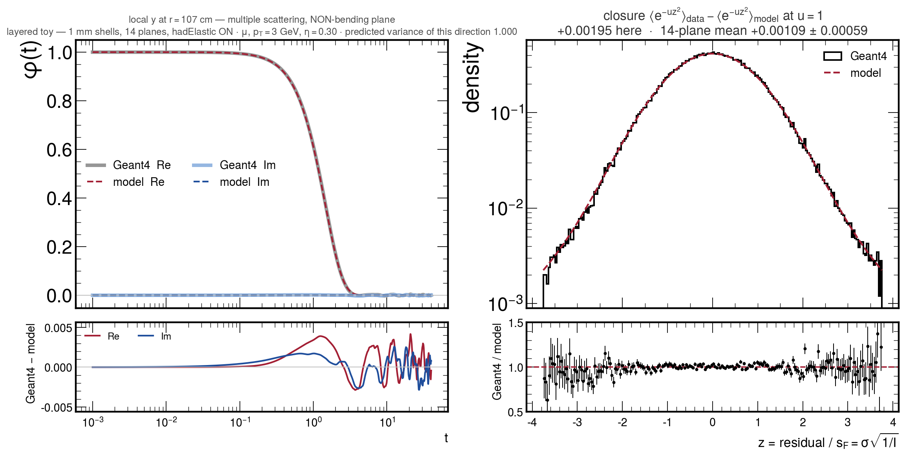
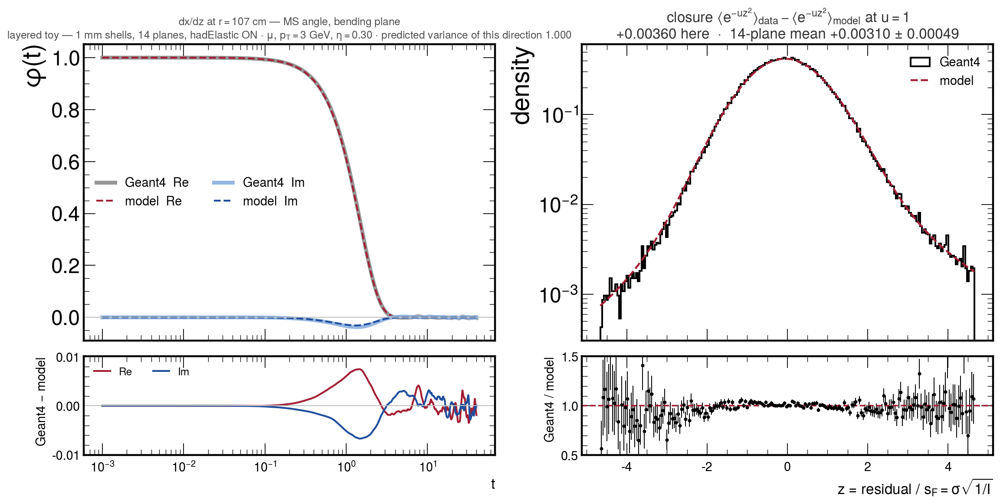
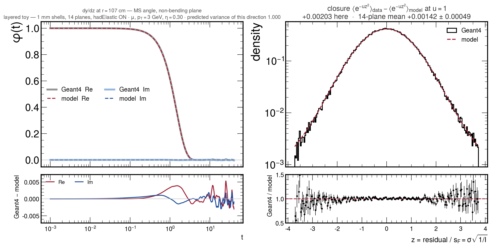

<!-- _class: title -->

# The clean propagation closure

## What changed in a week: ionization, scattering, nuclear elastic
## The transport model now closes on the toy geometry

David Walter — 2026-08-19
Z mass working group

---

## Reminder — where we were last Tuesday

The resolution programme predicts the **full non-Gaussian probability density** of the propagated
track state from first principles, not just its covariance matrix. The clean-propagation test is the
unit test for that prediction, with **Geant4 as ground truth** — so a disagreement has exactly
**one** possible owner: the transport-fluctuation model.

Last Tuesday: the muon position residual closed at the $10^{-3}$ level at 3 and at 40 GeV, with
nothing fitted, and **three things did not close**:

| last Tuesday's open item | today |
|---|---|
| plane-to-plane scatter $\approx3\times10^{-3}$, **equally at both momenta** — so not a scattering-strength error, and unexplained | **it was a bug in the test itself**, in the basis of the direction vectors |
| the $q/p$ **skew** over-stated — a peak-vs-mean effect, not a width error | four ionization / reference $dE/dx$ corrections |
| **hadrons could not be tested cleanly at all**: any acceptance cut either truncates the large-deflection tail or readmits nuclear interactions the model has no term for | the model now **has** that term, and the elastic arm needs no cut |

All three are addressed. Two of them were not what they looked like.

---

<!-- _class: plots -->

## Reminder — the test

  

One muon, one **fixed** initial state, simulated many times — the only thing that varies between
events is the Geant4 random seed, so the spread **is** the propagation kernel. Against it, one
deterministic Geant4e propagation gives the reference state.

---

## Reminder — what is compared

For each crossed plane $k$ and each direction $a$ in the local 5D state
$x = (q/p,\ dx/dz,\ dy/dz,\ x,\ y)$ — the curvature, the two **direction slopes** and the two
**positions** in the plane's own frame:

$$ z \;=\; \frac{a\cdot\left(x^{\rm sim}_{k}-x^{\rm ref}_{k}\right)}{s_k},
\qquad s_k = \sigma_k\sqrt{1/I_k} $$

with $\sigma_k^2 = a^{T}C_k\,a$ from the propagator's own noise covariance and $I_k$ the Fisher
information of the predicted density — so a **fat-tailed** law is not rewarded for having a large
variance.

Compared through the **characteristic function** $\varphi(t)=\langle e^{itz}\rangle$: the
simulation gives it for free with no binning and no fitting, and the model *is* built in transform
space, so no numerical inversion enters the test.

**One number per plane and direction:** the closure
$\langle e^{-uz^2}\rangle_{\rm data}-\langle e^{-uz^2}\rangle_{\rm model}$ at $u=1$, which weights
the core. **Positive means the data is narrower than the model.**

Study's own gauge: a relative change $\epsilon$ in the predicted variance moves this by $\approx 0.17\,\epsilon$.

---

<!-- _class: plots -->

## The layered toy geometry

  

Concentric shells at the **real barrel-layer radii** but with all the real tracker's complications
removed: no stereo modules, no gaps in $\varphi$, no support structure, vacuum between the shells.
Radial budget $15\times1\ \mathrm{mm}\times9\ \mathrm{g/cm^3} = 13.5\ \mathrm{g/cm^2}$, i.e. the
right total material in the wrong (deliberately simple) arrangement.
**Everything in this talk is $p_T = 3$ GeV, $\eta = 0.30$, on the outermost plane at $r = 107$ cm** —
the fully accumulated one, which is the statistic the fit integrates over.

---

<!-- _class: section -->

# What changed
# since last Tuesday

---

## The changes, at a glance

| what | how many | status |
|---|---|---|
| **Ionization + reference $dE/dx$** | 4 corrections | all **default-ON** |
| **Multiple scattering** | 7 harmonisations to Geant4 | 4 ON, 2 gauge-only, **1 reverted** |
| **Nuclear elastic scattering** | 1 new noise channel (+ recoil) | works, default-OFF |
| **Closure machinery** | 2 real bugs found and fixed | the two that mattered most |

Two rules were followed throughout, and both changed conclusions:

- **the model is a model of the simulation** — where the model and Geant4 held different numbers
  for the same quantity, Geant4's is the target, and the fix is a *harmonisation*, not a fit.
  **Nothing in this talk is tuned to the closure**;
- **every claim about "what Geant4 does" is a measurement**, from a driver that links Geant4's own
  models and cross sections and calls them directly — not a reading of the source.

---

## Ionization and the reference energy loss — 4 corrections

| # | correction | what was wrong |
|---|---|---|
| 1 | **exact $\delta$-ray spectrum** | the Urban knock-on channel samples a pure $1/E^2$ law; the true cross section carries $1-\beta^2T/T_{\max}$ ($+\,T^2/2E^2$ for spin-$\frac12$) |
| 2 | **Kokoulin radiative correction** | missing from the straggling variance the fit consumes |
| 3 | **charge-aware reference** | the reference $dE/dx$ was charge-blind. At these kinematics the charge-odd part is **Mott 99.3 %** and Barkas–Andersen 0.65–0.75 % |
| 4 | **species-dependent reference** | the extrapolator has **no $\pi$ or $K$ table** — every hadron is served from the **proton** table at $e = T\,m_p/m$. That preserves $\beta\gamma$ but **not** $T_{\max}$, which carries the projectile mass. The proton *is* that table and the muon has its own, so both are exact; the $\pi$ was too high by $+5.2\times10^{-3}$, the $K$ by 20× less |

---

## Ionization — the effect on the closure

$q/p$ closure, rms over the nine $u$ probes, outermost plane — afterwards **all eight species land
between 0.00020 and 0.00068**, and the species and charge structure is gone:

| | $\mu^-$ | $\mu^+$ | $\pi^-$ | $\pi^+$ | $K^-$ | $K^+$ | $\bar p$ | $p$ |
|---|--:|--:|--:|--:|--:|--:|--:|--:|
| before (3, 4 off) | 0.00217 | 0.00037 | 0.00758 | 0.00540 | 0.00311 | 0.00076 | 0.00301 | 0.00020 |
| **after** | **0.00045** | **0.00037** | **0.00054** | **0.00045** | **0.00051** | **0.00045** | **0.00068** | **0.00020** |

Every entry is $q/p$; correction 4 is what moves the pion and correction 3 the negative tracks.
**Nothing here is fitted** — each correction is a term put back into the analytic law, or a table
lookup given the right argument.

**A prediction was falsified, and it stays falsified.** Harmonising the atomic-excitation channels
with stock Geant4 11.2.2's one-channel 2021 Urban model gives **no** closure improvement. It was
built for a specific prediction, that prediction failed, and it is kept as a diagnostic and
default-off rather than quietly enabled.

---

## Ionization — two more things worth flagging

**An internal inconsistency had to be closed before correction 3 was safe to turn on** *(plumbing,
but it changes physics)*. The reference trajectory dispatched $dE/dx$ on charge while the
fluctuation model's mean loss did not, so with the charge-aware correction on, the two disagreed by
the **whole** charge-odd term on every negative track. They now agree to **1 unit in the last
place**, measured with a driver that calls both paths at the same kinematics — and the fix is
provably **exactly zero** on positive tracks, which is the free regression test.

**What this does not do:** four simultaneous changes went in, and the global fit that consumes the
exported derivatives has not been re-run. If a calibration parameter moves — particularly $M$, the
charge-odd one, which reads as physical misalignment — it will not be attributable.
**The next global fit should be run both ways.** That costs a fit, not a production.

---

## Multiple scattering — 7 harmonisations to Geant4

Where the Molière / screened-Rutherford transform is *physically different* from what Geant4 computes:

| # | harmonisation | size | status |
|---|---|---|---|
| 1–2 | **the atomic-electron term gets its own kinematic ceiling.** Molière's $Z(Z+1)$ gives the electrons the *nucleus's* angular range; exact two-body kinematics give $\theta^2(T)=\frac{2m_eT}{p^2}(1-T/T_{\max})$, turning over at $T=T_{\max}/2$ and capping at $\theta_{\rm G4}/2$ **exactly** | large | **ON** |
| 3 | **the form-factor ceiling is no longer snapped** to one of 13 half-decade rows — that snap inflated the MS second moment by **5.2 %** | 5.2 % | **ON** |
| 4 | **4.4× finer quadrature** in the scattering kernel — the documented $+2\times10^{-3}$ bias, never before sized in closure units | $-2\times10^{-4}$ | **ON** |
| 5–6 | **two constants** where model and Geant4 disagreed: Thomas–Fermi screening momentum ($+0.054\,\%$) and nuclear form-factor angle ($+0.49\,\%$) | $\sim3\times10^{-5}$ | gauge only |
| 7 | **Geant4's internal Gaussian / single-scattering split** in `WentzelVI` | $+2\times10^{-4}$ | **reverted** |

Effect on the toy at $p_T=3$: $\textsf{local }x$ closure max $|\sigma|$ **3.5–14.0 $\to$ 0.8–2.9**,
$\chi^2/\mathrm{ndf}$ **5.5–116.5 $\to$ 0.2–3.5**, 40–96 % of the rms removed on all eight species.
$q/p$ is untouched to five decimals — the two channels are cleanly separated.

Those improvements were measured at the **ladder mean** and **before** the basis fix below; re-attributing them plane by plane in the corrected basis is not done.

---

## Why harmonisation 7 was reverted — the toy is not the tracker

It was switched on last week on the "model the simulation" rule. It cannot honour it, and it does
not fail quietly: **it hard-fails the real geometry.**

The construction represents the correction as a Bessel series trusted only to $q^2U/4 = 60$; beyond
that it is clamped to zero, which is legitimate only where the characteristic function has already
died. Measured on the real tracker, $p_T=3$, $\mu^-$:

| plane | 0 | 5 | 9 | 14 | 18 |
|---|--:|--:|--:|--:|--:|
| $q^2U/4$ | 0.3 | 3267 | 18959 | 95366 | 170353 |
| verdict | clamp never fires | passes by 0.09 | passes by 0.25 | **guard fires** | **guard fires** |

Three to four **orders of magnitude** outside the validity region, and at the outer planes the clamp
is applied where $|\varphi|\sim e^{-5}$ — the same size as the closure being measured.

A bigger ceiling cannot fix it: the series terms go as $q^{2k}$ and already overflow double
precision. It is a **thin-target** construction, developed on the toy's dense 1 mm shells; the real
tracker's long air gaps and thin silicon are a different regime. **The other six are unaffected.**

---

## Nuclear elastic scattering — a new noise channel

Hadrons carry a process the model had no term for at all: `hadElastic`, a **rare, large-angle
single kick**. Over the modelled path there are only **0.03–0.11** of them per track, but with
$\langle\theta\rangle = 25$–35 mrad — **three to four times a whole track's Molière width**.
That is why it barely moves $q/p$ and wrecks the position.

The kick is isotropic, so its projected characteristic function is $J_0(t\,w\,\theta)$ and a
compound Poisson of mean $N$ contributes $S(t)=N\left(\mathbb{E}_\theta[J_0(t\,w\,\theta)]-1\right)$
— no centring term, and it rides on the **same** sub-step quadrature the scattering channel uses.

Local-$x$ closure, outermost plane, **nothing fitted**:

| | $\bar p$ | $p$ | $\pi^-$ | $K^-$ | $\mu^-$ |
|---|--:|--:|--:|--:|--:|
| channel off | 0.0402 | 0.0312 | 0.0224 | 0.0112 | 0.0015 |
| **channel on** | **0.0007** | **0.0006** | **0.0011** | **0.0011** | 0.0015 |
| clean-arm baseline | 0.0006 | 0.0010 | 0.0016 | 0.0010 | (exact null) |

Every species lands on its own baseline. The muon is an **exact** null — it has no `hadElastic`,
and the driver refuses to run for it.

---

## Nuclear elastic — validation, and the bug that nearly hid it

**Two-sided, not one-sided.** With the channel on, the model must *improve* against a simulation
arm that has elastic scattering and *degrade* against one that does not. Both hold — a tuned fudge
factor passes only one side.

**Elastic is essentially the whole nuclear effect.** Splitting the simulation into elastic-only and
inelastic-only arms: inelastic removes 11–19 % of the tracks and never moves the closure by more
than 1.5$\sigma$; elastic removes **4 tracks in 200 000** and is the entire effect.

**The antiproton failed, and it was my bug, not Geant4's.** The channel read the target $Z$ from the
*first* step of each leg — but the exported effective $Z$ is **not uniform within a leg** (there is
a beryllium beam pipe and hydrogen in there). So 8.8 % of the path got a **hydrogen** target, whose
kernel is **3× wider** at the same rate: a pure over-broadening, hence a 10× over-correction. Fixed
per step; **all four** species improved, which is the corroboration that matters.

**The recoil energy loss is in, and it is kept although it makes two numbers worse.** Verified three
ways: it is in Geant4, it is the two-body function of the deflection to 0.06 %, and the Geant4e
reference does *not* have it (0.046 MeV, matching the prediction to 7 %). A verified correction that
worsens agreement says the previous agreement was partly **cancellation**.

---

## The closure machinery had two real bugs — and they were the big ones

**1. The direction vectors were in the wrong basis.** The closure divided a **local** simulated
residual by a width built from a **curvilinear** direction vector. The two angle slopes were
literally **swapped** (local $dx/dz$ is essentially the curvilinear $\varphi$, local $dy/dz$ the
curvilinear $\lambda$ — correlation $\le0.14$ between the mislabelled pair), and local $y$ needs a
$\sec\lambda$ that does not cancel.

**The "bending-plane arch" was this, not physics.** Outermost plane, $u=1$, all corrections on:

| | $\mu^-$ $dx/dz$ | $p$ $dx/dz$ | $\mu^-$ $dy/dz$ | local $y$ (control) |
|---|--:|--:|--:|--:|
| wrong basis | $-0.0303$ | $-0.0331$ | $-0.0420$ | flat $-0.0156$ |
| **correct basis** | **$+0.0036$** | **$+0.0015$** | **$+0.0020$** | **$+0.0019$** |

The Jacobian itself was then verified against a closed-form finite-difference map (helix in a
uniform field with constant $dE/ds$, no propagator): **agreement to $10^{-10}$ on all 25 entries**,
four species, step-size independent over four decades. So the fix is not a refit of the basis.

---

## The second bug — the energy loss on arrival

$q/p$ **broke** when the basis was fixed ($\mu^-$ went to $-0.0110$), and that turned out to be a
genuine defect the wrong basis had been hiding.

The propagator exports the $dE/dx$ "on arrival" at the plane, taken from the **last** transport
step. When the plane sits on a **material boundary** — which it does whenever the target is a sensor
*face*, i.e. throughout this study — the propagation ends with a degenerate sliver just past the
boundary, and Geant4 attributes it to the volume on the **far** side. A factor **1550** between the
toy layer and vacuum, decided by which side of a surface a step boundary falls on.

The two cases need **opposite** treatment, so "always use the outside material" is wrong: one leg
arrives through air and its silicon reading is the bug, another genuinely traverses 188 µm of
silicon and its silicon reading is right. A per-step dump separates them by **length** — largest
sliver $7.8\times10^{-5}$ cm, smallest genuine traverse $3.1\times10^{-3}$ cm, a factor-40 gap — so
the criterion is a floor placed in the middle of it.

$\mu^-$ $q/p$ at the outermost toy plane: $-0.0110 \to -0.0011$.
**Production is unaffected** — the production maker propagates to the sensor mid-plane, which is not
a material boundary.

---

## Where the toy geometry stands now

Closure at $u=1$, **outermost plane**, all corrections on, in the corrected basis:

| | $q/p$ | local $x$ | local $y$ | $dx/dz$ | $dy/dz$ |
|---|--:|--:|--:|--:|--:|
| $\mu^-$ | $-0.0011\pm0.0006$ | $+0.0042\pm0.0008$ | $+0.0019\pm0.0008$ | $+0.0036\pm0.0008$ | $+0.0020\pm0.0008$ |
| $\mu^+$ | $+0.0010\pm0.0006$ | $+0.0040\pm0.0008$ | $+0.0014\pm0.0008$ | $+0.0042\pm0.0008$ | $+0.0015\pm0.0008$ |
| $\pi^-$ | $-0.0001\pm0.0006$ | $+0.0044\pm0.0008$ | $+0.0007\pm0.0008$ | $+0.0048\pm0.0008$ | $+0.0008\pm0.0008$ |
| $\pi^+$ | $+0.0001\pm0.0006$ | $+0.0024\pm0.0008$ | $+0.0012\pm0.0008$ | $+0.0027\pm0.0008$ | $+0.0014\pm0.0008$ |
| $K^-$ | $-0.0014\pm0.0008$ | $+0.0020\pm0.0008$ | $+0.0016\pm0.0008$ | $+0.0022\pm0.0008$ | $+0.0011\pm0.0008$ |
| $K^+$ | $-0.0018\pm0.0008$ | $+0.0022\pm0.0008$ | $+0.0023\pm0.0008$ | $+0.0019\pm0.0008$ | $+0.0035\pm0.0008$ |
| $\bar p$ | $-0.0019\pm0.0008$ | $+0.0026\pm0.0008$ | $+0.0031\pm0.0008$ | $+0.0022\pm0.0008$ | $+0.0028\pm0.0008$ |
| $p$ | $-0.0012\pm0.0008$ | $+0.0020\pm0.0008$ | $+0.0030\pm0.0008$ | $+0.0022\pm0.0008$ | $+0.0017\pm0.0008$ |

**Eight species, five directions, no species or charge structure left**, and every entry inside
$5\times10^{-3}$ — against $0.03$–$0.05$ a week ago in the four scattering directions and $0.008$ in
$q/p$ for the pion.

---

## What is left on the toy — one number, not a pattern

**$q/p$ is done, at this statistics.** $|{\rm closure}|\le0.0019$ on all eight species, mean
$-0.0008$. Nothing is species-ordered and nothing is charge-ordered any more.

**The four scattering directions all sit on the same small positive offset.** Mean over the 32
entries $+0.0024$, range $+0.0007$ to $+0.0048$ — the **same sign in every one of them**, so it is
one effect and not eight.

Positive means **the data is narrower than the model**: through the study's own gauge, the model
over-states the scattering variance by $\approx1.4\ \%$, i.e. **0.7 % in width**. For comparison,
that is well below the 5.2 % the form-factor snap alone was worth before it was removed.

It is **not** a correlation error — the position/angle correlation the model predicts agrees with
the simulation's to **0.4 %** ($0.9053$ vs $0.9013$ on the toy, and $-0.9264$ vs $-0.9127$ on the
real geometry). So it lives in the **scale or the shape** of the
single-scattering law, and that is the one thing still open on this geometry.

It is also the same size and the same sign on the real geometry (a $+0.005$ plateau in local $x$), which argues it is physics and not a toy artefact.

---

<!-- _class: section -->

# The five directions,
# one figure each

---

<!-- _class: plots -->

## $q/p$ — ionization straggling

  

Left: the characteristic function, real and imaginary part, model against Geant4, with the
difference below — **the closure is an integral over that difference panel**, so this is a plot of
the thing being measured. Right: the lineshape. The imaginary part is the **skew**, and it is
the item that was over-stated last Tuesday; it now agrees at the few $\times10^{-3}$ level across
the whole transform. This is the strongly asymmetric Landau-like law, tested out to a density of
$10^{-4}$ over 70 standard deviations of tail, with nothing fitted.

---

<!-- _class: plots -->

## Local $x$ — multiple scattering, bending plane

  

The hardest of the five: the bending-plane position accumulates every scattering kick along the
track *and* couples to the curvature. This is the direction that carried the "arch" in the wrong
basis, and the direction where the residual $+0.0042$ now sits. The difference panel shows it is a
**core** effect at $t\sim1$, not a tail effect.

---

<!-- _class: plots -->

## Local $y$ — multiple scattering, non-bending plane

  

The control for the bending plane. Scattering is isotropic, so a scattering-**magnitude** error
would appear in both projections equally; anything bending-plane-specific must come from the field,
the curvature coupling or the $q/p$–position correlation. This direction is also the one that was
wrong by $\sec\lambda$ until last week — it read a flat $-0.0156$ at every plane and now reads
$+0.0019$.

---

<!-- _class: plots -->

## $dx/dz$ — scattering angle, bending plane

  

Position is the transported integral of the angular kicks, so testing the **angle** directly
separates "is the kick distribution right" from "is the transport right" — the two are entangled in
the position result. In the wrong basis this direction read $-0.0303$ at this plane and was the
strongest evidence for a transport defect that does not exist.

---

<!-- _class: plots -->

## $dy/dz$ — scattering angle, non-bending plane

  

The fourth scattering direction, and the cleanest of them. Together with the three above it means
the **kick distribution and its transport are separately validated** in both projections — which is
what a 5×5 covariance block has to rest on before it can be trusted off-axis.

---

## The real geometry — four directions close, $q/p$ does not

Same measurement, 19 real barrel modules, $\mu^-$, $p_T=3$ GeV, $\eta=0.30$, outermost plane:

| direction | before the basis fix | after | re-exported today |
|---|--:|--:|--:|
| $dx/dz$ | $-0.0439$ | $-0.0021$ | $-0.0014$ |
| $dy/dz$ | $-0.0515$ | $-0.0047$ | $-0.0046$ |
| local $x$ | radial swing | flat, $+0.005$ plateau | $+0.0058$ |
| **$q/p$** | $+0.0676$ | $+0.0676$ | **$+0.0726$** |

The last column closes an open item: that export was **ten days and twelve
physics commits old**. Regenerating it moves the predicted width by **23 %** and
the closure not at all.

The four scattering directions behave **exactly as on the toy**, same $+0.005$ offset
in local $x$ — the corrected basis carries over unchanged.

**$q/p$ does not**: it grows $\times100$ with radius, from $+0.0007$ at the
innermost plane to $+0.0726$ at the outermost.

---

## A third geometry, built today: the real material as cylinders

Walk the reference through the real tracker, record every volume it crosses, and
re-emit that sequence as **coaxial cylinders** — real materials, real
thicknesses, real step structure; no stereo, no $\varphi$ gaps, no module edges.
142 volumes, 29 materials, 12.33 g/cm², reproduced against the real traversal to
**7×10⁻³** per volume with zero mismatches.

| | layered toy | real-material toy | real tracker |
|---|--:|--:|--:|
| ionization steps / leg | 1.79 | **12.83** | 17.26 |
| material-sampling spread | +1.15 % | **+1.46 %** | **+15.21 %** |
| $q/p$ closure, outermost | $-0.0011$ | **$-0.0019$** | $+0.0726$ |

**It has the detector's step structure and it closes.** So the step-structure
explanation for the $q/p$ growth is dead — and because a cylinder cannot have
material sampling, this toy is also the *control* the earlier study lacked.

---

## The real-geometry $q/p$ — what it is not

**It is not the basis fix in disguise.** On the real geometry the outer planes are reached
*through air*, so the arrival-energy-loss term is legitimately $\approx0$ there and the corrected
basis cannot move $q/p$ at all. That is also why the earlier test of it was **inconclusive**: before
the energy-loss export was fixed, the term was identically zero on 4 of the 19 planes *including the
outermost*, exactly where it would have had to act.

**It is not the magnetic field either** — measured, not argued. A model-field scan (simulation
fixed, planes fixed, uniform field at the path-averaged real value) shows the dominant channel is
the **reference bias**, and it is ~1000× more potent than the inhomogeneity-on-variance effect that
had been sized earlier: the reference displaces **22.3 µm per $10^{-4}$** of relative field error
against $\sigma_{{\rm loc}\,x}=2056$ µm, so ${\rm d(closure)} = -4.7\times10^{3}\,\epsilon^{2}$.
A per-mille field error is therefore worth $-0.0047$ — the size of the local-$x$ residual — but it
is **one-signed negative** at every $\epsilon$ and every direction, while the residual is positive.
The field is excluded by **sign**, not by size.

And $q/p$ specifically is field-blind: a **1 %** field error moves it by $0.00071$, so $+0.0676$
would need a **10 %** error.

Trap recorded for the next person: a uniform-field reference arm sits $0.06\sigma$ off the simulated mean, which manufactures a spurious *linear* response. Always check the mean before reading a sign off this statistic.

---

## Next steps — five explanations excluded today

$q/p$ on the real tracker is $+0.0726$ and grows $\times100$ with radius. It is **not**:

| excluded | how |
|---|---|
| a stale export | regenerated today: width moves 23 %, closure does not |
| acceptance | modal vs per-plane agree to $\le7.5\times10^{-4}$; $\le0.3$ % at the outermost plane |
| step structure | the real-material toy has it and closes at $-0.0019$ |
| **stereo modules** | H's $q/p$ row is **bit-identical** under a 100 mrad rotation about the module normal, while the position rows move by 0.104 |
| misalignment | the study runs the ideal geometry by necessity |

**Material sampling is now a measurement, not a bound: 40 %.** The real-material
toy is the control the earlier study lacked — its wander split is the *pure*
scattering-selection component, $-0.0016$ with no radial growth, against the
detector's $+0.065$.

---

## What is left, and the new handle

**~60 % is unexplained.** Surviving candidates: $\varphi$ segmentation, module
edges, and the real-geometry export/analysis chain itself.

**The test is two-sided for the first time.** The tail-truncation inflation that
made the wander cut only-one-sided measures **0.0003** on the toy, not 0.04.

**And a new observable.** The reference drifts off the simulated mean in $q/p$,
reaching $-1.07\sigma$ at the outermost plane and growing monotonically — while
on the real-material toy it is flat at $-0.10$ to $-0.18\sigma$. The median
offset is $+1.4$ to $+2.9\sigma$ on *both*, so that part is the known
mean-vs-mode; the detector grows a low-side $q/p$ tail with radius that no toy
has.

Next: bin the real-geometry residual by energy lost and confirm that tail is
carried by the same rays as the material-sampling 40 %.

A location shift alone would make the closure negative and it is positive, so the drift and the closure are not yet the same statement.

---

## Summary

- The closure at $p_T=3$ GeV is **resolved on the toy geometry** for **eight
  species in five directions** — every entry inside $5\times10^{-3}$, against
  $0.03$–$0.05$ in the four scattering directions a week ago.
- The two largest apparent defects — the plane-to-plane scatter open since last
  Tuesday, and the $q/p$ break it was hiding — were **bugs in the test and in an
  exported quantity**, not missing physics. Each fix was verified against an
  independent closed-form calculation.
- Real missing physics *was* found: **nuclear elastic scattering**, worth
  $0.011$–$0.040$ in the hadron position channel, now closing with **nothing
  fitted**, on an arm with $\sim100\ \%$ acceptance.
- A dozen items were changed, **all** harmonised to Geant4 or exact kinematics,
  **none** tuned to the closure. One was reverted, one prediction falsified.
- A **third geometry**, built today from the real material along the reference,
  has the detector's step structure and **closes** — killing that explanation
  and turning material sampling into a **40 % measurement**.
- **Open:** ~60 % of $q/p$ on the real tracker, and the $+0.0024$ scattering
  offset now on three geometries.
