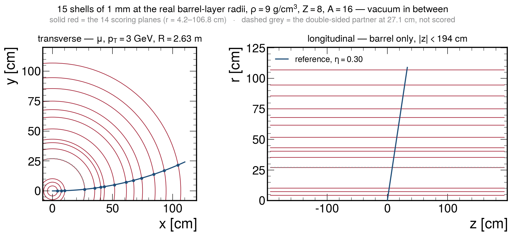

## BAD-A — the over-full ionization slide (clipped the "after" row)

| # | correction | what was wrong |
|---|---|---|
| 1 | **exact $\delta$-ray spectrum** | the Urban knock-on channel samples a pure $1/E^2$ law; the true cross section carries $1-\beta^2T/T_{\max}$ ($+\,T^2/2E^2$ for spin-$\frac12$) |
| 2 | **Kokoulin radiative correction** | missing from the straggling variance the fit consumes |
| 3 | **charge-aware reference** | the reference $dE/dx$ was charge-blind. At these kinematics the charge-odd part is **Mott 99.3 %** and Barkas–Andersen 0.65–0.75 % |
| 4 | **species-dependent reference** | the extrapolator has **no $\pi$ or $K$ table** — every hadron is served from the **proton** table at $e = T\,m_p/m$. That preserves $\beta\gamma$ but **not** $T_{\max}$, which carries the projectile mass. The proton *is* that table and the muon has its own, so both are exact; the $\pi$ was too high by $+5.2\times10^{-3}$, the $K$ by 20× less |

$q/p$ closure, rms over the nine $u$ probes, outermost plane:

| | $\mu^-$ | $\mu^+$ | $\pi^-$ | $\pi^+$ | $K^-$ | $K^+$ | $\bar p$ | $p$ |
|---|--:|--:|--:|--:|--:|--:|--:|--:|
| before (3, 4 off) | 0.00217 | 0.00037 | 0.00758 | 0.00540 | 0.00311 | 0.00076 | 0.00301 | 0.00020 |
| **after** | **0.00045** | **0.00037** | **0.00054** | **0.00045** | **0.00051** | **0.00045** | **0.00068** | **0.00020** |

All eight species land between 0.00020 and 0.00068 — the species and charge structure is gone.

---

## BAD-B — the over-full real-geometry slide (last line cut mid-glyph)

Same measurement, 19 real barrel modules, $\mu^-$, $p_T=3$ GeV, $\eta = 0.30$, outermost plane:

| direction | before the basis fix | after |
|---|--:|--:|
| $dx/dz$ | $-0.0439$ | $-0.0021$ |
| $dy/dz$ | $-0.0515$ | $-0.0047$ |
| local $x$ | radial swing | flat, on a $+0.005$ plateau ($\sim7\sigma$) |
| **$q/p$** | $+0.0676$ | **$+0.0676$ — unchanged** |

The scattering directions behave exactly as on the toy, including the same $+0.005$ positive
offset in local $x$. **$q/p$ is $\sim60\times$ the toy's $-0.0011$**, and it grows from $+0.0004$ at
the innermost plane to $+0.0676$ at the outermost.

**It is not the basis fix in disguise.** On the real geometry the outer planes are reached
*through air*, so the arrival-energy-loss term is legitimately $\approx0$ there and the corrected
basis cannot move $q/p$ — which is also why the earlier test of it was inconclusive and had to be
redone after the energy-loss fix.

**It is not the magnetic field either.** A model-field scan (simulation fixed, planes fixed) shows
the dominant channel is the reference bias: the reference displaces 22.3 µm per $10^{-4}$ of
relative field error against $\sigma_{\rm loc\,x}=2056$ µm, so a per-mille field error is worth
$-0.0047$ of closure — the size of the residual, but **one-signed negative** while the residual is
positive. And $q/p$ is field-blind: a **1 %** field error moves it by $0.00071$, so $+0.0676$ would
need a 10 % error.

---

## GOOD-1 — a full slide whose last element is a low footnote

**$q/p$ is done, at this statistics.** $|{\rm closure}|\le0.0019$ on all eight species, mean
$-0.0008$. Nothing is species-ordered and nothing is charge-ordered any more.

**The four scattering directions all sit on the same small positive offset.** Mean over the 32
entries $+0.0024$, range $+0.0007$ to $+0.0048$ — the **same sign in every one of them**, so it is
one effect and not eight.

Positive means **the data is narrower than the model**: through the study's own gauge, the model
over-states the scattering variance by $\approx1.4\ \%$, i.e. **0.7 % in width**. For comparison,
that is well below the 5.2 % the form-factor snap alone was worth before it was removed.

It is **not** a correlation error — the position/angle correlation the model predicts agrees with
the simulation's to **0.4 %**. So it lives in the **scale or the shape** of the
single-scattering law, and that is the one thing still open on this geometry.

It is also the same size and the same sign on the real geometry (a $+0.005$ plateau in local $x$), which argues it is physics and not a toy artefact.

---

<!-- _class: plots -->

## GOOD-2 — a plots slide whose caption runs to the last line

  

Concentric shells at the **real barrel-layer radii** but with all the real tracker's complications
removed: no stereo modules, no gaps in $\varphi$, no support structure, vacuum between the shells.
Radial budget $15\times1\ \mathrm{mm}\times9\ \mathrm{g/cm^3} = 13.5\ \mathrm{g/cm^2}$, i.e. the
right total material in the wrong (deliberately simple) arrangement.
**Everything in this talk is $p_T = 3$ GeV, $\eta = 0.30$, on the outermost plane at $r = 107$ cm** —
the fully accumulated one, which is the statistic the fit integrates over.

---

## GOOD-3 — a comfortable slide with room to spare

**An internal inconsistency had to be closed before correction 3 was safe to turn on.** The
reference trajectory dispatched $dE/dx$ on charge while the fluctuation model's mean loss did not,
so with the charge-aware correction on, the two disagreed by the **whole** charge-odd term on every
negative track. They now agree to **1 unit in the last place**.

**What this does not do:** four simultaneous changes went in, and the global fit has not been re-run.

---

<!-- _class: section -->

# GOOD-4 — a full-bleed
# section divider

---

## GOOD-5 — a slide that ends with a table, comfortably

| | $\bar p$ | $p$ | $\pi^-$ | $K^-$ | $\mu^-$ |
|---|--:|--:|--:|--:|--:|
| channel off | 0.0402 | 0.0312 | 0.0224 | 0.0112 | 0.0015 |
| **channel on** | **0.0007** | **0.0006** | **0.0011** | **0.0011** | 0.0015 |
