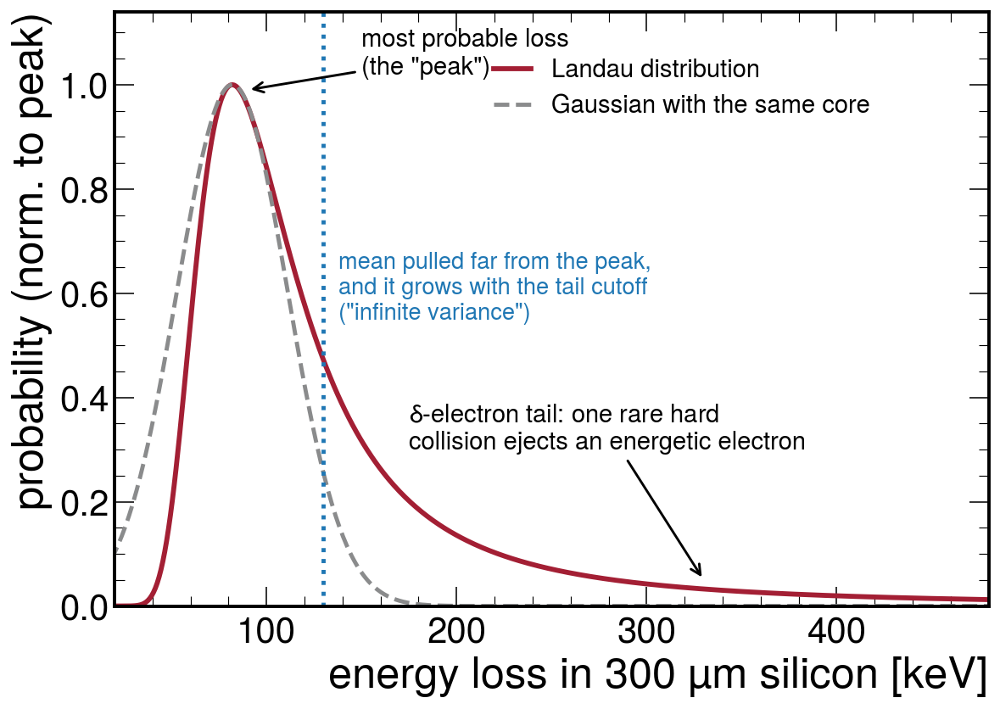
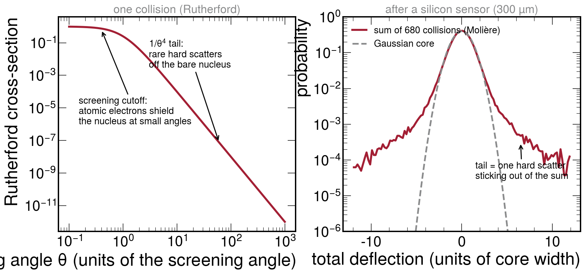
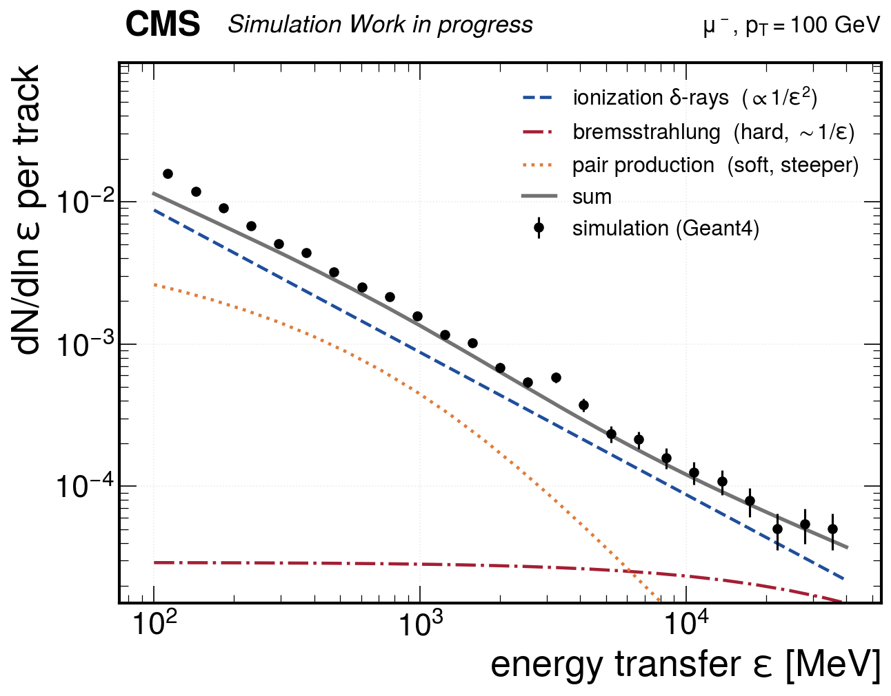
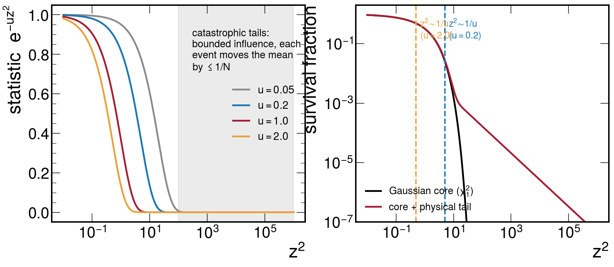

<!-- _class: title -->

# Characteristic functions for resolution calibration

## Why the usual width fits fail for tracker resolution —
## and the transform trick that fixes them

### 1 of 3 — the method. No results in this deck.

David Walter — 2026-08-12
Z mass working group
Muon momentum calibration

---

## Three random processes smear every track

As a muon crosses each tracker layer, things happen that we cannot predict, only
describe statistically:

1. **It loses energy** in collisions with atomic **electrons** (ionization).
   *Usually* many tiny losses — but occasionally one collision ejects an energetic
   electron (a **δ-ray**) and takes away far more.

2. **It changes direction** in collisions with atomic **nuclei** (multiple scattering, MS).
   *Usually* many tiny deflections — but occasionally one close encounter with a nucleus
   produces a large kick.

3. **It radiates** — bremsstrahlung and $e^+e^-$ pair production in the nuclear field.
   *Usually* nothing at all; occasionally a photon taking a sizeable fraction of the
   momentum. **Negligible below ~10 GeV, but 3.6% of the mean loss at $p_T$ = 40 GeV and
   11% at 100** — i.e. it matters exactly at the momenta the *Z* mass measurement uses.

The track fit needs the **width** of each process at every layer — that width *is* the
resolution model. All three share one personality: a well-behaved core plus rare, very
large outliers. The next three slides show what they look like.

---

<!-- _class: plots -->

## Ionization: the Landau distribution

Energy lost by a muon in one 300 µm silicon sensor. Most crossings lose ≈ 80 keV (the peak),
but the δ-ray tail extends to arbitrarily high losses. The tail is so heavy that the
<strong>mean</strong> sits far above the peak — and the <strong>variance is infinite</strong>:
whatever cutoff you place on the tail, the computed width depends on that cutoff, not on the
detector. This is why "the width of the energy loss" is not a well-defined number to fit.

---

<!-- _class: plots -->

## Multiple scattering: Rutherford, many times over

Left: a single deflection follows the Rutherford cross-section — flattened at small angles
(atomic electrons screen the nucleus), falling as 1/θ⁴ at large angles. Right: crossing one
sensor means ~700 such collisions; their sum (Molière's distribution) has a Gaussian core —
but a single rare hard scatter "sticks out" of the sum, producing tails a Gaussian
underestimates by orders of magnitude. Our measured track residuals show exactly this shape.

---

<!-- _class: plots -->

## Radiation: rare, but it carries the mean

Energy-transfer spectrum of a 100 GeV muon crossing the tracker, plotted so that a
1/ε spectrum is <strong>flat</strong>. <strong>Bremsstrahlung is flat</strong> — every decade
of ε contributes equally to the rate, so the <em>mean</em> is dominated by the hardest decade
while the <em>variance</em> is dominated by ε → E. That is why a radiative "width" is
meaningless and why it is (correctly) absent from the fit's covariance — and why a
<strong>CF term</strong> is the right way to put it back. Pair production is much softer yet
carries 58% of the radiative mean; treating the two as one shape gets the mixture wrong by
2.5×. Points: 10⁶ simulated muons; curves: Geant4's own cross sections, each normalised to
its own dE/dx.

---

## Why the usual width fit fails

The natural approach — a Gaussian likelihood, i.e. fitting the **average of the squared
residuals** — is exactly wrong for these distributions:

- An average of $z^2$ is dominated by the rare huge values. In our data the **median** $z^2$
  lands on the Gaussian expectation — $0.455$, the $\chi^2_1$ median — while the **mean**,
  which should be $1$, comes out at $4.9$–$147$ depending on the family
- Cutting the tails away doesn't help: the answer then depends on **where you cut**
  (we measured: the fitted MS width moves by 8% between two reasonable cut choices, and the
  ionization width by a factor of 5 between truncation conventions)
- This is precisely why the 2022 attempt found large fake corrections on simulation where
  the truth was zero — the tails, not the physics, were driving the fit

**What we need**: a way to measure the *core* width that (a) barely notices the tails, and
(b) doesn't introduce an arbitrary cutoff.

---

<!-- _class: plots -->

## The trick: average a bounded function instead

Instead of averaging z² (unbounded — one catastrophic track dominates), average
<strong>e−u·z²</strong> (left): it saturates, so even a 300σ outlier moves the
average by at most 1/N. The knob u chooses <em>how deep</em> the comparison looks (right):
large u probes only the core, small u includes more tail — <strong>smoothly, with no cut on
the data</strong>. Fitting the width means matching this average between data and model;
scanning u tests whether the answer is stable. <strong>This average is where the
characteristic function of the title enters</strong>: ⟨e−u·z²⟩ is a transform of
the z distribution, and Landau and Molière wrote their theories directly in transform
language — so the model side is an exact formula, tails included (backups 2–4).

---

## What we compare, in practice

For every hit and every layer crossing of every track, the fit already computes:

- **z² — the squared residual in units of the expected width.** If the resolution model is
  right, z² averages to 1 (like a per-hit χ²).
- **h — how much of that block's noise survives into the residual** (the "leverage",
  $h=\mathrm{tr}(V_bR)$; the rest is absorbed by the track refit). Hits $0.65$–$0.81$,
  scattering $0.39$, muon ionization $h\sim10^{-6}$ — essentially invisible, which the
  method exposes honestly rather than faking a constraint.

Both come **for free** from quantities the fit already stores — the whole analysis runs
offline on existing production files.

The comparison itself is one number per probe scale u:

$$ \big\langle e^{-u z^2} \big\rangle_{\rm data}
   \;\; \overset{?}{=} \;\;
   \big\langle e^{-u z^2} \big\rangle_{\rm model} $$

The **data side** is a plain average over hits/layers. The **model side** comes from the
physics — Landau/Urban energy loss and Rutherford/Molière scattering — which are *exact
analytic formulas in transform space*, tails included, no truncation. One 1D integral turns
that into the same bounded average (backup 4).

---

## Summary — and where the numbers are

**The problem.** Every layer contributes ionization, multiple scattering and radiation.
All three are a narrow core under a long tail. A width fit weights the tail by $z^2$, so
it is dominated by the rarest events and answers a question about outliers, not about
resolution.

**The construction.** Each process is a *compound Poisson* sum: a random number of
independent kicks. In transform space that becomes an exponent that simply **adds**
over layers and processes, with no Gaussian approximation anywhere:

$$\varphi(t)=\exp\Big[\sum_{\rm steps}\ n_s\big(\varphi_s(t)-1\big)\Big]$$

**The estimator.** Instead of $\langle z^2\rangle$ we compare $\langle e^{-uz^2}\rangle$,
a *bounded* function. One free knob $u$ moves the sensitivity smoothly from the far tail
($u\to0$) to the core ($u\sim1$). Nothing can be dominated by one event.

---

### The results live in the two companion decks

| deck | what is tested | how much machinery |
|---|---|---|
| **2 — clean propagation** | the transport model alone | no hits, no fit, no selection |
| **3 — track & mass resolution** | single-track fit, then the two-track mass | full fit |

Both use **prompt gun samples only** — muons, kaons, pions, protons, and $J/\psi\to\mu\mu$.

---

<!-- _class: section -->

# Backup:
# the mathematics

---

## Backup 1: from the track fit to z² — every symbol defined

The track fit minimizes $\chi^2 = r^T V^{-1} r$ where

- $r$ = the **residual vector**: all hit residuals (measured − predicted position)
  *and* the per-layer kink/energy-loss constraints of one track
- $V$ = the **covariance matrix** of $r$ under the resolution model: hit errors +
  multiple-scattering/energy-loss ("process noise") blocks — **the object we calibrate**
- Resolution parameter $i$ scales one block of $V$; its derivative $\partial V_i$ *is*
  that block ("which entries of $V$ does parameter $i$ inflate")
- $R$ = what replaces $V^{-1}$ **after the track parameters are fitted and eliminated**:
  $R = V^{-1} - V^{-1}F(F^TV^{-1}F)^{-1}F^TV^{-1}$ (gen-frozen closure: $R = V^{-1}$)

Per block: $\;q_i = (Rr)^T \partial V_i (Rr)$ = its squared-residual content;
$\;\nu_i = \mathrm{tr}(\partial V_i R)$ = its model expectation, $E[q]=\nu$. Then

$$ z^2 = q/\nu \;\;(\text{averages to 1 if the model is right}), \qquad
   h = \nu \;\;(\text{leverage: fraction of the block's noise actually measured}) $$

$H_{ii}$ = the Fisher information (curvature) for parameter $i$; the block eigenvalues
$\lambda_j$ are **per-direction leverages**. Both are stored; self-consistency
($H_{ii}=\nu^2$ on 1-dof blocks, $\Sigma\lambda=\nu$) holds to $10^{-7}$.

---

## Backup 2: why "compound Poisson", and where Landau comes from

Energy loss in a layer = a Poisson number of collisions, each drawing an energy from the
single-collision spectrum: a **compound Poisson process**. Its characteristic function is
*exact and simple*, because independent contributions **multiply** in transform space:

$$ \varphi(t) = \exp\Big[\, a\,\big(\langle e^{itE}\rangle_{\rm spectrum} - 1\big)\Big]
   \qquad a = \text{mean number of collisions} $$

**This is how Landau derived his distribution (1944)**: Rutherford spectrum $\propto 1/E^2$,
no upper cutoff → the Landau shape of slide 3; finite $E_{\max}$ → Vavilov.

**Urban** is Geant4's practical version of the same construction with three collision types:

| parameter | meaning | silicon (from our export) |
|---|---|---|
| $a_1,\;e_1$ | number and energy of excitations of atomic level 1 | $e_1 \approx 101$ eV |
| $a_2,\;e_2$ | same, level 2 | $e_2 \approx 160$ eV |
| $a_3$ | number of δ-ray (hard) collisions | O(10³)/300 µm |
| $e_0,\;E_{\max}$ | δ-ray spectrum range, density $\propto 1/E^2$ | 10 eV … kinematic limit |

Material enters **only through the counts** $a_j \propto \rho d$ → $\varphi = \exp(e^k S)$: one scale $k$, *linear in the exponent*.

---

## Backup 2b: radiation is the same construction, centred

Same compound Poisson, with the brems + pair spectra ($\nu = \varepsilon/E$) in place of
the $1/E^2$ δ-ray one — and **centred**:

$$ \varphi_{\rm rad}(t) \;=\; \exp\Big[\int\! d\nu\; \frac{dN}{d\nu}\;
   \big(e^{\,i a \nu E} - 1 - i a \nu E\big)\Big] $$

- The $-1-ia\nu E$ **subtracts the mean**, which is exactly right: the propagator's dE/dx
  table is built with `ionOnly=false` and has *already* removed the radiative mean. So
  "consistent mean + fluctuation" and "fluctuation with the mean subtracted" are the **same
  object** — centring forces $S'(0) = 0$ by construction.
- Nothing is re-derived: $dN/d\nu$ is tabulated per step from **Geant4's own**
  `G4MuBremsstrahlungModel` / `G4MuPairProductionModel`, each normalised to its own
  `ComputeDEDXPerVolume`. That fixes the mean exactly *and* gets the brems/pair mixture
  right, which a single hand-built shape did not (2.5× off at 5–15 GeV).
- **Why not simply add a variance instead?** For $d\sigma/d\nu \sim 1/\nu$ the second moment
  is dominated by $\nu \to 1$. A radiative variance would describe the one-in-a-thousand
  catastrophic radiator and inflate the error of the 99.9% that radiate nothing — while
  still not describing the radiators, which are outliers, not $1\sigma$ fluctuations.
  Excluding it from $V$ was right; the CF is where it belongs.

---

## Backup 3: multiple scattering — the same construction

Identical logic with angles instead of energies: a Poisson number
$N_{\rm scat} = \chi_c^2/\chi_a^2$ of collisions, each drawing a deflection from the
**screened-Rutherford** spectrum of slide 4 ($\chi_a$ = screening angle, $\chi_c$ = the
Rutherford strength):

$$ \varphi(t) = \exp\Big[ N_{\rm scat} \big( \langle e^{it\theta}\rangle - 1 \big) \Big] $$

— this exponent is Molière's theory (1948). Two practical points:

- A change of variables shows the exponent is one **universal shape**
  $S = N_{\rm scat}\, G(t\sqrt{\chi_a^2})$ — $G$ computed once, every layer/material is a
  table lookup
- The single-collision spectrum is the same one Geant4's WentzelVI model uses; we verified
  our screening constants against Geant4's and adopted its nuclear form factor (the far-tail
  cutoff from the finite nuclear size)

---

## Backup 4: from the model CF to the fitted statistic

Two steps connect $\varphi(t)$ to the bounded average $\langle e^{-uz^2}\rangle$ of the main slides.

**1. The fit sees a *diluted* version of the noise.** The block residual is the fit's *estimate*
of the layer's noise: a fraction $h$ (the leverage) is truly measured, the rest is estimation
noise from all the other hits — $z = \sqrt{h}\, z_{\rm true} + \sqrt{1-h}\, z_{\rm est}$, and
independent contributions multiply in transform space:

$$ \varphi_z(t) = \varphi_{\rm true}(\sqrt{h}\, t)\; \cdot\; e^{-\frac{1}{2}(1-h)t^2} $$

(This is how the method *proved* muon ionization unmeasurable: $h \sim 10^{-6}$ →
the first factor is 1 — nothing left to fit.)

**2. The Weierstrass transform.** We fit $\langle e^{-uz^2}\rangle$; the model delivers
$\varphi_z(t) = \langle e^{itz}\rangle$. The bridge: *a Gaussian in $z$ is a Gaussian in $t$*,
so averaging over events turns $e^{itz}$ into $\varphi_z(t)$:

$$ e^{-uz^2} = \int \frac{dt}{\sqrt{4\pi u}}\; e^{-t^2/4u}\, e^{itz}
   \quad\Longrightarrow\quad
   E\big[e^{-uz^2}\big] = \int \frac{dt}{\sqrt{4\pi u}}\; e^{-t^2/4u}\;
   \mathrm{Re}\,\varphi_z(t) $$

The statistic is the model CF smeared with a Gaussian (= the Weierstrass transform):
one well-behaved 1D integral, validated to 6 digits against the Gaussian closed form.
