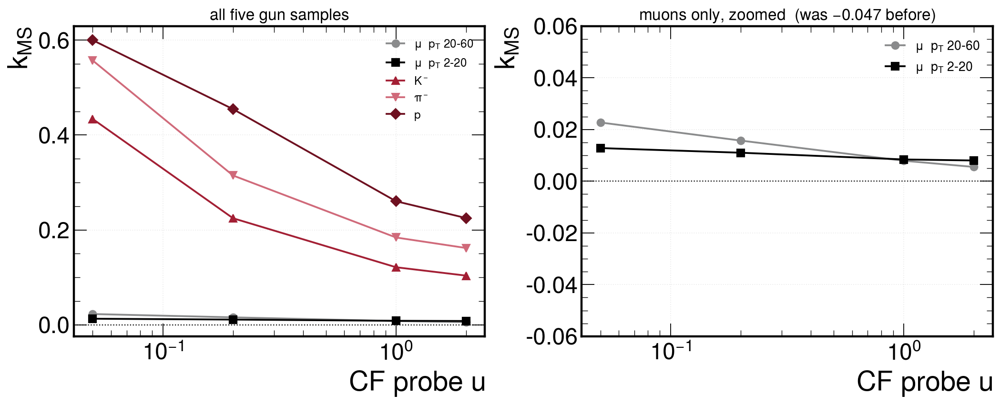
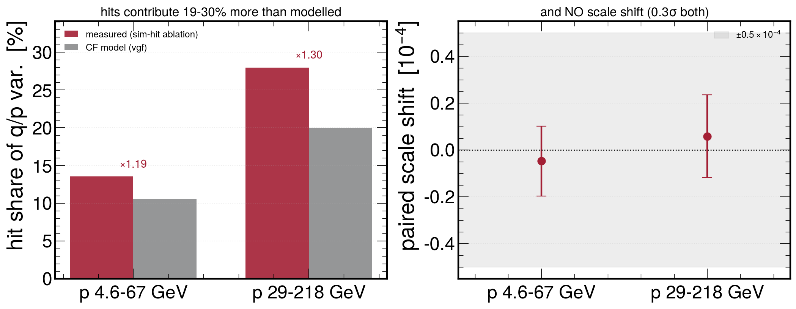
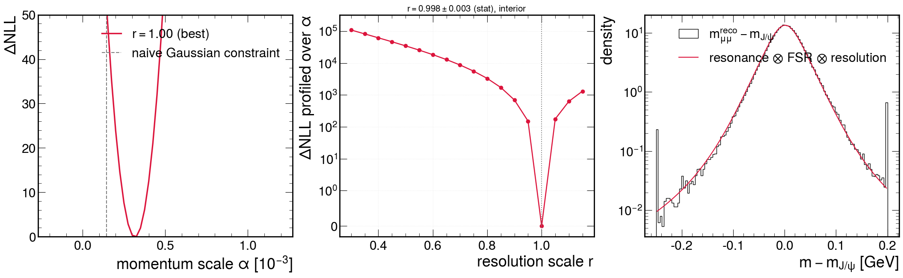

<!-- _class: title -->

# The resolution of a single track —
# and an exact mass likelihood

### 3 of 3 — the fit, on gun samples

From block-level calibration to a per-track resolution function,
and towards replacing the χ² mass constraint

David Walter — 2026-08-12
Z mass working group
Muon momentum calibration

---

## Where we start, and the two questions

The companion deck (*Characteristic functions for resolution calibration*) established the
block-level machinery: for every hit and every layer crossing, the fluctuation widths the fit
assumes are compared against simulation with **exact, tail-complete physics models**
(Landau/Urban for energy loss, Molière for scattering), and calibrated per layer / material
group.

Today's two questions build directly on that:

1. **Can we predict the resolution of one specific track** — not just its Gaussian error bar,
   but the full shape of its momentum-error distribution, tails included?

2. **Can the Gaussian χ² mass constraint be replaced by the exact likelihood** —
   resonance ⊗ QED radiation ⊗ per-candidate resolution — the idea from the original
   program plan?

The answer to both is yes, and (1) is the missing piece that makes (2) possible.

---

## The fitted momentum error is a weighted sum of layer noises

The track fit combines all hits into the momentum at the reference point. In its linear
regime this makes the momentum error an **explicit weighted sum** over every source of
noise on the trajectory:

$$ \delta(q/p) \;=\; \sum_{\mathrm{blocks}\ b} w_b^{\,T} n_b
   \qquad\quad
   \begin{array}{l}
   n_b = \text{noise of block } b \text{ (hit error, scattering kick, energy-loss}\\
   \text{fluctuation)},\ w_b = \text{how strongly it moves the fitted } q/p
   \end{array} $$

- The weights $w_b$ are computable **inside the fit for free** (one extra linear solve per
  track) — now exported per block (new branches `resinfv`, `resinfvarv`)
- **Exact bookkeeping check**: the per-block variance contributions must add up to the
  fit's own error bar, $\sum_b v_b = \sigma^2_{q/p}$. Verified at **ratio 1.0000 on every
  track**; ~1 track in 16,000 fails a 0.5% guard. Nothing is missing.
- Because the blocks are independent, the **full distribution** of $\delta(q/p)$ follows by
  multiplying the blocks' characteristic functions — the same exact Landau/Urban and
  Molière models of the block-level fits, now evaluated per track with that track's weights

One product of analytic functions + one integral = **the predicted lineshape of this
track's momentum error**, Gaussian core, scattering shoulder, δ-ray tail and all.

---
<!-- _class: plots -->

## Track-level closure on five gun samples

$k_{\rm MS}$ = the log-scale on the MS exponent that closes $\langle e^{-uz^2}\rangle$.
Small $u$ weights the **tails**, $u\sim1$ the **core**.
$k_{\rm MS}>0$ means the **data is wider** than the model; $k_{\rm MS}\approx2\times$ the
fractional width excess. ~300k tracks per sample.

---
## What the closure says

| sample | $n$ | mean $k_{\rm MS}$ | probe span |
|---|---|---|---|
| $\mu$, $p_T$ 20–60 | 319 831 | **+0.0129** | 0.017 |
| $\mu$, $p_T$ 2–20 | 319 685 | **+0.0100** | 0.005 |
| $K^-$, $p_T$ 2–20 | 300 007 | +0.2209 | 0.330 |
| $\pi^-$, $p_T$ 2–20 | 299 267 | +0.3045 | 0.395 |
| $p$, $p_T$ 2–20 | 292 659 | +0.3850 | 0.375 |

**Muons: $-0.047 \to +0.013$.** The four transport corrections account for it, and the
residual is **momentum-independent** (+0.0129 at $p_T$ 20–60 vs +0.0100 at 2–20) — as a
genuine Molière residual must be, since $\Omega=\chi_c^2/\chi_a^2$ is momentum-independent.

**The low-$p_T$ muon control (row 2)** is matched to the hadrons percentile by percentile
(median 10.95 GeV vs 11.15–11.20) and free of hadronic interactions by construction. It
closes **with the high-$p_T$ muon, not with the hadrons** — the deficits are species, not
momentum.

**Hadrons: probe span 12–24× the muon's.** No single width scale closes them; it is a
shape (tail) discrepancy — the missing nuclear-elastic component.

---
<!-- _class: plots -->

## Where the resolution actually comes from — measured, not inferred

Substituting PSimHit **truth positions** with the covariances left unchanged: same
estimator, one input changed. Paired on identical tracks.

---
## The hit / transport split, and a null that matters

**The ablation.** `fitSimHitPositions` replaces the hit positions with simulation truth
and leaves the assumed errors alone. So $\sigma$ is unchanged and
$\mathrm{var(simhit)}/\mathrm{var(reco)} = 1-f_{\rm hit}$ reads the hit share of the $q/p$
variance **directly** — the CF infers the same number indirectly through `vgf`, so this
is a cross-check of the formalism, not just of a number.

**Result 1 — the hit share behaves as physics demands and the model under-states it.**
13.5 % at $p$ 4.6–67 GeV, 28.0 % at 29–218: it roughly doubles as the hit-driven
curvature error grows with $p$ while MS falls as $1/p$. Against the CF's own `vgf` the
model is **19 % low at low $p_T$ and 30 % low at high $p_T$**. Both sides of that
comparison are Gaussian-component variances, so it is apples-to-apples.

**Result 2 — hit reconstruction broadens but does not shift.** The paired scale shift is
$-0.048\pm0.149$ and $+0.058\pm0.177$ ($\times10^{-4}$), i.e. $<0.5\times10^{-4}$ at 3$\sigma$
at both momenta. Lorentz angle, charge sharing, CPE templates and edge effects are all
excluded as sources of a momentum-scale bias.

*Method note: these two configurations select the same tracks but emit them in a different
order. Index pairing matches 15 % and returns nonsense; key-matching gives a 4× tighter error.*

---

## From tracks to the mass constraint

The two-track J/ψ fit currently constrains the dimuon mass with a **Gaussian χ² term** —
but the true situation is not Gaussian:

$$ p(m_{\mathrm{obs}}) \;=\;
   \underbrace{\delta(m - m_{J/\psi})}_{\text{resonance (}\Gamma = 93\text{ keV)}}
   \;\otimes\;
   \underbrace{K_{\mathrm{FSR}}}_{\text{QED radiation}}
   \;\otimes\;
   \underbrace{\rho_{\mathrm{cand}}}_{\text{detector resolution}} $$

- $K_{\mathrm{FSR}}$: photon radiation moves the dimuon mass **only down** — an
  asymmetric tail no Gaussian can represent
- $\rho_{\mathrm{cand}}$: each candidate has its **own** resolution function — widths
  differ by ×2 across the sample, tails are non-Gaussian

**The transform-space observation**: convolutions are *products* of characteristic
functions. All three pieces are now available in that language — so the exact likelihood
is one product and one integral per candidate. No binning, no templates, no Gaussian
assumption.

---

## The three pieces

**1. Resonance** — δ-function at $m_{J/\psi}$ (natural width negligible); for the Z later:
analytic Breit-Wigner.

**2. FSR kernel** — measured once from the generator (Photos): the distribution of the
generated dimuon mass. **8.3%** of J/ψ decays radiate more than 5 MeV.

**3. Per-candidate resolution** — the mass error is again a linear functional of both
tracks' noises. Generalizing the export: each block now provides its response to **all five
track parameters** ($B_b$, one 5×5 matrix per block), so *any* derived quantity $a$
(mass, pT, …) gets its exact noise decomposition offline via $a^T B_b$:

$$ \sum_b |a^T B_b|^2 = a^T C\, a
   \quad\text{verified to } 10^{-6} \text{ for arbitrary } a $$

Pairing the two refitted muons per event: **32,741 J/ψ candidates**, predicted mass
resolution median **31 MeV** — and the mass pulls against the generated mass standardize
at robust width **0.991**. The per-candidate σ is essentially exact.

---
## The $J/\psi$ gun — what it can and cannot test

**Sample.** A flat-$p_T$ $J/\psi\to\mu\mu$ gun, ideal geometry, field matched to the
simulation, 160 × 2000 events → **300 241 candidates**, zero fit failures.

**The gen dimuon mass takes 33 distinct float32 values** over 300k candidates — a few
ULPs at 3.1 GeV. It is a constant. **There is no QED FSR in this sample.**

So the FSR kernel is a delta and the likelihood
$L=\int d\mu\,p_{\rm FSR}(\mu)\,p_{\rm res}(m-\mu)$ degenerates: **this tests the
resolution half only.** That is the right first test, but the FSR machinery — which the
real $J/\psi$ calibration on data depends on — is entirely unexercised here.

**A trap worth recording.** The kernel and the sample must come from the same production.
The two caches are independent files and nothing checks their provenance; build the
kernel on an FSR sample and run on a non-FSR one and $\alpha$ shifts by the FSR *mean*,
which is MeV-scale.

**Reference masses.** The tool hardcodes $M_{J/\psi}=3.096900$; the sample generated
3.096920 — **+6.3 ppm**. It cancels here only because the kernel was built from this same
sample. With a Photos kernel from another production it would propagate straight into the
extracted scale, at the level of the $10^{-5}$ target.

---
<!-- _class: plots -->

## The unbinned mass likelihood on the gun

$\mathrm{NLL}(\alpha,r)$ with the resonance as a delta, the kernel and the per-candidate
resolution CF multiplied in transform space — no binning, no templates, no Gaussian
assumption. **Left:** the scale $\alpha$; the dashed line is the naive Gaussian constraint,
low by $1.7\times10^{-4}$ because it ignores FSR. **Middle:** $\Delta$NLL profiled over
$\alpha$ — a sharp interior minimum at $r=0.998$. **Right:** the resulting lineshape on the
observed spectrum.

---
## The resolution normalisation is right at candidate level

$$L_i(\alpha,r)=\frac1\pi\int_0^\infty \mathrm{Re}\Big[\varphi_K(t)\,\varphi_{{\rm res},i}(t;r)\,
e^{-it\,(m_i-M(1+\alpha))}\Big]dt$$

**Result: $r = 0.998 \pm 0.003$ (stat), sharply interior** — the scan spanned 0.30–1.15 and
the neighbouring grid points are disfavoured by $\Delta$NLL $=151$ and $176$.

$r$ is the resolution variance factor. Landing at unity means the CF model's **overall
normalisation is correct at the candidate level, to 0.3 %** — the first such test; every
earlier closure here was per-track.

*The 0.3 % is the statistical precision of this gun sample alone; it is not a systematic
uncertainty on the resolution model.*

**The scale offset itself is deferred** — it is a property of the bare refit, before the
global corrections the analysis always applies.

---
## The estimator matters more than most effects we chase

| estimator | $\alpha\ [10^{-4}]$ |
|---|---|
| median of $(m_{\rm reco}-m_{\rm gen})/m_{\rm gen}$ | +4.51 |
| **CF unbinned likelihood** | **+3.16 ± 0.17** |
| inverse-variance weighted mean | +1.45 |

Same data, same reference: **a factor 3**. The mass is not the median of a residual — it is
the $m_0$ whose convolved lineshape best fits the spectrum, and those agree only for a
symmetric kernel.

The AN uses a fourth (a Gaussian with exponential tails). **Estimators must be reconciled
before any number here is compared with an AN number** — the choice of estimator moves the
answer by more than most of the physics effects this programme chases.

---
## Summary

**Single track, five gun samples.** Muon $k_{\rm MS}$: $-0.047 \to +0.013$, and
**momentum-independent** — the signature of a genuine Molière residual. The pT-matched
low-momentum muon control closes with the muons, so the hadron deficits (+0.22 to +0.39,
probe span 12–24× larger) are **species, not momentum**: the missing nuclear-elastic tail.

**The hit / transport split, measured directly** by substituting sim-hit truth: the hit
share is 13.5 % → 28.0 % from low to high $p$, and the model **under-states it by 19–30 %**.
Hit reconstruction **broadens without shifting** — no scale bias, $<0.5\times10^{-4}$ at 3$\sigma$.

**Two-track mass, on the $J/\psi$ gun.** The CF lineshape gives **$r = 0.998 \pm 0.003$**: the
resolution normalisation is right at candidate level to 0.3 % (stat). The estimator spread
across three choices is a factor 3, which is larger than most effects in this programme.

### Next
- nuclear elastic as a second component in the scattering prior — fixes the hadron tail
  and the $B\to J/\psi K$ kaon leg
- the hit-share deficit: 19–30 % is not small and is not yet understood
- FSR: needs a sample that has it. The gun cannot test that half of the likelihood.

---

<!-- _class: section -->

# Backup: the resolution treatment in full

---

## B1 — The track fit, linearized, and where noise enters

The refit minimizes a quadratic form in the trajectory state $x$ — five parameters
$(q/p,\ \lambda,\ \phi,\ x_\perp,\ y_\perp)$ per layer crossing plus the reference point:

$$ \chi^2 = r^{T} V^{-1} r , \qquad r = r_0 + F\,\Delta x $$

- $r$ — the **constraint vector**: 5 transport residuals per propagation leg, the
  measured-minus-predicted local position per hit, plus the beamspot rows
- $V$ — their covariance, **block diagonal**: the Geant4e process noise $Q$ (5×5) per leg,
  the hit covariance per hit. $F = \partial r/\partial x$ — the transport Jacobians
- $C = (F^{T}V^{-1}F)^{-1}$ — the fitted state covariance; $C_{00} = \sigma^2_{q/p}$ at the
  reference point (branch `refCov`)

A noise realization $n$ — an actual scattering kick, an actual energy-loss fluctuation, an
actual hit error — displaces $r$ by $n$, and therefore displaces the fit result by

$$ \Delta x_{\mathrm{ref}} \;=\; C\,F^{T}V^{-1}\,n \;\equiv\; W^{T} n , \qquad W = V^{-1}F\,C\,E_5 $$

with $E_5$ selecting the five reference-point columns. Exact in the linear regime, and
**no new fit is required**: $C$ is already formed, so $W$ costs one solve with 5
right-hand sides.

---

## B2 — The noise budget of $q/p$ closes exactly

Take the $q/p$ column, $w = V^{-1}F\,C\,e_{q/p}$, and split it by noise source $b$:

$$ \delta(q/p) \;=\; \sum_b w_b^{T} n_b , \qquad\quad
   v_b \;\equiv\; w_b^{T}\, \mathrm{d}V_b\, w_b $$

$\mathrm{d}V_b$ is the **whole** covariance contribution of source $b$ — the object each
resolution parameter multiplies as $e^{\mathrm{par}}$. The sources tile $V$ with no gaps
and no overlap: per leg Geant4e returns $Q = \mathrm{d}Q_{\mathrm{MS}} +
\mathrm{d}Q_{\mathrm{ioni}}$ identically (5×5 each), and per hit the measurement
covariance splits into its local-$x$ / $r\phi$ and — for pixels — local-$y$ parts. Hence
$\sum_b \mathrm{d}V_b = V$ and

$$ \sum_b v_b \;=\; w^{T}Vw \;=\; e_{q/p}^{T}\,C F^{T}V^{-1}\,V\,V^{-1}F C\,e_{q/p}
   \;=\; C_{00} \;=\; \sigma^2_{q/p} $$

**an algebraic identity, not a fit result** — which is exactly what makes it a useful
integrity check. Exported per track as `resinfv` ($w_b$), `resinfvarv` ($v_b$) and
`resinfcov` ($\sum_b v_b$); the ratio to $\sigma^2_{q/p}$ is 1.0000, with ~1 track in
16,000 outside a 0.5% guard.

---

## B3 — Where the resolution actually comes from

The share of $\sigma^2_{q/p}$ carried by the hit-position errors, from the model's own
influence decomposition (`vgf`, families 8+9) on the muon gun samples:

$$ \frac{\sum_{b\,\in\,\mathrm{hits}} v_b}{\sigma^2_{q/p}}
   \;=\; 0.105 \ (p\ 4.6\!-\!67\ \mathrm{GeV}) \qquad
       0.200 \ (p\ 29\!-\!218\ \mathrm{GeV}) $$

At these momenta the curvature error is **80–90 % material** — the contributions with
Landau and Molière tails — and only 10–20 % hit resolution, rising with momentum as MS
falls as $1/p$. *Measured directly by the sim-hit ablation (main body): 0.135 and 0.280 —
the model under-states the hit share by 19 % and 30 %.*

Standardizing $z = \delta(q/p)/\sigma_{q/p}$, and using that the blocks are
**independent**, $\varphi_z(t) = \langle e^{itz}\rangle$ **factorizes**:

$$ \log\varphi_z(t) \;=\; \underbrace{-\tfrac{1}{2}\frac{V_{\mathrm{hits}}}{\sigma^2}t^2}_{\text{Gaussian}}
   \;+\; \sum_{b\,\in\,\mathrm{MS}} S^{\mathrm{MS}}_b(w_b t)
   \;+\; \sum_{b\,\in\,\mathrm{ioni}} S^{\mathrm{ioni}}_b(w_b t) $$

Each $S_b$ is the exact log-CF of that process, evaluated at the argument the fit itself
assigns to it. No fitted parameters enter.

---

## B4 — The scalar weight per block

$w_b$ has up to 5 components (the block's noise degrees of freedom), but the underlying
process — a scattering angle, an energy loss — is one scalar. The reduction used is

$$ w_b^{\mathrm{std}} \;=\; \frac{1}{\sigma_{q/p}}\sqrt{\frac{v_b}{\sigma^2_{Q,b}}},
   \qquad
   \sigma^2_{Q,b} = \begin{cases}
     \sum_{\text{steps}} \theta^2_{p} & \text{(MS)}\\[2pt]
     \sum_{\text{steps}} \sigma^2_{E}\,g_s^2 & \text{(ionization)}
   \end{cases} $$

i.e. **the block's exported variance contribution, expressed in units of the variance the
fit assumed for it**. $\theta_p^2$ is the projected-angle variance actually placed in $Q$;
$g_s = \partial(q/p)/\partial E$ converts an energy loss into a curvature shift.

This is **exact**, not an approximation, whenever the individual collisions are azimuthally
isotropic: any linear functional of the two projected angles is again a projected Molière
variable with modulus $|w|$. It is approximate only in that steps sharing one global
parameter index are pooled with a common weight (exact for a single crossing, the common
case), and that the angle/displacement depth correlation inside a leg is collapsed into
the same scalar.

---

## B5 — Multiple scattering: exact Molière, not Highland

Per Geant4 step, the single-scattering density in $\theta^2$ (screened Rutherford):

$$ n(\theta^2)\,\mathrm{d}\theta^2 = \frac{\chi_c^2}{(\theta^2+\chi_a^2)^2}\,\mathrm{d}\theta^2 ,
   \qquad N_{\mathrm{scat}} = \frac{\chi_c^2}{\chi_a^2} $$

$$ \chi_c^2 = 0.157\!\times\!10^{-6}\,\frac{Z(Z{+}1)}{A}\,\frac{x}{p^2\beta^2},
   \qquad
   \chi_a^2 = \chi_0^2\left(1.13 + 3.76\,(\alpha Z/\beta)^2\right),
   \qquad
   \chi_0 = \frac{4.214\!\times\!10^{-6}\,Z^{1/3}}{p} $$

$x$ = areal density $\rho d$ [g/cm²], $p$ [GeV], $Z,A$ = effective charge / mass number of
the step material, $\alpha$ = fine-structure constant. Compound-Poisson over collisions,
the azimuthal average giving a Bessel $J_0$:

$$ S^{\mathrm{MS}}_{\mathrm{step}}(t) = \int_0^{\infty}\!\!\big(J_0(t\theta)-1\big)\,n(\theta^2)\,\mathrm{d}\theta^2
   \;=\; \frac{\chi_c^2}{\chi_a^2}\; G\!\left(t\sqrt{\chi_a^2};\, y_{\max}\right) $$

$$ G(\tau;y_{\max}) = \int_0^\infty \frac{J_0(\tau y)-1}{(1+y^2)^2}\,
   \frac{\mathrm{d}y^2}{\left(1+y^2/y_{\max}^2\right)^{2}},
   \qquad y_{\max} = \theta_{\mathrm{FF}}/\chi_a $$

$G$ is **universal** — tabulated once, every step is then an interpolation.

---

## B5b — What the Molière form buys

- The second factor in $G$ is the **nuclear form factor**,
  $\theta^2_{\mathrm{FF}} = 12\,(\hbar c / p R_N)^2$ with $R_N = 1.27\,A^{0.27}$ fm, which
  terminates the Rutherford tail. Without it the single-scattering spectrum extends to
  unphysical angles
- $J_0$ is **even**, so the MS exponent is real: scattering is exactly symmetric and
  contributes no bias to the momentum, only width and tails
- The **full Molière tail is present**. The Highland core formula — which the standard
  fit's $Q$ matrix effectively encodes — underestimates the pulls and is step-length
  dependent through its logarithm; here it is not used at all
- Only the *rate* $\chi_c^2$ carries the material scale, so a per-material correction
  enters as $S_b \to e^{k}S_b$ — linear in the exponent, which is what makes the
  block-level material fits well conditioned

The one term deliberately omitted is the Mott (McKinley–Feshbach) spin correction: a
few-percent effect on the tail *shape* only.

---

## B6 — Ionization: the Urban compound-Poisson CF

Per step, energy loss maps to curvature by $\delta(q/p) = g_s\,\delta E$ with
$g_s = E_{\mathrm{tot}}/p^3$. Geant4's Urban model is a sum of Poisson processes, and its
CF exponent is written down exactly, **centered** — the mean loss is already in the
deterministic propagation, so only the fluctuation is noise:

$$ S^{\mathrm{ioni}}_{\mathrm{step}}(t) =
   \sum_{j=1,2} a_j\Big(e^{\,i t g_s e_j} - 1 - i t g_s e_j\Big)
   \;+\; a_3 \Big\langle e^{\,i t g_s E} - 1 - i t g_s E \Big\rangle_{p(E)} $$

- $a_{1,2}$ = mean numbers of the two excitation types at energies $e_{1,2}$ (Poisson)
- $a_3$ = mean number of δ-ray collisions, spectrum $p(E)\propto E^{-2}$ on
  $[e_0,\ T_{\max}]$; the average is closed-form in the exponential integral $E_1$
- thick steps in the near-Gaussian regime instead contribute $-\tfrac12 t^2 g_s^2\sigma_E^2$

**The δ-ray term is untruncated.** The fit's covariance uses an $\alpha = 0.999$ truncated
variance because a Gaussian fit needs a finite one; that truncation enters the CF only
through the normalization $\sigma^2_{Q,b}$, never through the physics.

---

## B6b — The ionization exponent is complex, and that matters

The $E^{-2}$ spectrum makes the exponent **complex**: expanding the δ-ray average,

$$ \big\langle e^{\,i a E} - 1 - i a E \big\rangle
   \;=\; -\tfrac{1}{2}a^2\langle E^2\rangle
   \;-\; \tfrac{i}{6}a^3\langle E^3\rangle \;+\;\ldots ,
   \qquad a = t\,g_s\,e_0 $$

- The quadratic term is the width; the **cubic imaginary term is the skew** — the
  transmitted Landau mean-vs-mode asymmetry
- Physically: the fit corrects for the *mean* energy loss, but the *typical* track loses
  less, so the reconstructed mass peak sits high while the mean closes. This is the
  **common $+0.2\times10^{-3}$** seen in every grid-field rung of the closure ladder —
  a resolution-model effect, not a propagator defect
- Numerically delicate: for muons $T_{\max}/e_0 \sim 10^{8}$–$10^{10}$, so the series holds
  only for $a\,T_{\max}/e_0 \ll 1$ while the closed form loses precision to cancellation
  below that. Both branches are kept, switching at $0.05$, where they agree to $3\times10^{-4}$
- With the correct $a\,T_{\max}/e_0$ branch switch the transmitted skew is small
  ($|\mathrm{Im}\,S| \sim 10^{-2}$ at the exponent level) and the predicted mode shift of
  the fitted mass is **zero within 0.04 MeV** — the observed $+0.6$ MeV peak displacement
  is *not* explained by skew transmission through the linear response; its origin
  (nonlinear response to loss fluctuations?) is an open item

---

## B7 — Turning the CF into numbers

Two operations, both one-dimensional integrals:

$$ p(z) \;=\; \frac{1}{\pi}\int_0^{\infty}\!\mathrm{Re}\!\left[\varphi_z(t)\,e^{-itz}\right]\mathrm{d}t
   \qquad\text{(the predicted lineshape)} $$

$$ \big\langle e^{-uz^2}\big\rangle \;=\; \frac{1}{\sqrt{\pi u}}\int_0^{\infty}\!
   e^{-t^2/4u}\;\mathrm{Re}\,\varphi_z(t)\,\mathrm{d}t
   \qquad\text{(Weierstrass transform)} $$

The second is the comparison statistic used throughout, and not for convenience: for
Landau straggling **every moment above the first diverges**, so $\langle z^2\rangle$ is not
an estimable quantity and any variance-based comparison is a truncation convention in
disguise. $e^{-uz^2}$ is bounded in $[0,1]$, so its sample mean is always well defined with
a finite error bar, and the probe $u$ scans continuously from the tails ($u\to0$) to the
core (large $u$) — the Gaussian reference being $(1+2u)^{-1/2}$.

Both integrals use a fixed grid $t\sigma \in [0,14]$, 448 points; the Gaussian limit
reproduces the analytic value, which validates the quadrature.

---

## B8 — Any derived quantity, not just $q/p$

Store not the $q/p$ row but the full response, symmetrically square-rooted:

$$ B_b \;=\; M_b\,\mathrm{d}V_b^{1/2}, \qquad
   M_b = \text{(5 reference params)} \times \text{(block dofs)} \ \text{response} $$

one 5×5 matrix per block (branch `resinfbv`; rows $= q/p,\lambda,\phi,d_0,z_0$ at the point
of closest approach to the beamspot). Then for **any** linear functional $a$ of the track
parameters — mass, $p_T$, anything — the signed per-block weights are $a^{T}B_b$, and

$$ \sum_b \big|a^{T}B_b\big|^2 \;=\; a^{T} C\, a \qquad \text{(verified to } 10^{-6}\text{)} $$

so the whole CF machinery transfers unchanged under $w_b \to a^{T}B_b$. For the dimuon
mass, $a$ is $\partial m/\partial(q/p,\lambda,\phi)$ on each leg. Note the sign is now
meaningful: it flips the skew of the ionization term, which a variance alone would lose.

---

## B8b — The same thing, inside the two-track fit

Pairing two independently refitted tracks offline ignores that they share a vertex. The
two-track fit now fills the same export directly against the mass Jacobian on the **joint**
state $(q/p_1,\lambda_1,\phi_1,\ q/p_2,\lambda_2,\phi_2,\ d_0,\ x,y,z_{\mathrm{vtx}})$:

$$ w_{\mathrm{mass}} = V^{-1}F\,C\,a, \qquad
   a = \left(\frac{\partial m}{\partial q/p_1},\frac{\partial m}{\partial \lambda_1},
   \frac{\partial m}{\partial \phi_1},\ \frac{\partial m}{\partial q/p_2},\ldots,\ 0,0,0,0\right) $$

- Filled in the **unconstrained** pass (mass constraint off), so it describes the
  resolution rather than the constrained result
- Only the material blocks carry a $\mathrm{d}V_b$ there, so $\sum_b v_b$ is the
  **material-only** share of $\sigma_m^2$ (median ≈ 0.9 on J/ψ simulation); the hit,
  beamspot and vertex share is the Gaussian remainder $\sigma_m^2 - \sum_b v_b$
- Here the export is already standardized, $u_b = \mathrm{d}V_b^{1/2}w_{\mathrm{mass},b}$,
  so $v_b = |u_b|^2$ — the same numbers, different units from the single-track branch

---

## B9 — The unbinned mass likelihood, written out

Three independent pieces convolve, so their CFs multiply:

$$ \varphi_m(t) \;=\; \underbrace{e^{\,i t\,m_{J/\psi}(1+\alpha)}}_{\text{resonance}}
   \cdot \underbrace{\varphi_K(t)}_{\text{FSR}}
   \cdot \underbrace{\varphi_{\mathrm{res},i}(t)}_{\text{this candidate}} $$

Per candidate $i$ with observed mass $m_i$ and predicted resolution $\sigma_i$:

$$ \mathcal{L}_i(\alpha, r) = \frac{1}{\pi}\int_0^{\infty}
   \mathrm{Re}\Big[\varphi_K(t)\,\varphi_{\mathrm{res},i}(t;r)\,
   e^{-\,i t\,\left(m_i - m_{J/\psi}(1+\alpha)\right)}\Big]\,\mathrm{d}t $$

- $\varphi_K(t) = \frac{1}{N}\sum_k e^{\,i t\,\delta m_k}$ — the **empirical** CF of the
  generated FSR shifts $\delta m_k = m^{\mathrm{gen}}_{\mu\mu} - m_{J/\psi}$: no functional
  form is assumed for the radiative tail, the generator sample *is* the kernel
- $\varphi_{\mathrm{res},i}(t;r) = \exp[\,r\,S_i(t)\,]$ — the candidate's CF product from
  B3–B6, with one **resolution nuisance** $r$ scaling the whole exponent
- mis-paired candidates absorbed by a uniform mixture,
  $\mathcal{L}_i \to (1-f)\,\mathcal{L}_i + f/\Delta m$, $f = 0.5\%$ over the
  $\Delta m = 0.7$ GeV window

---

## B9b — What is being compared to what

$-\sum_i \log \mathcal{L}_i$ is minimized in $(\alpha, r)$ — unbinned, one integral per
candidate per evaluation, no templates. The comparison estimator, i.e. what the Gaussian
$\chi^2$ mass constraint effectively computes on the same events, is the
inverse-variance mean

$$ \alpha_{\mathrm{gauss}} \;=\; \frac{\sum_i w_i\,(m_i - m_{J/\psi})}
   {m_{J/\psi}\sum_i w_i}, \qquad w_i = 1/\sigma_i^2 $$

It has no knowledge of the one-sided FSR tail, and every radiated candidate pulls it down
with full weight. That is the entire $-2.1\times10^{-3}$ bias — not a subtlety of the
implementation but the definition of the estimator.

Two consequences worth stating: the exact likelihood is **not** simply a better fit of the
same quantity, it estimates a different (correct) one; and because FSR enters as a kernel
rather than a correction, its uncertainty becomes an ordinary nuisance parameter instead of
an additive systematic.

---

## B10 — Approximations, honestly

| approximation | where it enters | expected size / status |
|---|---|---|
| linear response | everything | exact for typical noise; **fails for large δ-rays** — the over-predicted far tail |
| steps pooled by global index | shared $w$ within a leg | exact for a single crossing (the common case) |
| scalar block weight | depth correlation collapsed | small; exact under per-collision azimuthal isotropy |
| Mott factor omitted | MS single-scattering shape | few % on the tail shape only |
| offline pairing of the legs | mass CF, vertex correlation | superseded by the in-fit two-track export |
| uniform combinatoric floor | mass likelihood | placeholder; needs the real background shape |
| selection censoring | δ-ray far tail | large-δ-ray tracks fail gen-matching or lose hits |

Deliberately **not** listed: any truncation convention — the $\alpha = 0.999$ Landau
truncation and Highland live only inside the fit's own covariance.
