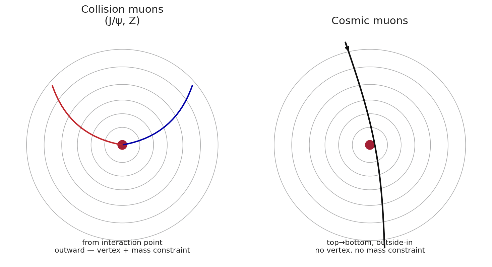
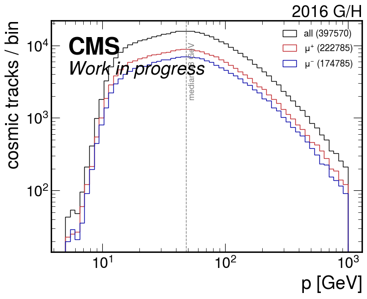
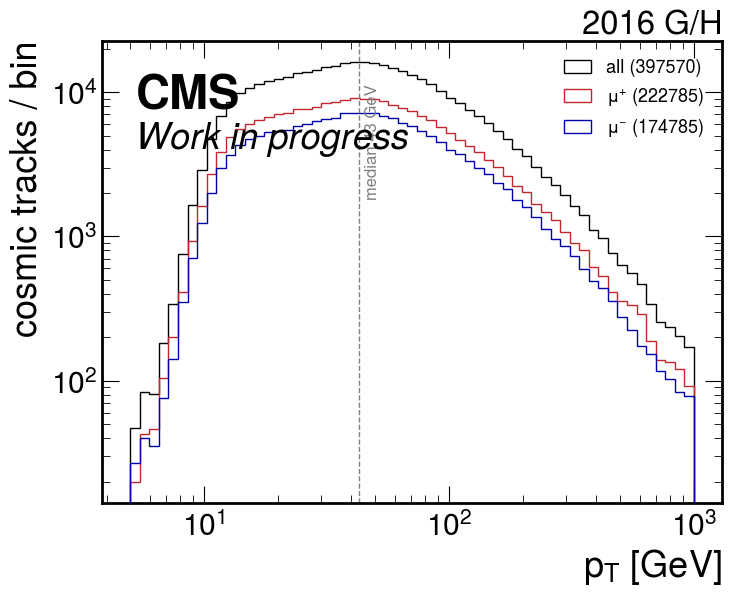
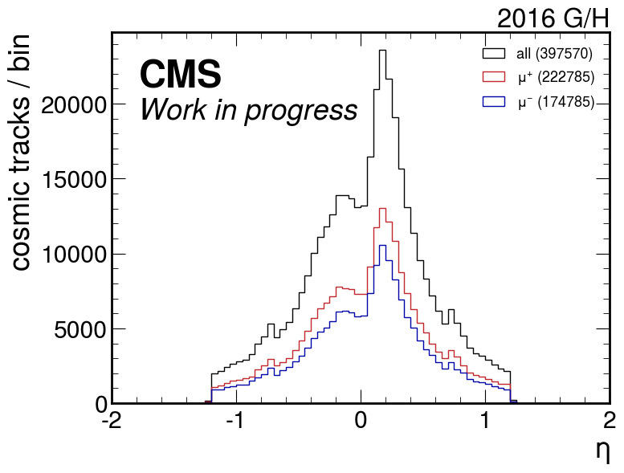
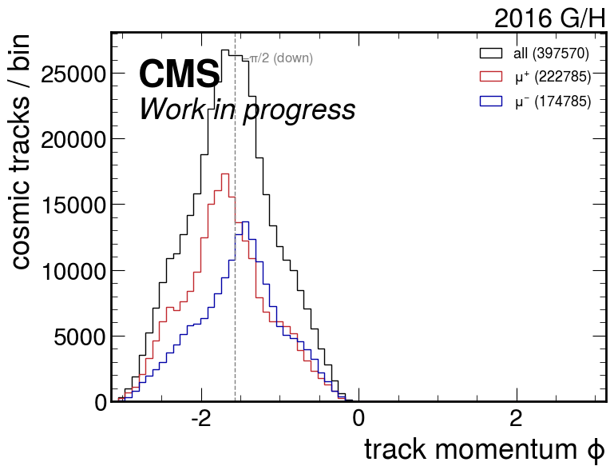
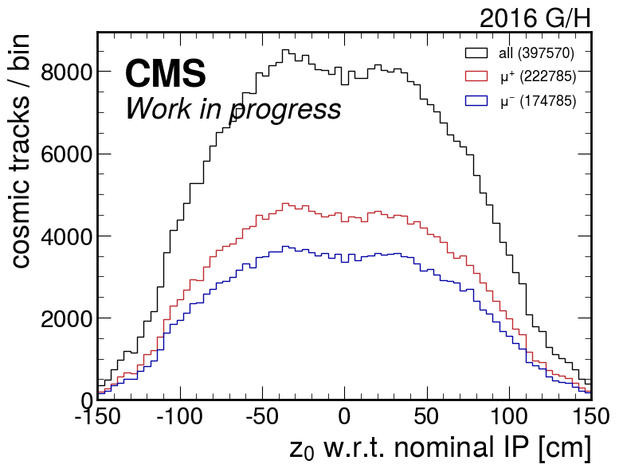

<!-- _class: title -->

# Cosmic Muons for the Muon Momentum-Scale Calibration

## Toward the Z-mass measurement — first CVH refit of Run-2 cosmic tracks
## Motivation, samples, production

David Walter — 2026-07-19
Z-mass / momentum-scale meeting

---

## Motivation — the calibration and its new handles

The **Z-mass measurement** targets a muon momentum scale of **$\delta p_T/p_T \sim 10^{-5}$** —
an **order of magnitude** beyond the completed W-mass measurement ($\sim 10^{-4}$).
Two dominant detector effects are being modelled from **first principles**:

| Effect | Legacy model | New global model | reduction |
|--------|--------------|------------------|----------:|
| **Magnetic field** | ~15 000 per-module $\Delta B_z$ | ~50 scalar-potential modes (Maxwell-exact) | ~300× |
| **Material / energy loss** | ~25 000 per-module $k_\xi$ | $\mathcal{O}(50)$ global material groups | ~500× |

- Both new models are **origin- and direction-independent**: energy loss and field
  are evaluated **along each track's actual path**, per Geant4 step.
- The legacy per-module material model was only correct for **prompt tracks from the
  interaction point** — every track to a given module crossed the same material in the
  same order.

### → This is exactly what unlocks cosmic muons.

---

<!-- _class: plots -->

## Why cosmics were impossible before — and are now

  

- Cosmics enter **outside-in**, cross material in the **opposite order**, and do **not**
  originate from the beamline → the legacy per-module material model (built for prompt
  tracks) was **wrong** for them. The path-based global model removes that assumption.
- **Physics:** cosmics probe field & material along trajectories collision muons never take.
  **Plumbing:** the propagator picks the leg direction per step (`anyDirection`) → outside-in
  legs handled with exact backward-leg Jacobians.

---

## What cosmics add — and what they cannot

**Add (complementary information):**
- **Hemisphere-asymmetric field modes** — a single track samples top *and* bottom of the
  solenoid bore in one pass.
- **Material lever-arm** — top-half vs bottom-half curvature difference is a per-track
  energy-loss handle that needs **no mass constraint**.
- Dense statistics right at the **~40 GeV working point** (overlaps the Z muons).

**Cannot do (by construction):**
- **No absolute scale** — a single cosmic has no mass constraint, so the field↔material
  ("$A$–$\varepsilon$") degeneracy is unbroken. The scale stays anchored by **J/ψ**.
- **No forward coverage** — cosmics arrive from above → central only.

### Cosmics and J/ψ are complementary, not redundant.

---

<!-- _class: section -->

# Samples & production

---

## Samples — official ALCARECO, no re-reco

- **Dataset:** `/NoBPTX/Run2016{G,H}-TkAlCosmicsInCollisions-21Feb2020_UL2016-v1/ALCARECO`
- **In-collision cosmics** (reconstructed during collision runs) → solenoid guaranteed at
  the nominal **3.8 T**.
- The CVH fit refits from **clusters**, so official ALCARECO is sufficient — **no private
  re-reconstruction needed** (same as the J/ψ workflow).

| Era | files | events |
|-----|------:|-------:|
| Run2016G | 21 | 335 k |
| Run2016H | 32 | 77 k |
| **Total** | **53** | **~412 k** |

Event content keeps full pixel + strip clusters and the cosmic track collection — everything the CVH refit consumes.

---

## Field-status filter — a real cut, not bookkeeping

The `Cosmics`/`NoBPTX` streams run **continuously**, including when the magnet is ramped.
2016 era G contains genuine reduced-field data.

| Field | runs | source |
|-------|-----:|--------|
| 3.8 T (kept) | 648 | — |
| 2.0 T (ramp) | ~20 | late-Aug ramp-down |
| 0.0 T (off) | ~20 | Sep technical stop |

Verified **per run** against the conditions DB (`RunInfo`).

The 3.8 T scalar-potential model **must not** be fit to reduced-field runs → filtered at
the source.

- Run2016H is **100 % 3.8 T**; the 40 low-field runs live entirely in era G.
- Applied as a whole-run selection inside the job, independent of how runs are mixed
  across files.

Plumbing note: 10_6 ALCARECO is repacked (split-level 0) so the SiStrip clusters are readable in CMSSW 15_0 — a known ROOT schema-evolution issue, not physics.

---

## Production — CVH single-track refit at scale

- **Fit:** `ResidualGlobalCorrectionMakerG4e` — Geant4e propagator, full 3-D field,
  per-step scalar-potential field modes + global material groups, `anyDirection`.
- **Output:** per-track gradient + Hessian w.r.t. the 92 global parameters
  (50 field modes + 42 material groups) — the same quantities the J/ψ fit stores.
- Run as a 46-task batch array, 8 threads each.

| Metric | Value |
|--------|------:|
| Cosmic fits attempted | 397 718 |
| **Succeeded** | **397 570 (99.96 %)** |
| Failure rate | 0.037 % |
| Backward propagation legs | genuinely exercised (outside-in) |

- Failure rate matches **collision tracks** — the machinery is robust on cosmic topology.

Statistics shown for the 46 currently-available files; a handful of remaining files (a transient storage issue) fold in trivially later.

---

<!-- _class: section -->

# Track kinematics

---

<!-- _class: plots -->

## Momentum spectrum

  
  

Median $p \approx 48$ GeV, spanning ~10 GeV to >1 TeV. Turn-on below ~20 GeV is
**selection** (stiff full-length tracks), not the true flux. The surviving band sits **at
the Z working point** and well above the J/ψ muons — same rigidity, different trajectories.

---

<!-- _class: plots -->

## Pseudorapidity & charge

  

Sharply **central**: 95 % within $|\eta|<1.0$, hard cutoff at $|\eta|\approx1.2$ — cosmics
arrive from above, geometrically forbidden from the endcaps. Charge ratio
**$\mu^+/\mu^- = 1.28$** reproduces the known cosmic positive excess — a free validation
that these are real cosmic muons. **Forward field/material must come from collision channels.**

---

<!-- _class: plots -->

## Azimuth & longitudinal impact point

  
  

**Left:** track-momentum $\phi$ peaks sharply at $-\pi/2$ and lives entirely in $(-\pi,0)$ —
the muons travel **downward**, the defining cosmic signature. **Right:** $z_0$ at closest
approach to the beamline is **broad** (median $|z_0|\approx 50$ cm, spanning the tracker
length) — cosmics do **not** originate from the luminous region ($\sigma_z\!\sim\!3.5$ cm),
so they sample the field and material at $z$ values collision vertices never populate.

---

## Where cosmics enter the calibration

- The stored gradients/Hessians are **already marginalised** over per-track parameters,
  so the global fit is a plain sum over candidates:
  $$\delta = -\Big(\textstyle\sum_i H_i + P\Big)^{-1}\textstyle\sum_i g_i$$
- Cosmics and J/ψ share an **identical 92-parameter global catalog** → they add **directly**
  in the same solve. The reader ingests both storage formats transparently.

**Cosmics-only fit is degenerate — as expected:**
- With no mass constraint, field and material trade off freely → large, unphysical
  compensating values. **This is the $A$–$\varepsilon$ degeneracy, not a bug.**
- The **combined** J/ψ + cosmics fit: J/ψ mass constraint pins the scale, cosmics add the
  hemisphere-asymmetric field modes and the barrel material lever-arm.

---

## Status & next steps

**Done**
- ✅ Cosmics usable in CVH — validated end-to-end on official Run-2 ALCARECO.
- ✅ ~398 k single-track refits with field + material Jacobians on disk.
- ✅ Combined reader (cosmics + J/ψ) on a shared global catalog.

**Next**
- Field-only cosmics fit (material frozen) — well-conditioned cross-check.
- **Combined J/ψ + cosmics fit** — J/ψ `globalMaterialModel` grads in progress.
- Fold in the few remaining files; extend the field-status filter to era G statistics.

All plots: Run2016 G/H, CVH refit, 397 570 tracks. Scripts + logs under calibration_studies/.

---

<!-- _class: title -->

# Backup

---

## Backup — cosmic samples used (on disk)

**In-collision cosmics** — `/NoBPTX/Run2016*-TkAlCosmicsInCollisions-21Feb2020_UL2016-v1/ALCARECO`
Reconstructed during collision runs → solenoid at the nominal 3.8 T (after the run filter).

| Era | files | events | status |
|-----|------:|-------:|--------|
| Run2016F | 26 | 389 k | available — **not yet processed** |
| Run2016G | 21 | 335 k | **processed** (staged → repacked → refit) |
| Run2016H | 32 | 77 k | **processed** |
| **F+G+H** | **79** | **~801 k** | |

- Refit sample this note: **G + H** (~412 k events → 397 570 tracks after the 3.8 T filter).
- **F is available and adds ~50 %** more in-collision statistics — natural next extension.

Official ALCARECO, staged from tape to local disk with a Rucio rule; no re-reconstruction.

---

## Backup — larger cosmic samples NOT yet available

**Dedicated cosmics ALCARECO** — `/Cosmics/Run2016*-TkAlCosmics0T-UL16/ALCARECO`
(the standard tracker-alignment cosmic stream; "0T" = selection works without field, runs
**mix 0 T and 3.8 T**)

| Era | events | availability |
|-----|-------:|--------------|
| Run2016F | 770 k | **no disk replica** (DBS/tape only) |
| Run2016G | 568 k | **no disk replica** |
| Run2016H | 1.06 M | **no disk replica** |

- **~2.4 M events** — 3–6× the in-collision sample — but currently **lost from disk**;
  would need a tape recall of the `Cosmics` UL16 **RECO** (on `T1_DE_KIT` tape) or re-reco.

**RAW on tape** — `/Cosmics/Run2016{F,G,H}-v1/RAW`: **19.0 + 18.2 + 36.3 = ~73 M events**
(3025 files). The ultimate reservoir; requires full re-reconstruction **and** the field
filter (mixed 0 T / 3.8 T).

Trade-off: in-collision cosmics are small but clean (3.8 T, on disk); the dedicated / RAW samples are far larger but need staging or re-reco and a field selection.

